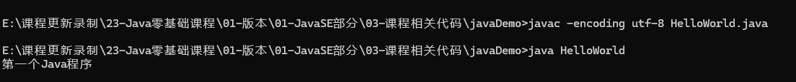

# Java零基础系列课程-JavaSE基础篇

> Lecture:波哥

&emsp;&emsp;`Java `是第一大编程语言和开发平台。它有助于企业降低成本、缩短开发周期、推动创新以及改善应用服务。如今全球有数百万开发人员运行着超过 51 亿个 `Java `虚拟机，`Java `仍是企业和开发人员的首选开发平台。


# 一、Java基础入门

## 1. 编程语言的发展

`语言`：人与人沟通交流的桥梁

`计算机语言`：人与计算交流的桥梁

### 1.1 机器语言

> 机器语言是[机器](https://baike.baidu.com/item/机器/2275865)能直接识别的程序语言或指令代码，无需经过翻译，每一操作码在计算机内部都有相应的电路来完成它，或指不经翻译即可为机器直接理解和接受的程序语言或指令代码。机器语言使用[绝对地址](https://baike.baidu.com/item/绝对地址/573580)和绝对操作码。不同的计算机都有各自的机器语言，即指令系统。从使用的角度看，机器语言是最低级的语言。

机器是只能识别`0`和`1`的， 0101010101001101010


### 1.2 汇编语言

> 汇编语言（assembly  language）是一种用于电子计算机、微处理器、微控制器或其他可编程器件的低级语言，亦称为符号语言。在汇编语言中，用助记符（Mnemonics）代替机器指令的操作码，用地址符号（Symbol）或标号（Label）代替指令或操作数的地址 

是在"机器语言"之上的编程语言，理解难度要比"机器语言"容易，单片开发。属于第二代编程语言


### 1.3 高级语言

​        面向人类的高级语言

> 高级语言（High-level programming language）是一种独立于机器，面向过程或对象的语言。高级语言是参照数学语言而设计的近似于日常会话的语言。


  


## 2.人机交换的方式

​       人和计算机交换的方式是通过操作系统来实现，操作系统(Operating System OS)

### 2.1图形用户界面

Windows，Mac,Linux等

### 2.2 基于字符界面

DOS系统


### 2.3 常用的快捷键

​       这些快捷键不是说程序员必须要掌握，而是稍微懂点电脑的都应该要掌握

| 快捷键     | 说明           | 快捷键           | 说明         |
| ---------- | -------------- | ---------------- | ------------ |
| Ctrl+A     | 全选           | Windows+左方向键 |              |
| Ctrl+C     | 复制           | Windows+右方向键 |              |
| Ctrl+V     | 粘贴           | Windows+D        | 切换到桌面   |
| Ctrl+S     | 保存           | Windows+E        | 打开计算机   |
| Ctrl+X     | 剪切           | Window+R         | 打开运行窗口 |
| Ctrl+Z     | 撤销           | Control          | 打开控制面板 |
| Ctrl+Y     | 反撤销         | calc             | 打开计算器   |
| Alt+F4     | 退出当前窗口   | notepad          | 打开记事本   |
| Ctrl+alt+. | 打开任务管理器 | mspaint          | 打开画图工具 |


### 2.4常用的Dos命令

​      我们通过DOS命令窗口来实现用户的各种操作，我们需要掌握常用的操作命令

#### 2.4.1 打开命令窗口的方式

1. window+r 打开运行窗口然后输入 cmd命令 回车即可打开
2. 在win10系统，我们可以在左下角的搜索框中输入cmd即可
3. 在win7系统下， 按住 shift键 然后在桌面空白的地方鼠标右键在菜单栏中找选项
4. 直接在目录框中输入cmd即可


#### 2.4.2 常见名称解释

目录：文件夹，Directory

文件：带有后缀名的内容，a.txt,b.jpg,c.css ...  File

盘符：D:  E: F: ...


路径：主要是定位我们的文件或者文件夹的

地址：

​        相对地址  : 在我的隔壁房间

​        绝对地址：中国湖南长沙岳麓区XXXX街道XXX室


路径：

​       相对路径：在 boge_repository_03 的旁边(同级目录下)  【不带盘符的地址  协议】

​       绝对路径：D:\tools\git  


#### 2.4.3 常用的DOS命令

dir命令：`眼睛` 可以看到当前目录下的所有的文件及其目录 directory

cd命令：`脚`可以进入到任意目录中 change directory

1. 盘符切换 d:   E:  f: 不区分大小写的
2. 单级进入 cd 文件夹名称   cd tools
3. 退出到上一级  cd .. 返回上一级目录
4. 多级进入  cd 文件夹1\文件夹2
5. 直接退回到根目录  cd / 退出到当前盘符的根目录


md命令：创建文件夹的  make directory

注意：通过命令创建的文件夹尽量不要使用中文，尽量不要使用空格


rd命令：删除非空的文件夹 remove directory

rd /s 要删除的文件夹名称  -- 会有提示信息

rd /s /q 要删除的文件夹的名称  --没有提示直接删除


创建文件的两种方式：

1.type nul>a.txt 创建一个空的a.txt文件

2.echo abc>b.txt 创建一个b.txt 内容是 abc


del命令：删除文件的命令，delete的简写

如果要批量删除文件可以通过通配符的方式来实现 del *.txt   ,del abc*

注意：del是不走回收站的。


`小技巧`：

1.Tab键：自动补全

2.上下键：显示上一次或者下一次已经输入过的命令

3.help：帮助命令

4.cls:清空屏幕  clear screen

5.exit：退出DOS命令窗口


#### 2.4.4 课堂练习

​         使用命令在D盘下创建一个文件夹，名字为Test，然后在Test文件夹下面创建Demo文件夹和a.txt文件，删除Test文件夹。

> d:
>
> md Test
>
> cd Test
>
> md Demo
>
> type nul>a.txt
>
> cd ..
>
> rd /s Test 删除非空的文件夹


## 3. Java核心概念

### 3.1 Java的历史

Java是由Sun公司开发出来的，2009年被甲骨文Oracle收购了


詹姆斯·高斯林  James Gosling    `Java之父`  Oak语言-->Java


Java演变的各个版本

| 版本             | 发布时间      |
| ---------------- | ------------- |
| JDK Beta         | 1995年        |
| JDK 1.0          | 1996 年 1 月  |
| JDK 1.1          | 1997 年 2 月  |
| J2SE 1.2         | 1998 年 12 月 |
| J2SE 1.3         | 2000 年 5 月  |
| J2SE 1.4         | 2002 年 2 月  |
| J2SE 5.0         | 2004 年 9 月  |
| Java SE 6        | 2006 年 12 月 |
| Java SE 7        | 2011 年 7 月  |
| Java SE 8 (LTS)  | 2014 年 3 月  |
| Java SE 9        | 2017 年 9 月  |
| Java SE 10       | 2018 年 3 月  |
| Java SE 11 (LTS) | 2018 年 9 月  |
| Java SE 12       | 2019 年 3 月  |
| Java SE 13       | 2019 年 9 月  |
| Java SE 14       | 2020 年 3 月  |
| Java SE 15       | 2020 年 9 月  |
| Java SE 16       | 2021 年 3月   |
| Java SE 17       | 2021 年 9 月  |
| Java SE 18       | 2022 年3 月   |
| Java SE 19       | 2022 年 9 月  |
| Java SE 20       | 开发中        |

https://openjdk.org/projects/jdk/

### 3.2 Java的三大版本

#### 3.2.1 J2SE

​         标准版，Java的基础版本，其他两个版本都是要依赖于此的  Java 2Standard Edition

#### 3.2.2 J2EE

​		企业版，我们要学习的就是J2EE 企业级的Web应用解决方案 Java 2 Enterprise Edition

- 定位在服务端应用
- 主要用于企业Web服务器应用

#### 3.2.3 J2ME

​       微型版  Java 2 Micro Edition

- 定位于电子产品
- 移动设备、TV、手机


### 3.3 Java跨平台的原理

平台：操作系统

跨平台：书写的一份代码可以在各个平台上面运行  www.oracle.com


## 4.Java特点分析

1. Java是跨平台的
2. Java是简单的
3. Java是安全的 取消了指针，垃圾回收机制
4. Java是完全面向对象的
5. Java是健壮


## 5.傻傻分不清的JDK、JRE、JVM


### JVM

Java Virtual Marchin Java虚拟机

1. JVM是一种规范，Oracle实现了这种规范
2. JVM是跨平台的基础
3. 一次编译到处运行

### JRE

Java Runtime Environment Java运行时环境

1. JRE 中提供了Java程序运行时需要用到的核心的Jar(类，接口等)
2. 如果我们希望一个Java程序能够运行的话，那么我们必须要安装JRE


### JDK

Java Development Kit Java开发工具包

1. 提供了很多像java.exe,javac.exe,javap.exe等开发工具，帮助我们开发Java程序
2. 如果我们希望在自己的电脑上面开发Java程序，那么我们就必须安装JDK

JDK包含了JRE，JRE包含了JVM。所以我们开发的时候就只需要安装JDK即可


## 6.JDK操作

### 6.1 卸载JDK

​         如果我们电脑上已经安装的有JDK了，那么我们需要先卸载掉原来有的再安装新的JDK

#### 1.在控制面板中卸载


#### 2.删除掉遗留的文件

之前是安装在默认路径下面的，所以我们去到 C盘下的 Program File 目录下找到 java 删除即可


#### 3.移除环境变量的配置

选中"计算机"--> 右键 属性 --> 删除相关信息


移除path路径后的相关信息


删除classpath 配置


可以重启下电脑。

### 6.2 安装JDK

首先需要获取对应的操作系统的JDK安装文件


安装路径可以自定义，也可以使用默认的。推荐使用自定义的路径


安装过程稍等片刻


JRE的安装


等待安装完成即可


测试是否安装成功 在cmd 窗口输入 java 能看到如下的输出信息表示安装是成功


### 6.3 JDK安装路径介绍

 


JDK的安装成功表示当前的电脑已经初步具备了开发Java程序的条件


## 7.HelloWorld

### 7.1 HelloWorld程序的实现

​      在JDK的安装路径的bin目录下创建一个HelloWorld.java文件，如果你是把JDK安装在了c盘的Program File 文件夹下的话，有可能因为系统的原因，不能在该目录下创建文件，那么你可以在其他位置创建好文件然后复制过去即可。


打开该文件，在文件中写下如下内容:

```java
public class HelloWorld
{
    public static void main(String[] args) 
    {
        System.out.println("HelloWorld .... ");
    }
}
```


代码写完也就意味着我们的开发完成了。接下来我们就可以借助JDK中提供的开发工具来执行我们程序。

javac.exe 将我们的Java文件编译成为class文件

```cmd
javac HelloWorld.java
```


​        如果出现了"拒绝访问"的错误提示，那么一般是权限的原因。所以这个时候我们需要通过"系统管理员身份"来打开命令行窗口


编译成功后我们就可以借助另一个开发工具 "java.exe"来执行我们的class文件

```cmd
java HelloWorld
```

注意：java后面跟的不是class文件名称而是我们在代码中定义的类名


### 7.2 课堂练习

​      自己去写一个HelloWorld程序，然后看看自己能够碰到什么错误！ 


### 7.3 大家可能踩到的坑

#### 1.文件扩展名的问题

​     因为操作系统的原因，造成文件扩展名隐藏，那么创建的 HelloWorld.java其实是 HelloWorld.java.txt文件，当然就没法编译了


#### 2.文件名和类名要一致


​	我们的类名和文件名称不一致的请求下，同样的是编译不过去的


#### 3. Java中是严格区分大小写的

```java
public Class HelloWorld999
{
	public Static void main(String[] args)
	{
		system.out.println("Hello Wrold ... 666");
	}
}
```


#### 4.非法字符

在代码中，每行代码的结束必须有英文状态";"结尾，方法中的字符串我们必须用英文状态的"  " " 来包含，不能是中文状态 或者 单引号

```java
public class HelloWorld666
{
	public static void main(String[] args)
	{
		System.out.println("Hello Wrold ... 666“)；
		System.out.println('Hello Wrold ... 666');
	}
}
```


#### 5.括号匹配

​    在程序中出现括号都是成对出现的 {} [] ()

```java
public class HelloWorld666
{
	public static void main(String[] args
	{
		System.out.println("Hello Wrold ... 666");
		System.out.println("Hello Wrold ... 666");
	
}
```


#### 6.找不到主方法

​	 程序的入口是 main方法，而主方法的格式必须是 `public static void main(String[] args){ ... }`

```java
public class HelloWorld666
{
	public static void man(String[] args)
	{
		System.out.println("Hello Wrold ... 666");
		System.out.println("Hello Wrold ... 666");
		System.out.println("....");
		System.out.println("...");
	}
	
}
```

main方法写错了，编译是能通过的，表示它还是一个普通的方法，只是在程序执行的时候就找不到入口方法了


### 7.4 课堂练习

1.写一个Java程序，向控制台输出"世界你好，Java我来了！！！"

2.写一个Java程序，向控制台输出你的 姓名，年龄，爱好。


### 7.5 HelloWorld案例小结

1. Java对大小写敏感，如果出现了大小写拼写错误的情况，程序是没法执行的
2. 关键字 class 表明Java程序中的全部内容都包含在类中，Java是一种面向对象的语言
3. main方法是Java程序的入口，它的固定写法是`public static void main(String[] args){....}`
4. 在Java中，程序被包裹的情况下 {} [] () 都是成对出现的。


刚开始学习大家要注意编程风格

1.注意缩进， “Tab”键，不推荐用键盘的 空格

2.成对编程，括号，引号 我们都应该直接写完然后再往里面添加内容

3.见名知意，我们命名的时候比如 类名，我们不要随便取 "aa" "bb" "cc" 让人看不懂的名称，我们应该取一些别人一眼能看明白的名称


## 8.配置系统环境变量

​     想要在JDK的安装目录之外执行我们的Java程序，那么这时我们就需要在环境变量中配置Jdk的目录信息

> 右键点击桌面计算机→选择属性→选择高级系统设置→选择高级选项卡→点击环境变量→下方系统变量中查找path→双击path


### 8.1 JAVA_HOME

内容是Jdk的安装路径，在bin目录的上一级

```cmd
E:\java\jdk
```


### 8.2 Path

​     我们只需要将JDK的bin目录追加到Path的录制之后，注意！！！ 不要删除原来的内容

```cmd
%JAVA_HOME%\bin
```


### 8.3 classpath

在jdk1.5之后我们在通过开发工具编程的时候可以不加classpath，但是我们在直接通过文本操作的时候还要添加下的

```cmd
.;%JAVA_HOME%\jar;%JAVA_HOME%\lib\tools.jar;
```


这样就表示我们的JDK的环境变量是配置好了，那么我们就可以在当前电脑上来写我们的Java程序了


# 二、Java基础语法

## 1. 关键字

​       Java关键字：是Java语言保留供内部使用的，比如class 用户与定义类。关键字也可以称为保留字，他们的意思是一样的。


```java
public class HelloWorld
{
    public static void main(String[])
    {
        System.out.println("HelloWorld...");
    }
}
```

​      关键字是Java语言事先定义的，有特殊的意义的标识符，简而言之就是在高级记事本或者IDE中颜色会改变的单词就是关键字

| 关键字   |                 |          |           |            |              |
| -------- | --------------- | -------- | --------- | ---------- | ------------ |
| abstract | assert          | boolean  | break     | byte       | case         |
| catch    | char(character) | class    | const     | continue   | default      |
| do       | double          | else     | extends   | final      | finally      |
| float    | for             | goto     | if        | implements | import       |
| null     | package         | private  | protected | public     | return       |
| short    | static          | strictfp | super     | switch     | synchronized |
| this     | throw           | throws   | transient | try        | void         |
| volatile | while           |          |           |            |              |

`注意`：不需要刻意的去背！后面我们会慢慢的接触到每个关键字的用法


关键字的特点

1. 关键字基本都是由小写字母组成的

2. Java语言规定关键字是不能作为`标识符`

3. 目前Java中共有50个关键字

   其中"const"和"goto"这两个关键字在Java中是没有具体的含义的，预留的关键字。在其他的编程语言中"const"和"goto"都是关键字


课堂小案例：

判断一下单词哪些是关键字：

class     HelloWorld      public     static     void       main     String      System    out    println


class:类名

public:共有的

static:静态的

void:没有返回结果


## 2. 标识符

​     标识符：等同于现实生活中的取名字，Java中对包、类、方法、参数和变量等要素命名的时候使用的字符序列称为标识符。      简而言之就是给类，接口，方法等起名字。

### 2.1 标识符的命名规则

规则：一定要遵守的，如果违反那么编译会报错

1. 是由字母、数字、下划线_、美元符$组成
2. 不能以数字开头
3. 区分大小写
4. 不能使用Java中的关键字

### 2.2 标识符的命名规范

规范：大家相互约定，都会遵守，如果不遵守编译不会报错

1. 驼峰命名法(schoolName)
2. 见名知意(使用有意义的英文单词)
3. 命名的长度不要超过31个字符


### 2.3 开发中标准的规范

​       针对开发中对 包、类、抽象类、接口和实现类、变量、方法、常量的命名规范

#### 2.3.1 包

​       也就是文件夹

1. 一般都是用公司域名的反写
2. 所有的单词使用"."隔开
3. 每个单词都是小写的

```java
// www.bobo.com 
com.bobo.www
com.bobo.oa
```


#### 2.3.2 类(抬头骆驼)

1. 所有的单词的首字母大写，其他字母小写
2. 见名知意

> eg: HelloWorld IdentifiedDemo


#### 2.3.3 接口(抬头骆驼)

1. 所有的单词的首字母大写，其他字母小写 interface
2. 一般会在第一个单词的前面添加一个大写的 "I"

> eg: IStudent  IPerson IUserService


#### 2.3.4 接口的实现类(抬头骆驼)

1. 所有的单词的首字母大写，其他字母小写 
2. 一般我们会在最后一个单词后面追加"Impl"  implements

> eg: StudentImpl  PersonImpl  UserServiceImpl


#### 2.3.5 抽象类(抬头骆驼)

1. 所有的单词的首字母大写，其他字母小写 
2. 在单词的开头一般都会加上 "Abs" Abstract

> eg: AbsStudent AbsPerson


#### 2.3.6 变量(低头骆驼)

1. 第一个单词首字母小写，其他单词首字母大写
2. 一般都是名词

> eg: studentName studentAge  score totalScore


#### 2.3.7 方法(低头骆驼)

1. 第一个单词首字母小写，其他单词首字母大写
2. 一般是动词


> eg: getTotalScore  getAvgScore getMaxScore getMinScore


#### 2.3.8 常量

1. 所有的单词都是大写
2. 每个单词间都有"_"分割

> eg: MAX_VALUE  MIN_VALUE


面试题：说一说你对Java规范的理解


## 3. 注释

注释的概念：

​         为程序进行解释说明的，编译期不会对注释进行编译操作

注释的好处：

1. 是代码的可读性提高
2. 开发中工作项目交接更加顺畅
3. 程序调试更方便


单行注释：  // 

多行注释:    /*  在此处写我们的注释内容  */  多行注释是不能嵌套的

文档注释:  /**   */


注意：

1. 文档注释可以是javadoc工具来生成API，后续会介绍
2. 初学者一定要养成良好的习惯，先写注释，再写代码
3. 开发中的注释不能随便删除


```java
public class zhushi
{
	/**
	 *  我们的第一个main方法
	 */
	public static void main(String[] args){
		// 声明一个变量 测试
		/*
			注释1
			注释2
			注释3
			
		*/
		String userName = "张三";
	}
}
```


执行程序中文乱码的问题

```java
javac -encoding utf-8 HelloWorld.java
```




## 4. 常量和变量

### 4.1 常量

#### 4.1.1 什么是常量

​          在程序的执行过程中，值不会发生改变的量

#### 4.1.2 为什么要用常量

​          一周有7天

​         PI：3.1415926

​         一年有12个月

#### 4.1.3 常量的分类

**字面值常量**

​            就是具体的值

**1.) 整数常量**

​      大家要注意整数的进制。

1. 二进制 由 0 1组成，常量表示二进制 0b开头   0b010110
2. 八进制 由0~7组成，由 0 开头  012
3. 十进制 由0~9组成，默认就是十进制
4. 十六进制 由0~9 ABCDEF组成，开头 0x

**2.) 小数常量**

1. float  单精度小数  0.5F
2. double 双精度 0.5D 默认

float,double后面会具体的来介绍这两个类型

**3.) 布尔型常量**

​    用来表示 "真" "假",在程序中布尔型只有两个值 `true` `false`

**4.) 字符常量**

什么是字符：字符串中的最小单位，包括字母，数字，运算符，标点符号和其他符号

字符本质上还是数字

针对有特殊含有的字符我们需要通过转义符来实现 "\\"

​      \t 制表   \n 换行 \r\n 换行  \R 换行 \\'   \\"  

**5.) 字符串常量**

1. 由双引号包裹
2. 里面可以有一个字符也可以有多个字符还可以没有字符


```java
public class ConstantDemo
{
	public static void main(String[] args)
	{
		// 整数 常量
		System.out.println(10);
		// 二进制常量 13
		System.out.println(0b01101);
		// 八进制 10
		System.out.println(012);
		// 十六进制 65535
		System.out.println(0xFFFF);

		System.out.println(5.5f);
		System.out.println(5.6D);

		System.out.println(true);
		System.out.println(false);
		// 字符 '' 单引号不能为空
		System.out.println('\'');
		// 字符串常量  必须写在一对 双引号之内
		System.out.println("HelloWorld");
		System.out.println("");
		// System.out.println(null);

	}
}
```


**1.3.2  自定义常量**

​            后面章节中会和大家介绍


### 4.2.变量

变量的定义：在程序的执行过程中，其值可以发生改变的量。类似于数学中的未知数 X

变量的本质：就是一个地址

变量的三要素：

1. 声明
2. 赋值
3. 使用


```java
public class VariableDemo
{
	public static void main(String[] args)
	{
		// 定义一个变量  租房子 我  我要租一个两室一厅的房子
		int a ;// 声明了一个变量
		a = 20; // 赋值操作 将一个常量赋值给了一个变量
		System.out.println(a); // 使用
		a = 50;
		System.out.println(a); // 使用
		int b = 100; // 声明和赋值一块执行
		System.out.println(b);
        int c,d,e; // 声明多个变量可以通过,连接
		c = 1;
		d = 2;
		e = 3;
		int c1 = 20,d1=30,e1=40; // 这种方式语法上支持，但是不推荐  推荐一行声明一个变量
	}
}
```

注意点：

1. 变量一定要先声明再赋值在使用
2. 变量的定义不能够重复
3. 不能够连续定义变量 int x=y=z=123;
4. 建议一行只写一条语句


## 5.基本数据类型和转换

### 5.1 计算机单位

​      计算机能识别是只有二进制文件`0`和`1`

> eg:10010101010101

| 单位    | 说明                                                         |
| ------- | ------------------------------------------------------------ |
| 1位     | 上面的每一个0或者1就是一位                                   |
| 1B      | 1B=1*8 字节，1一个字节等于8位 0000 0000  10000 0000 -1    -128~127 |
| 1KB     | 1KB=1024*B                                                   |
| 1MB     | 1MB=1024*1KB                                                 |
| 1GB     | 1GB=1024*1MB                                                 |
| 1TB     | 1TB=1024*1GB                                                 |
| ....... |                                                              |


### 5.2 数据类型

​      Java是一门强类型的语言。针对于每一种数据都提供的对应的数据类型

#### 5.2.1 基本数据类型


#### 5.2.2 引用数据类型

​         后面专门介绍

1. 类(class)
2. 接口(interface)
3. 数组([])


### 5.3 数据类型转换

数据类型转换的依据：取决于数据的取值范围


#### 5.3.1 自动类型转换

我们将取值范围小的数据保存到取值范围大的数据类型中的时候是可以自动转换类型的

```java
public class DataTypeDemo{
	public static void main(String[] args){
		// 1.数值类型  八个基本数据类型
		byte b1 = 100;
		short s1 = 300;
		int i1 = 999;
		long l = 1234567890l;
		// 自动类型转换
		short s2 = b1; // byte --> short
		int i2 = s1 ; // short --> int 
		long l2 = i1; // int --> long 
		// 2.浮点型
		float f1 = 1234.567f;
		double d1 = 1234.567d;
		double d2 = f1;
		// 3.字符型
		char c1 = 'a';
		// 4.boolean
		boolean b2 = true;
		boolean b3 = false;
	}
}
```


#### 5.3.2 强制类型转换

​         我们将取值访问比较大的变量赋值给取值范围比较小的变量，那么此时会出现数据的丢失，所以此时我们需要强制类型转换。

```java
public class DataTypeDemo{
	public static void main(String[] args){
		// 1.数值类型  八个基本数据类型
		byte b1 = 100;
		short s1 = 300;
		// 强制类型转换
		byte bb2 = s1; // short --> byte 
		System.out.println("b2 = " + bb2);
	}
}
```

编译的时候会出现如下的错误


此时为了避免这个错误，我们需要强制类型转换

```java
目标类型  变量名 = (目标类型) 被转换的类型;
```


```java
public class DataTypeDemo{
	public static void main(String[] args){
		// 1.数值类型  八个基本数据类型
		byte b1 = 100;
		short s1 = 300;
		// 强制类型转换
		byte bb2 = (byte)s1; // short --> byte 
		System.out.println("b2 = " + bb2);
	}
}
```

​        做数据类型的强制转换的时候会有`数据溢出`和`数据丢失`的可能.所以在做数据的强制类型转换的时候一定要谨慎！


#### 5.3.3 类型转换的特例

​     在 byte、short、char在转换的时候系统会帮助我们做一些处理，我们在赋值给byte,short,char时，如果赋予的值在对于类型的范围之内，系统会帮助我们自动完成转换，次场景下我们不需要强制内容转换。

```java
// 特例
byte by2 = 100;
//byte by3 = 129;
//short short1 = 32768;
char c1 = 65536;
System.out.println(c1);
```


#### 5.3.4 byte/short和char转换，都需要强制类型转换

   byte类型和char类型转换及short类型和char类型相互转换都是需要强制类型转换的

```java
// short和byte类型 同 char类型转换的时候都需要强制类型转换
byte by4 = 120;
char c2 = (char)by4;
System.out.println(c2);
char c3 = 'd';
byte by5 =(byte) c3;
System.out.println(by5);

short s2 = 666;
char c4 = (char)s2;
System.out.println(c4);
```


#### 5.3.5 表达式类型提升

​     当表达式运算符两边的类型不一致的时候，结果的类型会自动向高类型转换

```java
// 表达式类型的提升
double d = 2.67;
int i3 = 50;
int i4 = d + i3; // double 和 int 会提升到 double
System.out.println(i4);
```


解决方式

```java
int i4 = (int)d + i3; // double 和 int 会提升到 double
int i4 =(int)(d + i3);
```


#### 5.3.6 byte,short,char之间参与运算

​      当byte,short,char之间参与运算的时候，底层都会转换为int类型来计算。

```java
char c5 = 'a';
short s3 = (short)(c5 + 1); // c5 + 1 得到的结果的类型是int
System.out.println(s3);

char c6 = 'A';
byte b6 = 1;
short s4 =  (short)(c6 + b6);
System.out.println(s4);
```


### 5.3.7 布尔型不能参与运算和转换的

​         在Java中boolean是不能参与运算和转换的。

```java
boolean bool1 = false;
System.out.println(bool1 + 1);
short s5 = bool1;
```


#### 5.3.8 字符串运算的时候拼接

​      当字符串类型的数据和其他数据做加法运算的时候都是之间拼接的

```java
String ss = "HelloWorld";
System.out.println(ss + 2.5);
// 20101010
System.out.println(10 + 10 + "10" + 10 + 10);
```


#### 5.3.9 变量和常量计算的问题

​        如果表达式是变量组成的，那么我们说讲的特例是不生效的，特例只针对常量

```java
byte b7 = 20 + 30;
System.out.println(b7);

byte b8 = 30;
short s6 = 50;
byte b10 = (byte)(b8 + s6);
System.out.println(b10);
byte b9 = 10;
byte b11  = (byte)(b8 + b9);
System.out.println(b11);
```


## 6.运算符


### 6.1 算术运算符

> +，-，*， / 、% 、++ 、 --

#### 6.1.1 +号

1. 正数
2. 加号
3. 连接符号

```java
System.out.println(+20); // 表示 正数
System.out.println(3+4); // 两数相加
System.out.println("Hello" + 666);  // 拼接
```


#### 6.1.2 - * / %

```java
System.out.println(5-3); // 2
System.out.println(-3);  // -3
System.out.println(5*3); // 15
System.out.println(5/3); // 1
System.out.println(5%3); // 2
System.out.println(2%4); // 2

System.out.println(5/(double)3); // 1.666667
System.out.println((double)5/3); // 1.666667
```


#### 6.1.3 ++/--

++ -- 属于单目运算

> ++ 表示自增1
>
> -- 表示自减1


*单独使用*

​	表示自增或者自减，没有任何的区别

```java
public static void main(String[] args)
{
    int a = 10;
    int b = 20;
    // a = 10 b = 20
    System.out.println("a = " + a + " b =  " + b);
    //a ++;
    //b --;
    // a = 11 b = 19
    //System.out.println("a = " + a + " b =  " + b);

    ++ a ;
    -- b ;
    // a = 11 b = 19
    System.out.println("a = " + a + " b =  " + b);
}
```


**参与运算**

1. 如果++放在操作数的左边，就表示先自增再参与运算
2. 如果++放在操作数的右边，就表示先参与运算然后在自增1或者自减1


```java
// ++ -- 参与运算
int a1 = 3;
int a2 = 4;
int result = (a1++)/3 + (--a2)*2 -(a1--)%6 + (a2++)*3 - (a2--);
System.out.println("a1=" + a1 + "  a2="+a2 + " result="+result);
```


**课堂练习：**

1. int x = 3; int res = (x++)%(++x) 请推断res的值，及x此时的值
2. int n = 5; n=++n + ++n 求n的值
3. int n = 3; n= ++n + n ++;求n的值


### 6.2 赋值运算符

> 普通的   =
>
> 扩展的  +=  -+  *=  /=  %= 


```java
public static void main(String[] args)
{
    // 赋值运算符 这个不是==赋值语句
    int a = 10 ; // 表示将常量10赋值给变量a地址所对应的内存区域中

    a += 3; //等价于a = a + 3
    System.out.println(a);

    a -= 3; // 等价于 a = a - 3;
    System.out.println(a);	
}
```


`面试题1`: short s1 = 1 ; ?  s1 = s1 + 1; 有什么错？

​               short s1 = 1; s1 += 1; 又有什么错？

```java
short s1 = 1;
s1 = s1 + 1; // 报错 需要强制类型转换
s1 += 1; // 不会 += 会帮助我们自动完成强制类型转换
```


`面试题2`：如何交换两个数?

```java
int x = 10;
int y = 20; // 互换x和y的值

int c = x;
x = y;
y = c;
```

解决方案：声明一个中级变量即可


### 6.3 关系运算符

> \>    <   >=  <=  !=   ==

关系运算符得到的结果都是boolean类型的数据(true和false)

```java
public static void main(String[] args)
{
    int a = 10;
    int b = 20;

    System.out.println(a > b) ; // false
    System.out.println(a < b) ; // true
    System.out.println(a >= b) ; // false
    System.out.println(a <= b) ; // true
    System.out.println(a != b) ; // true
    System.out.println(a == b) ; // false

}
```


### 6.4 逻辑运算符

​       连接多个boolean类型的表达式

>   boolean类型的表达式1  boolean类型的表达式2 boolean类型的表达式3  boolean类型的表达式4 


#### 6.4.1 位逻辑运算符

>& 按位与
>
>| 按位或
>
>^ 异或

```java
public static void main(String[] args)
{
    int a = 10;
    int b = 20;
    // 按位 & 都为true 结果 true
    System.out.println((a > b ) & (a < b)) ; // false &  true = false
    System.out.println((a < b ) & (a > b)) ; // true & false = false
    System.out.println((a < b ) & (a < b)) ; // true & true = true
    System.out.println((a > b ) & (a > b)) ; // false & false = false
    System.out.println("----------------------------");
    // 按位 | 有true 就为true
    System.out.println((a > b ) | (a < b)) ; // false |  true = true
    System.out.println((a < b ) | (a > b)) ; // true | false = true
    System.out.println((a < b ) | (a < b)) ; // true | true = true
    System.out.println((a > b ) | (a > b)) ; // false | false = false
    System.out.println("----------------------------");
    // 按位 异或 相同为false 不同为true
    System.out.println((a > b ) ^ (a < b)) ; // false ^  true = true
    System.out.println((a < b ) ^ (a > b)) ; // true ^ false = true
    System.out.println((a < b ) ^ (a < b)) ; // true ^ true = false
    System.out.println((a > b ) ^ (a > b)) ; // false ^ false = false

}
```


按位符号也会运用在`位运算`，位运算操作要比普通运算的效率要高很多

```text
&:有0取0，否则取1
1001 & 0110 = 0
    1 0 0 1
 &  0 1 1 0
 ----------
    0 0 0 0  

|:有1取1，否则取0
1001 | 0110 = 15
    1 0 0 1
 |  0 1 1 0
 ----------
    1 1 1 1 

^:相同为0 不同为1    
1001 ^ 0110 = 15
    1 0 0 1
 ^  0 1 1 0
 ----------
    1 1 1 1 
```


#### 6.4.2 短路逻辑运算符

> && 短路与
>
> || 短路或者
>
> ! 非


& 表示按位与，无论什么情况都会同时计算运算符两边的表达式

&& 表示短路与，如果前面的表达式为false，那么无论后面的表达式结果如何，都不会去计算后面表达式的值。因为后面表达式的值不会影响结果

同时注意：在实际使用中我们很少使用按位与，更多的是使用短路与


！：取反

​      当!的个数是奇数个的时候，结果相反

​	  当!的个数是偶数的时候，结果不变


面试题：& 与 && 的区别

1. & 表示按位与，无论什么情况都会同时计算运算符两边的表达式
2. && 表示短路与，如果前面的表达式为false，那么无论后面的表达式结果如何，都不会去计算后面表达式的值。因为后面表达式的值不会影响结果
3. && 开发中使用，&基本不使用
4. &常用与位运算操作，效率高


### 6.5 位运算符

位运算符：用来计算二进制的运算符

> & | ^ ~ 
>
> <<   >>  >>>  补码


### 6.6.条件运算符

条件运算符又称为`三目运算`

```java
格式： X ? Y : Z ;
X 表达式必须是boolean类型的表达式
计算流程：
     1. 首先计算X的值
     2. 如果X为true，那么整个表达式的结果就是Y的值
     3. 如果X为false，那么整个表达式的结果就是Z的值
```


## 7. 表达式

表达式的定义：符合一定的语法规则的`运算符`和`操作数`的序列

运算符：算数运算符,赋值运算符,关系运算符,逻辑运算符,位运算符(了解), 三目运算符

操作数：变量或者常量

```java
a + b 
a * 64 - 3
x ? y : z
(x > y) && (100 > z)
```

表达式的值：整个表达式的结果

表达式的类型：整个表达式的结果的类型


表达式的优先级：

​      i < 30  &&  i%10  !=0

优先级不用去背！！！

| 优先级 | 描述         | 运算符                  |
| ------ | ------------ | ----------------------- |
| 1      | 括号         | ()、[]                  |
| 2      | 正负号       | +、-                    |
| 3      | 自增自减，非 | ++、--、!               |
| 4      | 乘除，取余   | *、/、%                 |
| 5      | 加减         | +、-                    |
| 6      | 移位运算     | <<、>>、>>>             |
| 7      | 大小关系     | >、>=、<、<=            |
| 8      | 相等关系     | ==、!=                  |
| 9      | 按位与       | &                       |
| 10     | 按位异或     | ^                       |
| 11     | 按位或       | \|                      |
| 12     | 逻辑与       | &&                      |
| 13     | 逻辑或       | \|\|                    |
| 14     | 条件运算     | ?:                      |
| 15     | 赋值运算     | =、+=、-=、*=、/=、%=   |
| 16     | 位赋值运算   | &=、\|=、<<=、>>=、>>>= |


运算符的优先级：

1. 有括号先计算括号里面的
2. 单目运算 > 双目运算 > 三目运算
3. 算数运算符 > 关系运算 > 逻辑运算 > 条件运算 > 赋值运算
4. 如果优先级相同，从左至右即可
5. +、-    >   ++ -- !


`( )` 可以显著的提高程序的可读性


***为了便于查询，以下列出ASCII码表：第128～255号为扩展字符（不常用***） 

|         |      |          |       |          |      |          |      |
| ------- | ---- | -------- | ----- | -------- | ---- | -------- | ---- |
| ASCII码 | 键盘 | ASCII 码 | 键盘  | ASCII 码 | 键盘 | ASCII 码 | 键盘 |
| 27      | ESC  | 32       | SPACE | 33       | !    | 34       | "    |
| 35      | #    | 36       | $     | 37       | %    | 38       | &    |
| 39      | '    | 40       | (     | 41       | )    | 42       | *    |
| 43      | +    | 44       | '     | 45       | -    | 46       | .    |
| 47      | /    | 48       | 0     | 49       | 1    | 50       | 2    |
| 51      | 3    | 52       | 4     | 53       | 5    | 54       | 6    |
| 55      | 7    | 56       | 8     | 57       | 9    | 58       | :    |
| 59      | ;    | 60       | <     | 61       | =    | 62       | >    |
| 63      | ?    | 64       | @     | 65       | A    | 66       | B    |
| 67      | C    | 68       | D     | 69       | E    | 70       | F    |
| 71      | G    | 72       | H     | 73       | I    | 74       | J    |
| 75      | K    | 76       | L     | 77       | M    | 78       | N    |
| 79      | O    | 80       | P     | 81       | Q    | 82       | R    |
| 83      | S    | 84       | T     | 85       | U    | 86       | V    |
| 87      | W    | 88       | X     | 89       | Y    | 90       | Z    |
| 91      | [    | 92       | \     | 93       | ]    | 94       | ^    |
| 95      | _    | 96       | `     | 97       | a    | 98       | b    |
| 99      | c    | 100      | d     | 101      | e    | 102      | f    |
| 103     | g    | 104      | h     | 105      | i    | 106      | j    |
| 107     | k    | 108      | l     | 109      | m    | 110      | n    |
| 111     | o    | 112      | p     | 113      | q    | 114      | r    |
| 115     | s    | 116      | t     | 117      | u    | 118      | v    |
| 119     | w    | 120      | x     | 121      | y    | 122      | z    |
| 123     | {    | 124      | \|    | 125      | }    | 126      | ~    |


# 三、分支语句


## 1. Scanner类

​       之前我们书写的程序，数据都是固定不变得，也就是我们都是使用的常量，在实际的开发过程中，数据肯定是动态的而不是固定的，所以我们需要把固定的数据变更为键盘录入。通过Scanner模拟实际情况。

### 1.1 package

​     为了便于管理我们的Java文件，我们可以通过创建package的方式来处理，package其实就是文件夹


### 1.2 class

&emsp;&emsp;我们可以选择对应的package下创建 Java  Class,也可以在创建JavaClass的同时去指定package


### 1.3 main

​     在IDEA中，主方法可以在创建类的时候在菜单中勾选，也可以在创建好的Java文件手动敲，也可以通过 main 关键字快速生成

```java
/**
 * 通用快捷键和设置
 * psvm:快速创建main方法
 * main:也可以快速创建main方法
 * sout:可以快速的生成 输出语句
 * "xxx".sout:可以快速生成输出语句和内容
 * 变量.soutv:可以快速生成输出语句和变量=值的格式
 */
public class HelloWorld {
    public static void main(String[] args) {
        System.out.println("HelloWorld");
        String name = "张三";
        System.out.println("name = " + name);
    }
}
```


### 1.4 导包

​    在Java项目中，默认会引入java.lang.*下面的所有的类型，我们在使用lang包下的所有类型都不用导包，但是当我们要使用其他包下的类型的时候我们就需要通过`import`关键字来实现包的引入，同意可以通过`alt` + `/`方式快捷导入  也可以通过`ctrl` + 1（感叹号1）


```java
package com.bobo.scanner;

import java.util.Scanner;

/**
 * Scanner案例 键盘输入案例
 * 在Java中会自动导入 java.lang.* 
 * @author dpb
 *
 */
public class ScannerDemo {

    public static void main(String[] args) {
        // 1.获取一个Scanner 对象
        Scanner input = new Scanner(System.in);
        System.out.println("请输入姓名:");
        String name = input.next(); // 阻塞 等待用户输入姓名
        System.out.println("name = " + name);
        System.out.println("请输入年龄:");
        int age = input.nextInt();// 阻塞等待用户输入年龄
        System.out.println("age = " + age);
    }
}
```


如果接受的类型和实际键盘录入的类型不一致会出现如下的错误


## 2. Java中的语句结构

​       Java中我们执行main方法中的代码的时候是有执行的先后顺序的，之前所写的代码都从上往下一行行执行了，没有遗落，除非报错，这种执行顺序我们叫`顺序结构`,最简单的结构。


### 2.1  顺序结构

​      程序从上到下一行一行的执行代码，没有判断和中转，写在前面的代码先执行，写在后面的代码后执行


### 2.2 分支结构

​	分支结构又称为选择结构，根据判断的结果判断某些条件，根据判断的结果来控制程序的流程，在这个结构中代码有可能执行一次，也有可能一次也不执行，在Java中分支结构的具体实现有`if语句`和`switch语句`

> if语句
>
> switch语句


### 2.3 循环结构

​    在满足循环条件的情况下，反复执行特定的代码，特定的代码有可能一次也不执行，也有可能执行了很多遍

> for循环
>
> while循环
>
> do while 循环


## 3. 分支语句

### 3.1 if语句

​      为什么要用分支结构？

如果小明考试成绩大于90分，周末去海底世界游玩，这样的场景我们应该怎么来实现？

#### 3.1.1 单if语句

语法结构

> if ( 关系表达式 ) {
>
> ​	// 语句体
>
> }


针对语法结构的说明：

1. 表达式的类型必须是boolean类型，不能是其他类型
2. 如果if语句下面只有一行代码，那么大括号可以省略，但是不推荐省略


执行的流程：

1. 首先判断if语句的表达式的结果是true还是false
2. 如果是true那么执行语句体
3. 如果是false不执行语句体


案例：

```java
package com.bobo.ifdemo;

import java.util.Scanner;

public class IfDemo01 {
	
	/**
	 * if语句
	 *    需求：如果小明考试成绩大于90分，周末去海底世界游玩，
	 *         这样的场景我们应该怎么来实现？
	 * @param args
	 */
	public static void main(String[] args) {
		// 获取一个Scanner对象
		Scanner in = new Scanner(System.in);
		System.out.println("请输入小明的考试成绩: " );
		int score = in.nextInt();
		if (score > 90) {
			System.out.println("周末去海底世界游玩....");
		}
		System.out.println("-------------------");
	}

}

```


面试题：

```java
int i = 99;
if ( i > 100); {
    System.out.println("HelloWorld");
}
```

这段程序有没有问题？如果有问题什么原因？如果没有问题那么输出的结果是什么？

```java
public static void main(String[] args) {
    int i = 99;
    if ( i > 100)

        ; // 这是一行代码
    // 这是一个代码块
    {
        System.out.println("HelloWorld");
    }
}
```

不会报错，输出的结果是 HelloWorld


课堂练习

张三Java成绩大于98分，而且音乐成绩大于80分，老师给他奖励，或者 Java成绩大于等于100分，音乐成绩大于70分，老师也可以给奖励

```java
package com.bobo.ifdemo;

import java.util.Scanner;

public class ifdemo03 {

	/**
	 * 张三Java成绩大于98分，而且音乐成绩大于80分，老师给他奖励，
	 * 或者 Java成绩大于等于100分，音乐成绩大于70分，老师也可以给奖励
	 * @param args
	 */
	public static void main(String[] args) {
		
		// 获取 Scanner对象
		Scanner in = new Scanner(System.in);
		System.out.println("请输入张三的Java成绩：");
		int javaScore = in.nextInt();
		System.out.println("请输入张三的音乐成绩：");
		int music = in.nextInt();
		// 表达式可以很简单也可以很复杂，但是最终要求的结果的类型必须是boolean  
		// 复杂的表达式 最好通过() 括起来增强可读性
		if(  ( javaScore > 98 && music > 80 )
			|| (javaScore >= 100 && music > 70)	
			) {
			System.out.println("奖励一个苹果");
		}
		System.out.println("*************");
	}

}

```


#### 3.1.2  if-else语句

如果小明考试成绩大于90分，周末去海底世界游玩，否则在家打扫卫生。这样的场景我们应该怎么来实现？

if-else语句的语法格式：

> if(条件表达式){
>
> ​	// 代码块1
>
> }else{
>
> ​	// 代码块2
>
> }

执行顺序：

1. 判断条件表达式的结果，true或者false
2. 如果结果是true就执行代码块1
3. 否则执行代码块2

案例：

```java
package com.bobo.ifdemo;

import java.util.Scanner;

public class IfDemo04 {

	/**
	 * 如果小明考试成绩大于90分，周末去海底世界游玩，否则在家打扫卫生。
	 * @param args
	 */
	public static void main(String[] args) {
		// 获取一个Scanner对象 shift+Tab
		Scanner in = new Scanner(System.in);
		System.out.println("请输入小明的考试成绩: " );
		int score = in.nextInt();
		/*if (score > 90) {
			System.out.println("周末去海底世界游玩..");
		}
		
		if (score <= 90) {
			System.out.println("周末在家打扫卫生...");
		}*/
		
		if (score > 90) {
			System.out.println("周末去海底世界游玩..");
		}else{
			System.out.println("周末在家打扫卫生...");
		}
		// 三目运算符适合比较简单的场景
		String prize = score > 90 ? "周末去海底世界游玩.." : "周末在家打扫卫生...";
		
		System.out.println("*********" + prize);
	}

}

```


课堂练习：

1. 如果体彩中了500万，我买车、资助希望工程、去欧洲旅游
   如果没中，我买下一期体彩，继续烧高香
2. 输入四位数字的会员号的百位数字等于产生的随机数字即为幸运会员，提示恭喜您中奖了，否则没中奖

提示：生成随机数的方法  int random = (int)(Math.random()*10);


```java
package com.bobo.ifdemo;

import java.util.Scanner;

public class IfDemo05 {

	/**
	 * 输入四位数字的会员号的百位数字等于产生的随机数字即为幸运会员，
	 * 提示恭喜您中奖了，否则没中奖
	 * Math.random();  获取一个0~1.0 不包含1.0的小树
	 * 5678
	 * 8  5678%10
	 * 7  5678/10%10  5678%100/10
	 * 6  5678/100%10  5678%1000/100
	 * @param args
	 */
	public static void main(String[] args) {
		// 生成一个个位数的随机值
		// System.out.println(Math.random()); 
		int random = (int)(Math.random()*10);
		System.out.println("random:" + random);
		Scanner in = new Scanner(System.in);
		System.out.println("请输入一个四位数的整数:");
		int code = in.nextInt();
		if(code >= 1000 && code <= 9999){
			// 1000 < code < 9999  5678
			int i = code/100%10; //5678/100%10
			if(i==random){
				System.out.println(random + " 恭喜您成为幸运的会员");
			}
		}else{
			System.out.println("请输入合法的数字...");
		}

		/*System.out.println(5678%10);
		System.out.println(5678/10%10);
		System.out.println(5678%100/10);*/
	}

}
```


#### 3.1.3 多重if-else语句

有这样一个场景：

​        老师在批改试卷，成绩在90分以上的为优秀，成绩在80-90分之间为良好，成绩在60-80分之间的为合格，60分以下的为差，这个应该要怎么来实现？

多重if-else语句语法：

```java
if (条件1) {
    // 代码1
}else if(条件2){
    // 代码2
}else if(条件3){
    // 代码3
}...{
    
}else{
    // 代码N
}
```


执行顺序：

1. 判断条件1,结果为true或者false

2. 如果为true，直接执行代码1，然后结束
3. 如果为false，那么看条件2是否为true
4. 如果为true，直接执行代码2
5. 否则判断条件3以此类推，如果所有的 else - if语句都返回的是false，那么执行else中的代码


注意：

1. else if 可以有0到多个
2. else语句最多只能有一个

案例：

```java
package com.bobo.ifdemo;

import java.util.Scanner;

public class IfDemo06 {

	/**
	 * 老师在批改试卷，成绩在90分以上的为优秀，
	 * 成绩在80-90分之间为良好，
	 * 成绩在60-80分之间的为合格，
	 * 60分以下的为差，
	 * @param args
	 */
	public static void main(String[] args) {
		Scanner in = new Scanner(System.in);
		System.out.println("请输入考试成绩：" );
		int score = in.nextInt();
		String info = "";
		if (score >= 90) {
			info = "成绩优秀";
		}else if(score >=80 ){
			info = "成绩良好，继续加油";
		}else if (score >= 60) {
			info = "成绩刚好及格，努力加油";
		}else {
			info = "成绩很差，明天叫家长过来....";
		}
		System.out.println(info);

	}

}

```


课堂练习：

键盘输入一个月份值，然后输出对应的季节

```java
package com.bobo.ifdemo;

import java.util.Scanner;

public class IfDemo07 {

	/**
	 * 键盘输入一个月份值，然后输出对应的季节
	 * @param args
	 */
	public static void main(String[] args) {
		Scanner in = new Scanner(System.in);
		System.out.println("请输入一个月份");
		int month = in.nextInt();
		if(month >= 1 && month <= 12){
			if( month <= 3){
				// 表示是春季
				System.out.println(month + "月份对应的是春季");
			}else if(month <= 6){
				System.out.println(month + "月份对应的是夏季");
			}else if(month <= 9){
				System.out.println(month + "月份对应的是秋季");
			}else{
				System.out.println(month + "月份对应的是冬季");
			}
		}else{
			System.out.println("请输入一个合法的月份...");
		}

	}

}

```


#### 3.1.4 嵌套if语句

语法结构：

```java
if(条件1){
    if(条件2){
        // 代码1
    }else{
        // 代码2
    }
}else{
    //  代码3
}
```


执行流程：

1. 首先判断条件1是否为true
2. 为true再判断条件2是否为true，
3. 条件如果为true执行代码1，否则执行代码2
4. 条件1为false，则执行代码3


### 3.2 switch语句

#### 3.2.1 switch语句介绍


switch语句是根据表示的不同的值做出不同的执行的，针对特定的值来出来

语法格式：

```java
switch(表达式){
    case 值1:
        代码1;
        break;
    case 值2:
        代码2:
        break;
    ....N 
        
     default:
        默认语句;
        break;
}
```

注意：

1. 表达式的值得类型必须是如下几种(int shor byte char String) String是jkd7之后支持的

2. case子句中的取值必须是常量，且所有case子句中的取值是不同的
3. case子句中农的取值数据类型必须是表达式返回值得类型
4. default子句是可选的，同时default块顺序可以变动，但要注意执行顺序，通常default块放在末尾，也可以省略
5. break语句的作用是在执行完一个case分支后是程序跳出switch语句块

案例：

```java
package com.bobo.switchdemo;

import java.util.Scanner;

public class SwitchDemo01 {

	/**
	 * 模拟：拨打中国电信客户的案例
	 * 按1：办理快带业务
	 * 按2：办理手机业务
	 * 按3：办理投诉业务
	 * 按4：转人工服务
	 * 没有上面的选项： 对不起您的输入有误
	 * @param args
	 */
	public static void main(String[] args) {
		Scanner in = new Scanner(System.in);
		System.out.println("请输入您服务编号：");
		int num = in.nextInt();
		switch (num) {
			case 1:
				System.out.println("办理快带业务");
				break;
			case 2:
				System.out.println("办理手机业务");
				break;
			case 3:
				System.out.println("办理投诉业务");
				break;
			case 4:
				System.out.println("转人工服务");
				break;
			default:
				System.out.println("对不起您的输入有误");
				break;
		}

	}

}

```


#### 3.2.2 switch和if对比

**if语句**

1. 表达式的结果是boolean类型
2. 常用于区间的判断

**switch语句**

1. 表达式的类型不能是boolean类型，可以是 byte，short，int，char和String 枚举类型
2. 常用于等值判断


**选择语句的选取**

1. 能switch语句实现的就一定能够有if语句实现，但是反之就不一定了
2. 如果是区间范围的采用if语句，如果是等值判断的使用switch语句


#### 3.2.3 经典switch面试题

1. 若a和b均是整型变量并已正确赋值，正确的switch语句是( )。
   A) switch(a+b); { ...... }     B) switch( a+b*3.0 )  { ...... }
   C) switch a  { ...... }           D) switch ( a%b )  { ...... }

2. 设int 型变量 a、b，float 型变量 x、y，char 型变量 ch 均已正确定义并赋值，正确的switch语句是( )。
   A) switch (x + y)  { ...... }       B) switch ( ch + 1 )  { ...... }
   C) switch  ch  { ...... }         D) switch ( a + b );  { ...... }

3. 下列语句序列执行后，k 的值是( )。

   ```java
   int x = 6, y = 10, k = 5;
   switch (x % y) {
        case 0:
              k = x * y;
        case 6:
              k = x / y;
         case 12:
              k = x - y;
          default:
              k = x * y - x;
   }
   ```

   A) 60     B) 5     C) 0     D) 54

4. 下列语句序列执行后，k 的值是( )。
   ```java
   int i = 10, j = 18, k = 30;
   switch (j - i) {
         case 8:
            k++;
         case 9:
            k += 2;
         case 10:
            k += 3;
         default:
            k /= j;
   }
   ```

   A) 31      B) 32      C) 2       D) 33

5. 下列语句序列执行后，r 的值是(  )
   ```java
   char ch = '8';
   int r = 10;
   switch (ch + 1) {
         case '7':
            r = r + 3;
         case '8':
            r = r + 5;
         case '9':
            r = r + 6;
            break;
          default:
            r = r + 8;
   }
   ```

   A) 13     B) 15     C) 16     D) 18

6. 下面语句运行结果为：（）
   ```java
   switch (5) {
       default:
           System.out.println(5);
           break;
       case 0:
       	System.out.println(0);
      	 	break;
       case 1:
       	System.out.println(1);
       	break;
      	case 2:
      		 System.out.println(2);
       	 break;
   }
   ```

   A) 0     B) 1    C) 2    D) 5

7. 下面语句运行结果为：（）
   ```java
   switch (5) {
       default:
       	System.out.print(5);
       case 0:
       	System.out.print(0);
       case 1:
      	 	System.out.print(1);
       	break;
       case 2:
       	System.out.print(2);
       	break;
   }
   ```

   A) 1     B) 5    C) 0    D) 501


# 四、循环语句

循环语句就是重复执行某块代码，能够大大提高我们的效率

```java
/**
	 * 输出一个 好好学习，天天向上 这个信息到控制台上
	 * 输出两遍
	 *    10遍呢
	 *    100遍
	 *    10000遍？
	 * @param args
	 */
	public static void main(String[] args) {
		/*System.out.println("好好学习，天天向上");
		System.out.println("好好学习，天天向上");
		System.out.println("好好学习，天天向上");
		System.out.println("好好学习，天天向上");
		System.out.println("好好学习，天天向上");
		System.out.println("好好学习，天天向上");
		System.out.println("好好学习，天天向上");
		System.out.println("好好学习，天天向上");
		System.out.println("好好学习，天天向上");
		System.out.println("好好学习，天天向上");*/
		for(int i = 0 ; i < 10000 ; i ++){
			System.out.println("好好学习，天天向上 : " + i);
		}

	}
```


## 1.for循环

### 1.1 for循环的语法格式

```java
for( 表达式1 ; 表达式2 ; 表达式3 ) 
{
   // 循环体语句  
}
```

语法格式说明：

```java
for( 初始化语句 ; 循环条件语句 ; 控制条件语句 ) 
{
   // 循环体语句  
}
```

| 表达式  | 说明                                                         |
| ------- | ------------------------------------------------------------ |
| 表达式1 | 初始化语句，完成变量的初始化操作   初始化语句只会在第一次执行一次 |
| 表达式2 | 循环条件语句，boolean类型，返回true进入循环体，返回false结束循环 |
| 表达式3 | 控制条件语句，在循环体执行完成后执行的代码，负责修正变量，改变循环条件的 |

### 1.2 for循环的执行流程


### 1.3 课堂案例

1. 控制台输出数据1-10
2. 计算1到100的和，用for语句实现
3. 求1~100之间不能被3整除的数的和


案例代码

```java
/**
	 * 控制台输出数据1-10
	 * @param args
	 */
public static void main(String[] args) {
    // 添加注释的快捷键 多行注释 ctrl + shift + /
    /*for (int i = 0 ; i < 10 ; i ++) {
			System.out.println(i+1);
		}*/
    //		循环案例的实现  单行注释 Ctrl+/
    for (int i = 1 ; i <= 10 ; i ++) {
        System.out.println(i);
    }

}
```


```java
/**
	 * 计算1到100的和，用for语句实现
	 * @param args
	 */
public static void main(String[] args) {
    // 在for循环之外创建一个变量 来接收我们的数据 相当于一个 容器
    int total = 0 ; // 保存计算结果
    for ( int i = 1 ; i <= 100 ; i ++) {
        total += i; // 将变量的结果累加到到total中
    }
    System.out.println(total);

}
```


```java
package com.bobo.fordemo;

public class ForDemo04 {

	/**
	 * 求1~100之间不能被3整除的数的和
	 *    1.先找到所有不能被3整除的数
	 *    2.将找到的数累加即可
	 * @param args
	 */
	public static void main(String[] args) {
		int total = 0;
		for( int i = 1 ; i <= 100 ; i ++){
			if (i % 3 != 0) {
				// 表示不能被3整除
				// System.out.println(i);
				total += i;
			}
		}
		System.out.println("1~100之间不能被3整除的数的和：" + total);
	}

}

```


扩展案例：

1.求n的阶乘 9 \* 8 \* 7 \* ... \* 1

```java
package com.bobo.fordemo;

import java.util.Scanner;

public class ForDemo05 {

	/**
	 * 求n的阶乘 9 * 8 * 7 * ... * 1
	 * 5的阶乘
	 *     5 * 4 * 3 * 2 * 1
	 *     1 * 2 * 3 * 4 * 5
	 *     其实和 1 到 N的整合的和  效果是一样
	 * @param args
	 */
	public static void main(String[] args) {
		Scanner in = new Scanner(System.in);
		System.out.println("输入阶乘的值：" );
		int num = in.nextInt();
		
		int total = 1 ; // 记录阶乘结果的变量
		for( int i = 1 ; i <= num; i++){
			total *= i;
		}
		
		System.out.println(num + "的阶乘是：" + total);

	}

}

```


2.实现如下的效果

```text
请输入一个值：
根据这个值可以输出如下的加法表：
0 + 6 = 6
1 + 5 = 6
2 + 4 = 6
3 + 3 = 6
4 + 2 = 6
5 + 1 = 6
6 + 0 = 6
```


```java
package com.bobo.fordemo;

import java.util.Scanner;

public class ForDemo06 {

	/**
	 * 请输入一个值：
		根据这个值可以输出如下的加法表：
		0 + 6 = 6
		1 + 5 = 6
		2 + 4 = 6
		3 + 3 = 6
		4 + 2 = 6
		5 + 1 = 6
		6 + 0 = 6
		
		i + (6-i) = 6
		循环N次，每次循环打印一条输出语句
	 * @param args
	 */
	public static void main(String[] args) {
		Scanner in = new Scanner(System.in);
		System.out.println("请输入一个1-9之间的数字" );
		int num = in.nextInt();
		for (int i = 0 ; i <= num ; i++) {
			System.out.println(i + " + " + (num - i ) + " = " + num);
		}
		
		System.out.println("------------");
		// 第二种方式 通过多个变量来控制
		for (int i = 0, j = num ; i <= num ;i++,j--) {
			System.out.println(i + " + " + j + " = " + num);
		}
		
		System.out.println("------------");
		// 第二种方式 通过多个变量来控制
		for (int i = 0, j = num ; j >= 0 ;i++,j--) {
			System.out.println(i + " + " + j + " = " + num);
		}
	}

}

```


3.在控制台输出所有5位数的回文数字

   注意：回文数如 12321,13531 等等... 11111

```java
package com.bobo.fordemo;

public class ForDemo07 {

	/**
	 * 在控制台输出所有5位数的回文数字
  		注意：回文数如 12321,13531 等等... 11111
  		
  		解决思路：
  		   1.遍历找出所有的5位数
  		   2.分离出遍历的数字的  万位  千位   十位  个位
  		   3.判断如果 万位和个位相等 同时 千位和十位相等 说明是我们要找的数字
	 * @param args
	 */
	public static void main(String[] args) {
		for(int i = 10000; i < 100000 ; i ++ ){
			int ge = i / 1 % 10;
			int shi = i / 10 % 10;
			int qian = i / 1000 % 10;
			int wan = i / 10000 % 10;
			if (ge == wan && shi == qian) {
				System.out.println(i);
			}
		}

	}

}

```


4.在控制台输出1000以内的所有的水仙花数，并统计水仙花数的个数。

注意：水仙花数指的是其各位数的立方和等于该数本身的三位数

153 = 1^3 + 5^ + 3^ = 153


```java
package com.bobo.fordemo;

public class ForDemo08 {

	/**
	 * ctrl + d 快速删除一行
	 * 
	 * 在控制台输出1000以内的所有的水仙花数，并统计水仙花数的个数。
		注意：水仙花数指的是其各位数的立方和等于该数本身的三位数
		153 = 1^3 + 5^3 + 3^3 = 1 + 125 + 27 =153
		
		解决思路：
		   1.遍历出所有的数字
		   2.对遍历的数字，拆分出 个位 十位 百位
		   3.判断 个位的立方+ 十位的立方 + 百位的立方 是否等于遍历的数字本身
	       4.是  输出这个结果  统计变量+1
	       5.不是 不做任何处理
	 * @param args
	 */
	public static void main(String[] args) {
		int count = 0 ; // 统计水仙花数的个数
		for (int i = 0 ; i <= 1000; i ++) {
			int ge = i / 1 % 10;
			int shi = i / 10 % 10;
			int bai = i / 100 % 10;
			/*if(ge * ge * ge + shi * shi * shi + bai* bai * bai == i){
				System.out.println(i);
				count ++;
			}*/
			if (Math.pow(ge, 3) + Math.pow(shi, 3) + Math.pow(bai, 3) == i) {
				System.out.println(i);
				count ++;
			} 
		}
		
		System.out.println("1000以内的水仙花数是：" + count);
	}

}

```


### 1.4 for循环的注意事项

##### 1.4.1 大括号可以省略

如果循环体大括号省略 ，循环体默认执行for语句后面的第一条语句(;结尾)

```java
public class ForDemo09 {

	public static void main(String[] args) {
		// 作用域：i 的作用域 是在for循环以内  表达式 1 2 3 4 中使用
		for(int i = 0 ; i < 4 ; i ++)
			//;
			System.out.println(i);// 这个是我们的循环体
		System.out.println("---------");
	}

}
```

##### 1.4.2 表达式2的值是一个boolean类型

表达式2如果有多个条件我们需要用逻辑运算符连接

```java
int a = 10;
int b = 20;
for(int i = 0 ; i < 10 && (a > 0 || b < 30) ; i ++){

}
```


##### 1.4.3 表达式2可以省略，但是";"不能省略

​    如果表达式2省略的话，那么程序会一直执行，直到资源耗尽，死循环

```java
public static void main(String[] args) {
    for ( int i = 0 ;  ; i ++) {
        System.out.println("-->" + i);
    }
}
```


##### 1.4.4 表达式1 省略，表达式3省略

​      表达式1和表达式3也省略

```java
package com.bobo.fordemo;

public class ForDemo11 {

	/**
	 * 表达式1 初始化变量的
	 * @param args
	 */
	public static void main(String[] args) {
		int i = 0; // 表示i的作用域在方法中
		for (; i < 10 ;) {
			System.out.println(i);
			
			// 将表达式4的信息 写到循环体的尾部
			i ++;
		}
		
		/*for ( int i = 0 ; i < 10; i++) {
			
		}*/
	}

}

```


##### 1.4.5 表达式123都可以省略

​      表达式123都可以省略，但是两个";"是不能够省略的,出现死循环的情况

```java
public class ForDemo12 {

	/**
	 * 表达式1 初始化变量的
	 * @param args
	 */
	public static void main(String[] args) {
		for(;;){
			System.out.println("----");
		}
	}

}
```


## 2.while循环

​      while是Java使用频率也比较高的一种循环方式。while语句的语法结构要比for循环简单些

### 2.1 语法格式

```java
while (条件表达式) {
    // 循环语句
}
```


```java
/**
	 * while循环
	 * @param args
	 */
public static void main(String[] args) {
    int i = 0;
    while( i < 10){
        System.out.println("i = " + i);
        i ++ ;
    }

    System.out.println("循环结束...");
}
```

### 2.2 while语句的执行顺序

1. 首先判断条件表达式结果是为true还是false
2. 如果结果是true，执行循环体
3. 如果结果是false，退出循环体


这里面为了便于大家的理解，可以将while循环看出for循环的一种简化形式

```
for( 表达式1 ; 表达式2 ; 表达式3 ){
 	循环体
}
--->
表达式1
for( ; 表达式2 ; ){
	循环体;
	表达式3
}
```

对应的while循环

```java
表达式1
while (表达式2){
    循环体
    表达式3
}
```


### 2.3 课堂案例

1.用while语句去实现1到100的和

```java
package com.bobo.whiledemo;

public class WhileDemo02 {

	/**
	 * 用while语句去实现1到100的和
	 * @param args
	 */
	public static void main(String[] args) {
		int total = 0; // 记录总和
		int i = 1; // 声明的变量
		while( i <= 100){
			total += i;
			// 改变循环条件
			i ++; // 不能漏掉，不然会 死循环
		}
		System.out.println("1到100的和是：" + total);

	}

}

```


2.用while语句实现1到100偶数的和

```java


	/**
	 * 用while语句实现1到100偶数的和
	 * @param args
	 */
	public static void main(String[] args) {
		int total = 0;
		int i = 0;
		while( i <= 100){
			if( i % 2 == 0){
				// 表示循环的数字是偶数
				total += i;
			}
			i++;
		}
		
		System.out.println("1到100之间的偶数和是：" + total);
	}

    public static void main(String[] args) {
        int sum = 0;
        int i = 2;
        while(i <= 100){
            sum += i;
            i += 2; // 每次自增2
        }
        System.out.println("sum = " + sum);
    }


```


3.将前面讲的for循环中的案例该为通过while循环来实现


## 3.do while循环

​     do while循环的特点：先执行一次循环体，然后在判断条件是否成立

### 3.1 语法格式

```java
do{
    循环语句;
}while ( 条件表达式 ) ;
```

```java
public static void main(String[] args) {
    int i = 0 ;
    do{
        // 循环在循环条件判断之前执行一次
        System.out.println("----" + i);
    }while(i < 0);
    System.out.println("循环执行结束...");

}
```


### 3.2 执行顺序

1. 先执行循环语句一次
2. 然后判断条件语句的返回结果是true还是false
3. 如果是true再执行一次循环体，然后判断条件语句
4. 如果是false，那么直接退出循环


### 3.3 课堂案例

1.使用do-while语句去实现1到100的和

2.使用do-while循环实现1-100的偶数求和

3.使用do-while循环实现for循环中的所有的案例


## 4. while循环和for循环的对比

1. for循环和while循环都是先判断再执行，do-while是先执行再判断，并且一定会执行一次循环体
2. 在循环结束之后，还希望能够使用循环变量，使用while循环，否则使用for循环，for循环的变量i只能作用于循环体
3. 死循环的方式

while:

```java
while (true) {}
```


do -while:

```java
do{
    
}while(true);
```


for:

```java
for (;;){
    
}
```


循环方式的选择：

1.如果循环条件是一个区间范围(循环次数确定的)，推荐使用for循环

2.如果循环次数不明确的情况下，推荐使用while循环

3.在第二个基础上如果要先执行再判断就使用do-while循环，否则使用while循环


场景引入：

```txt
请在控制台输出如下的图形
********
********
********
```


```java
public static void main(String[] args) {
    // TODO Auto-generated method stub
    System.out.println("********");
    System.out.println("********");
    System.out.println("********");
}
```


## 5.嵌套循环

### 5.1 嵌套循环的格式

最常用的方式：

```java
for(表达式1 ; 表达式2 ; 表达式3){
    for(表达式1 ; 表达式2 ; 表达式3){
    	
	}
}
```

其他的组合

```java
for(表达式1 ; 表达式2 ; 表达式3){
    while(表达式){
        
    }
}
```

```java
while(表达式){
     while(表达式){
        
	}   
}
```

```java
do{
    for(表达式1 ; 表达式2 ; 表达式3){
    	
	}
}while(表达式);
```

...


### 5.2 嵌套循环的规则

1. 外层循环控制行数，内层循环控制列数
2. 外层循环变量变化一次，内层循环变量要变化一轮


### 5.3 课堂案例

1.打印如下的图案

```txt
********
********
********
```

```java
package com.bobo.forfor;

public class QTDemo01 {

	/**
	 * 请在控制台输出如下的图形
	 *  ********
		********
		********
	 * @param args
	 */
	public static void main(String[] args) {
		// TODO Auto-generated method stub
		/*System.out.println("********");
		System.out.println("********");
		System.out.println("********");*/
		for(int i = 0 ; i < 8; i ++){
			System.out.print("*");
		}
		System.out.println(); // 显示的换行
		for(int i = 0 ; i < 8; i ++){
			System.out.print("*");
		}
		System.out.println();// 显示的换行
		for(int i = 0 ; i < 8; i ++){
			System.out.print("*");
		}
		System.out.println();// 显示的换行
		System.out.println("------------------");
		
	}

}
	public static void main(String[] args) {

		/*
		 * 1. 外层循环控制行数，内层循环控制列数
		 * 2. 外层循环变量变化以此，内层循环变量要变化一轮
		 */
		for (int i = 0 ; i < 3 ; i ++) { // 外层循环控制行数
			for( int j = 0 ; j < 8 ; j ++){ // 内层循环控制列数
				System.out.print("*");
			}
			System.out.println(); // 内层循环走完一遍 显示的换行
		}
    }
```


2.打印如下图案，直角三角形

```txt
*
**
***
****
*****
******
```

```java
package com.bobo.forfor;

public class QTDemo02 {

	/**
	 * 输出如下图案
	 *  *
		**
		***
		****
		*****
		******
		
		1. 外层循环控制行数，内层循环控制列数
		2. 外层循环变量变化以此，内层循环变量要变化一轮
	
	 * @param args
	 */
	public static void main(String[] args) {
		for(int i = 0 ; i < 6 ; i ++){
			// i = 0 1*
			// i = 1 2*
			// i = 2 3*
			// ...
			for(int j = 0 ; j < i +1 ; j ++){
				System.out.print("*");
			}
			System.out.println();
		}

	}

}

```


3.打印如下图案，直角三角形

```txt
*
***
*****
*******
*********
```

```java
package com.bobo.forfor;

public class QTDemo03 {

	/**
	 * 输出如下图案
	 *  *
		***
		*****
		*******
		*********
		***********
		
		1. 外层循环控制行数，内层循环控制列数
		2. 外层循环变量变化以此，内层循环变量要变化一轮
	
	 * @param args
	 */
	public static void main(String[] args) {
		for(int i = 0 ; i < 6 ; i ++){
			// i = 0 1*
			// i = 1 3*
			// i = 2 5*
			// ...
			for(int j = 0 ; j < 2 * i +1 ; j ++){
				System.out.print("*");
			}
			System.out.println();
		}

	}

}

```


4.打印九九乘法表

```java
package com.bobo.forfor;

public class QTDemo04 {

	/**
	 * 打印九九乘法表
	 * 1*1=1
	 * 1*2=2  2*2=4
	 * 1*3=3  2*3=6 3*3=9
	 * ....
	 * 1*9=9  2*9=18 3*9=27 4*9=36 5*9=45 6*9=72 ... 9*9=81
	 * 
	 * i = 1 1个表达式
	 * i = 2 2个表达式
	 * ..
	 * i = 9 9个表达式
	 * @param args
	 */
	public static void main(String[] args) {
		for(int i = 1 ; i <= 9 ; i ++){
			for(int j = 1 ;j <= i ; j ++){
				System.out.print(j + " × " + i + " = " +  i*j + "\t");
			}
			System.out.println();
		}

	}

}

```

输出的结果

```txt
1×1=1	
1×2=2	2×2=4	
1×3=3	2×3=6	3×3=9	
1×4=4	2×4=8	3×4=12	4×4=16	
1×5=5	2×5=10	3×5=15	4×5=20	5×5=25	
1×6=6	2×6=12	3×6=18	4×6=24	5×6=30	6×6=36	
1×7=7	2×7=14	3×7=21	4×7=28	5×7=35	6×7=42	7×7=49	
1×8=8	2×8=16	3×8=24	4×8=32	5×8=40	6×8=48	7×8=56	8×8=64	
1×9=9	2×9=18	3×9=27	4×9=36	5×9=45	6×9=54	7×9=63	8×9=72	9×9=81
```


5.计算若干个学生5门课的平均分。

```java
package com.bobo.forfor;

import java.util.Scanner;

public class QTDemo05 {

	/**
	 * 计算若干个学生5门课的平均分。
	 *    提示：
	 *       外层循环一次处理一个学生
	 *       内层循环一遍处理一个学生的五门成绩
	 * @param args
	 */
	public static void main(String[] args) {
		Scanner in = new Scanner(System.in);
		System.out.println("输入学生的个数：");
		int num = in.nextInt();
		
		for(int i = 1 ; i <= num ; i ++){
			double sum = 0.0 ; // 记录当前学生的总成绩
			for(int j = 0 ; j < 5 ; j ++){ // 五门课程 内层循环5次
				// 获取该学生的每门课程的成绩
				double score = 0.0;
				System.out.println("请输入第" + i + "个学生的第" + (j+1) + "门的成绩");
				score = in.nextDouble();
				sum += score;
			} // 通过一次内层循环获取到该学生的总成绩
			System.out.println("第" + i + "个学生的平均成绩是：" + sum/5);
		}

	}

}

```


## 6.break、continue、return关键字

### 6.1 break关键字

#### 6.1.1 break关键字介绍

​      在循环过程中我们要跳出循环的时候那么可以通过`break`关键字来实现，改变程序控制流。

用户do-while、while、for循环中，可以跳出循环而执行循环以后的语句


#### 6.1.2 使用的场合

1. 循环语句中(单层循环、嵌套循环)

2. switch语句


#### 6.1.3 课堂案例

1.打印1到10个数，遇到4的倍数程序自动退出

```java
package com.bobo.breakdemo;

public class BreakDemo01 {

	/**
	 * 打印1到10个数，遇到4的倍数程序自动退出
	 * @param args
	 */
	public static void main(String[] args) {
		for( int i = 1 ;i <= 10 ; i++){
			if(i % 4 == 0){
				break; // 跳出循环 执行之后的代码
			}
			System.out.println(i);
		}
		System.out.println("程序结束...");

	}

}
```


2.循环录入学生成绩，求和。如果输入的成绩为负数。则停止输入，给出错误的提示

```java
package com.bobo.breakdemo;

import java.util.Scanner;

public class BreakDemo02 {

	/**
	 * 循环录入学生成绩，求和。如果输入的成绩为负数。则停止输入，给出错误的提示
	 * @param args
	 */
	public static void main(String[] args) {
		Scanner in = new Scanner(System.in);
		int sum = 0;
		int i = 1; // 记录循环的次数
		while(true){
			System.out.println("请输入第" + i + "个学生的成绩：");
			int score = in.nextInt();
			if(score < 0){
				// 表示是负数
				System.out.println("你输入的数据有误！！！");
				break; // 退出循环
			}
			sum += score;
			System.out.println("sum = " +sum);
			i++;
		}
	}

}

```

3.嵌套循环中的break；只能跳出包裹的那层循环

```java
    public static void main(String[] args) {
        for (int i = 0; i < 5; i++) {

            for (int j = 0; j < 5; j++) {

                if(j == 3 && i ==2){
                    break;
                }
                System.out.print( i + "+ " + j + " = " + (i + j ) + "\t" );
            }
            //break;
            System.out.println();
        }
    }

```


###  6.2 continue 关键字

作用：continue关键字用于跳过某个循环语句的一次执行，下一次循环还会继续

使用的场合：跳过循环体中剩余的语句而执行下一次循环


```java
package com.bobo.continuedemo;

import java.util.Scanner;

public class ContinueDemo01 {

	/**
	 * 循环录入Java课程的学生成绩，统计分数大于等于80分的学生比例
	 * 分析：
	 *    1.通过循环获取分数大于等于80分的学生人数num
	 *    2.判断成绩是否<80分，满足条件不执行num++,直接进入下一次循环
	 * @param args
	 */
	public static void main(String[] args) {
		Scanner input = new Scanner(System.in);
		System.out.println("请输入班级总的人数：");
		int count = input.nextInt();
		int num = 0 ; // 记录成绩大于等于80分的人数
		for(int i = 0 ; i < count ; i ++){
			System.out.println("请输入第" + i + "个学生的成绩:");
			int score = input.nextInt();
			if(score < 80){
				continue;
			}
			num++;
		}
		System.out.println("80分以上的人数：" + num);
		System.out.println("80分以上的人数的比例：" + num/(double)count);

	}

}
```


### 6.3 break和continue的对比

使用场合

1. break可以用于switch语句和循环结构中
2. continue只能用于循环结构中


作用：

1. break语句终止某个循环，程序跳转到循环块外的下一条语句

2. continue跳出本次循环，进入下一次循环


### 6.4 课外练习

1.循环录入会员信息


```java
package com.bobo.continuedemo;

import java.util.Scanner;

public class ContinueDemo02 {

	/**
	 * 循环录入会员信息
	 * @param args
	 */
	public static void main(String[] args) {
		Scanner input = new Scanner(System.in);
		System.out.println("MyShopping管理系统....");
		for(int i = 0 ; i < 3 ; i ++){
			System.out.println(i + "请输入会员号<4位整数>");
			int vipNumber = input.nextInt();
			System.out.println("请输入会员生日(月/日 用俩位整数表示):");
			String birthday = input.next();
			System.out.println("请输入会员的积分：");
			int score = input.nextInt();
			
			if( !(vipNumber >=1000 && vipNumber < 10000)){
				System.out.println("客户号" + vipNumber + "无效");
				System.out.println("录入信息失败...");
				continue;
			}
			
			System.out.println("您录入的会员信息是:");
			System.out.println(vipNumber + "\t" + birthday + "\t" + score);
		}

	}

}

```


2.模拟验证用户登录信息

录入成功：


```java
package com.bobo.continuedemo;

import java.util.Scanner;

public class ContinueDemo03 {

	/**
	 * 模拟用户登录操作
	 *   情况：
	 *      1.登录成功
	 *      2.登录失败，提示可以使用的登录次数，
	 *      3.登录失败的次数超过了规定的次数，就不让再登录
	 * @param args
	 */
	public static void main(String[] args) {
		Scanner input = new Scanner(System.in);
		for(int i = 0 ; i < 3 ; i ++){ // 循环控制登录的次数
			System.out.println("请输入登录的账号：" );
			String userName = input.next();
			System.out.println("请输入密码：");
			String password = input.next();
			// 判断账号密码是否正确 admin  123456
			if("admin".equals(userName) && "123456".equals(password)){
				// 表示登录成功
				System.out.println("欢迎光临MyShopping管理系统....");
				break; // 跳出循环
			}
			
			// 表示登录失败
			
			if(i == 2){
				System.out.println("对不起，您3次机会都输入错误~~");
				continue;
			}
			
			System.out.println("认证失败，您还有" + (2-i) + "次机会");
		}

	}

}

```


### 6.5 return关键字

​	 return关键字的作用是从当前方法中退出。返回到调用该方法的语句处，并且从该语句的下一条语句处开始执行。还没有讲方法，我们会在下节课中给大家详细介绍


# 五、方法讲解

## 1. IDEA导入项目

​       实现准备了一个小游戏的案例，导入IDEA中运行，导入的方式 File --》 Open


导入后调整下jdk环境的设置


打开后乱码，提示修改编码方式


运行即可


## 2.方法概念的引入

### 2.1 方法和没有使用方法的对比

没有使用方法的情况

```java
package com.bobo.funcation;

public class FunDemo01 {

	/**
	 * 为什么要使用方法
	 * @param args
	 */
	public static void main(String[] args) {
		// 在控制台输出 1 到 100的偶数
		for (int i = 1 ; i <= 100 ; i++) {
			if(i % 2 == 0){
				System.out.println(i);
			}
		}
		// 在控制台输出300 到500的偶数
		for (int i = 300 ; i <= 500 ; i++) {
			if(i % 2 == 0){
				System.out.println(i);
			}
		}
		// 在控制台输出200 到1000的偶数
		for (int i = 200 ; i <= 1000 ; i++) {
			if(i % 2 == 0){
				System.out.println(i);
			}
		}
	}

}

```

使用方法的情况

```java
package com.bobo.funcation;

public class FunDemo02 {

	/**
	 * 为什么要使用方法
	 * @param args
	 */
	public static void main(String[] args) {
		// 在控制台输出 1 到 100的偶数
		printEven(1, 100);
		// 在控制台输出300 到500的偶数
		printEven(300, 500);
		// 在控制台输出200 到1000的偶数
		printEven(200, 1000);
	}
	
	/**
	 * 我们定义的第一个方法
	 *    作用：输入 x 到 y之间的所有的偶数
	 * @param x
	 * @param y
	 */
	public static void printEven(int x,int y){
		for (int i = x ; i <= y ; i++) {
			if(i % 2 == 0){
				System.out.println( i);
			}
		}
	}

}
```


### 2.2 方法的概念

​       一段用来完成特定功能的代码片段

```java
/**
	 * 我们定义的第一个方法
	 *    作用：输入 x 到 y之间的所有的偶数
	 * @param x
	 * @param y
	 */
public static void printEven(int x,int y){
    for (int i = x ; i <= y ; i++) {
        if(i % 2 == 0){
            System.out.println( i);
        }
    }
}
```

### 2.3 为什么使用方法

1. 程序中多次使用到的功能
2. 便于程序的阅读
3. 提供程序的重用性

在其他语言中，方法又称为`函数`


## 3.方法的定义

### 3.1 方法的语法规则

```java
访问修饰符 返回值类型  方法名称(参数类型 参数1 , 参数类型 参数2 ...){
    方法体;
    return 返回值;
}
```


**访问修饰符**: 暂时使用 `public static`.后面我们会在面向对象的课程中详细介绍这部分的内容 

**返回值类型**:该方法的返回结果的数据类型，可以是八大基本数据类型也可以是引用类型[后面介绍]

**方法名称**:自定义的，符合**标识符**的命名规则即可，见名知意

**参数**：表明该方法要完成特定功能所需要的支持

​           实际参数【实参】：水果榨汁机案例中，具体放进榨汁机中的水果，比如 苹果，西瓜等。

​											 方法调用时的参数，也就是实际参与运算的参数

​           形式参数【形参】：水果榨汁机案例中，这个机器在设计的时候定义的外部要给与的类型

​								 			方法定义时的参数，用于接收实际的参数。


​			参数类型：参数的数据类型，可以是八大基本数据类型和引用类型

​			参数名：就是变量名，满足标识符的命名规则几个

**方法体**：就是完成特定功能的代码，具体根据需求来确定

**返回值**：方法特定功能的结果，通过过return返回给调用者的，哪里调用的就返回到哪里去


### 3.2 方法的具体实现

#### 3.2.1 方法写在哪？

```java
// 位置 5
public class FunDemo03 {
	
	// 位置 1
	
	public static void main(String[] args) {
		// 位置 2

	}
	// 位置 3

}
// 位置 4
```

1. 首先方法和方法是平级的关系，main方法也是一个方法，所以方法是不能写在main方法中的
2. 方法只能定义在类以内。不能单独的写到类以外
3. 一个类中可以包含任意个方法，没有先后顺序


#### 3.2.2 课堂案例

1.求两个数之和

```java
/**
	 * 求两个数之和
	 * @param x 
	 * @param y
	 * @return
	 */
public static int add(int x,int y){
    int sum = x + y; // 方法体
    return sum;
}
```


2.键盘录入年份判断是否是闰年

```java
package com.bobo.funcation;

import java.util.Scanner;

public class FunDemo05 {

	/**
	 * 键盘录入年份判断是否是闰年
	 *   1.把方法的基本结构定义出来
	 *   2.根据得到的年份实现闰年判断的逻辑
	 * @param args
	 */
	public static void main(String[] args) {
		Scanner in = new Scanner(System.in);
		System.out.println("请输入一个年份:");
		int year = in.nextInt();
		boolean flag = isLeapYear(year);
		if(flag){
			System.out.println(year + "是闰年");
		}else{
			System.out.println(year + "不是闰年");
		}
			

	}
	
	/**
	 * 判断 year 是否是闰年
	 * 闰年的规则：
	 *    1.year能被4整除同时year不能被100整除
	 *    2.或者year能被400整除
	 * @param year
	 * @return
	 */
	public static boolean isLeapYear(int year){
		if((year % 4 == 0 && year % 100 != 0 ) || year % 400 == 0){
			// 表示满足闰年的条件
			return true;
		}
		return false;
	}

}

```


3.键盘录入数据，返回两个数中较大的值

```java
package com.bobo.funcation;

import java.util.Scanner;

public class FunDemo06 {

	public static void main(String[] args) {
		Scanner in = new Scanner(System.in);
		System.out.println("请输入两个要比较的整数:");
		int x = in.nextInt();
		System.out.println("再输入一个：");
		int y = in.nextInt();
		int max = max(x, y);
		System.out.println(x + " 和 " + y +"中值大的是："+ max);

	}
	
	// 键盘录入数据，返回两个数中较大的值
	public static int max(int i , int j){
		/*if(i >= j){
			return i;
		}
		return j;*/
		return i >= j ? i : j;
	}

}

```


4.输出1到100之间的所有的素数

```java
package com.bobo.funcation;

public class FunDemo07 {

	public static void main(String[] args) {
		for(int i = 2; i < 100; i ++){
			// 调用方法判断是否是素数
			if(isPrimeNumber(i)){
				System.out.println(i);
			}
		}

	}

	/**
	 * 输出1到1000之间的所有的素数
	 * 比1大的整数中，除了1和它本身以外，不再有别的因数，这种整数叫做 质数或者素数
	 * i = 7  7%2 7%3  7%4  7%5  7%6
	 * i=23   23%2 23%3 .... 23%22 
	 * @param num
	 * @return
	 */
	public static boolean isPrimeNumber(int num){
		boolean isPrime = true; // 默认是素数
		// 让 num 对 2到num-1 取余，如果结果都不为0说明是素数否则不是
		for(int j = 2 ; j <= num/2 ; j++){
			if(num % j == 0){
				// 说明不是素数
				isPrime = false;
				break;
			}
		}
		return isPrime;
	}
	
}

```

输出的结果：

```txt
2
3
5
7
11
13
17
19
23
29
31
37
41
43
47
53
59
61
67
71
73
79
83
89
97
```


### 3.3 方法的调用

​        方法在定义完成之后，如果没有被调用是永远不会执行的！main方法之所以不会被调用，是因为main方法是由Java虚拟机调用的，main方法是程序的唯一入口。

方法的调用三要素：

1. 需要什么类型的参数就传什么类型的参数
2. 返回什么类型的值就拿什么类型的变量来接收
3. 实参的数目、数据类型、和次序必须和调用方法声明的形参列表匹配


方法的调用的三种方式

1. 输出调用：输出调用适用于直接显示结果
2. 赋值调用：适用于有返回结果的，并且返回值可以后续继续使用
3. 直接调用：适用于没有返回值，只需要执行方法即可


方法如果没有返回结果，可以省略掉` return ` 关键字；

```java
public static void show(){
    System.out.println("HelloWorld");
    return ;
}
```


## 4.方法的重载

在一个类中可以定义有相同名称，但参数列表不同的多个方法，调用的时候会根据不同的参数列表类选择对应的方法。

参数列表不同：参数的个数，顺序，类型不同

重载的特点：

1. 发生在同一个类中
2. 方法名称相同
3. 参数列表不同(类型、个数、顺序)
4. 和返回类型没有关系


```java
public class FunDemo08 {
    /**
     * 方法的重载
     *   1.方法名称相同
     *   2.方法参数列表不同
     *       参数个数
     *       参数类型
     *       参数顺序
     * @param args
     */
    public static void main(String[] args) {
        System.out.println(add(1,2));
        System.out.println(add(2,3,4));
        System.out.println(add(12.3,45.6));
        System.out.println(add(2.3,6));
    }

    /**
     * 两个int类型的求和
     * @param a
     * @param b
     * @return
     */
    public static int add(int a,int b){
        return a + b;
    }

    public static double add(double d1 ,double d2){
        return d1 + d2;
    }

    public static double add(double d1 ,int d2){
        return d1 + d2;
    }
    public static double add(int d1 ,double d2){
        return d1 + d2;
    }
    public static int add(int a ,int b,int c){
        return a + b + c;
    }
}
```


相关面试题：介绍下Java中的重写和重载的区别？


## 5.递归

### 5.1 什么是递归

方法中调用本地方法，自己调用自己


### 5.2 递归的注意事项

1.  递归一定要有出口，否则很容易出现死递归，走不出来，类似死循环
2.  递归的次数太多，容易出现内存溢出的情况
3.  构造方法不能递归【后面的内容】


### 5.3 递归的案例

#### 5.3.1 n的阶乘计算

```java
package com.bobo.funcation;

public class FunDemo11 {

	/**
	 * 求n的阶乘   5 ！  5*4*3*2*1
	 * @param args
	 */
	public static void main(String[] args) {
		//System.out.println(getFactorial(10));
		System.out.println(getFactorialRecursion(10));
	}
	
	/**
	 * 通过递归的方式来实现N的阶乘计算
	 * 分析 递归的出口
	 * 5!=5*4!=5*4*3!
	 * @param num
	 * @return
	 */
	public static int getFactorialRecursion(int num){
		if(num < 0){
			return 0;
		}
		// 先确定递归的出口
		if( num == 0 || num == 1){
			return 1;
		}else{
			return num * getFactorialRecursion(num-1);
		}
	}
	
	
	/**
	 * 普通的获取num的阶乘
	 * @param num
	 * @return
	 */
	public static int getFactorial(int num){
		if(num <=0 ){
			return 0;
		}
		int factorial = 1;
		for( int i = 1 ; i <= num;i++){
			factorial *= i;
		}
		return factorial;
	}
	

}

```


#### 5.3.2 斐波拉契数列

斐波拉契数列，又称黄金分割数列，因数据集列昂多.斐波拉契以兔子繁殖为例而引入，又称为"兔子数列"

> 1 1 2 3 5 8 13 21 34 ......

计算第N个位的值是多少


```java
package com.bobo.funcation;

public class FunDemo12 {

	public static void main(String[] args) {
		// TODO Auto-generated method stub
		System.out.println(getFibonacci(9));
	}
	/**
	 * 获取斐波拉契数列
	 * @return
	 */
	public static int getFibonacci(int n){
		// 定位到 出口
		if(n == 1 || n == 2){
			return 1;
		}
		
		return getFibonacci(n-1) + getFibonacci(n-2);
	}

}
```


实现过程分解：


# 六、数组讲解

 ## 1.为什么要使用数组

> byte  short int long
>
> double float
>
> boolean
>
> char   
>
> String 


问题：Java考试结束后，需要统计全班学员的平均分(30个人)。

解决方案：定义30个变量，然后相加求和，并计算平均分。

更好的解决方案：数组  数据容器


## 2.内存分配

### 2.1 硬盘

​        持久化我们的数据

### 2.2 内存

​      `运行时`存储，在软件(程序)运行的时候开辟空间，软件运行结束后，内存中的数据就会消失

Java程序运行的时候，系统分配的`内存`,Java程序是怎么利用的？

FunDemo01.java这个Java文件肯定是存储在硬盘上的。但是当我们通过javac FunDemo01.java --> FunDemo01.class --> 

java FunDemo01 执行 这个过程中内存是怎么分配的?


### 2.3 Java程序的内存分区

内存划分的结构图


| 名称         | 描述                                             |
| ------------ | ------------------------------------------------ |
| 方法区       | 又称为代码区/永久区，存放 代码、静态东西、常量池 |
| 堆           | 存放的是`new`出来的东西                          |
| 本地方法栈   | 和系统有关系，我们暂时不介绍                     |
| Java虚拟机栈 | 存放局部变量的                                   |
| 程序计数器   | 和CPU计算有关，暂时也不介绍                      |


局部变量：方法体内定义的变量 或者 方法定义时声明的变量【形参】

```java
public class ArrayDemo01 {
	
	// 定义一个全局变量
	int sum = 30;

	public static void main(String[] args) {
		// 定义一个局部变量
		int i = 10;

	}

}
```


### 2.4 Java虚拟机栈的特点

1. 先进后出(Firt in last out  FILO),类似于子弹夹
2. 栈区中的数据仅在作用域内有效，使用完毕之后立马自动释放
3. 栈内的变量没有默认值，如果没有给出默认值就直接报错

### 2.5 堆区的特点

1.堆区中的每个变量都有默认值

> byte short int long 默认的都是 0
>
> float double 默认的 0.0
>
> char 默认的是 '\u0000' 就是一个空字符
>
> boolean 默认值 false
>
> 引用类型 默认值是 null

2.凡是`new`出来的东西都在`堆区`开辟空间，堆区开辟的空间都会有地址值

3.在堆区中的对象，一旦使用完毕之后，不会立刻消失，会等待垃圾回收期空闲的时候自动回收


## 3.数组的初始化

### 3.1 数组的语法格式

```java
数据类型[] 数组名 = new 数据类型[数组的长度];
数据类型 数组名[] = new 数据类型[数组的长度];
```


```java
public static void main(String[] args) {
    // 定义一个数组
    int[] array1 = new int[5];
    int array2[] = new int[10];
}
```

数组其实也一个变量，存储相同类型的一组数据

作用：告诉计算机数据类型是什么

特点：

1. 数据类型相同
2. 数组名实际上就是一个变量，既然是变量，那就必须先赋值在使用
3. 数组的每一个元素既可以是基本数据类型，也可以是引用数据类型


> A "张三" ,"李四"  ,“王五”  
>
> B  9 , 99, "c", 12
>
> C  98.1 ,33.3 ,45 


### 3.2 数组的内存分配

上面的数组的语法格式其实有两步组成

1.数组的声明

```java
int[] array1;
```

声明的变量会在内存中划分一块合适的空间，栈区


2.数组的赋值

```java
arra1 = new int[5];
```

将内存划分出来的一串连续的内存空间的地址赋值给了变量


### 3.3 数组的赋值

​        在前面介绍的` arra1 = new int[5];` 数组中的每个元素会根据数组的类型赋予默认值，那么我们可以通过数组的下标来获取数组中的各个位置上的元素，在Java中数组的下标是从`0`开始的,最大的下标 `length-1`


如果我们从数组中获取元素的下表超过的数组的长度会出错，下表越界

```java
Exception in thread "main" java.lang.ArrayIndexOutOfBoundsException: 3
```

下标不能是负数

```java
java.lang.ArrayIndexOutOfBoundsException: -1
```


我想要修改数组中对应位置中的元素

```java
public static void main(String[] args) {
    int i = 10;
    // 定义一个数组
    int[] array1 = new int[3];
    array1[0] = 5;
    array1[1] = 6;
    array1[2] = 7;
    System.out.println(array1[0]);
    System.out.println(array1[1]);
    System.out.println(array1[2]);
}
```

简化的初始化方式

在初始化的时候就为每个元素赋值，不需要指明长度

```java
public static void main(String[] args) {
    //int[] a1 = new int[7];
    // 声明变量后直接将一个数组赋值给了这个变量
    int a1[] = {1,2,3,4,5,6,7,8,9};
    System.out.println(a1[0]);
    System.out.println(a1[3]);
    System.out.println(a1[4]);
    System.out.println(a1[5]);
    System.out.println(a1[6]);
}
```


注意事项：

1. 标识符：数组的名称，用于区分不同的数组
2. 数组元素：向数组中存放的数据
3. 元素下标，从0开始，数据中的每个元素都可以通过下标来访问
4. 元素类型：数组元素的数据类型


## 4. 数组的遍历

​       前面我们是通过下标一个个从数组中取出元素的，这种在数组中元素比较多的情况下，会比较麻烦这时我们可以考虑使用前面介绍的循环来实现。

```java
public static void main(String[] args) {
    //int[] a1 = new int[]{1,2,3,4,5,6,7,8,9};
    int a1[] = {1,2,3,4,5,6,7,8,9};
    // 通过遍历的形式获取数组中的每个元素
    System.out.println(a1[0]);
    System.out.println(a1[1]);
    System.out.println(a1[2]);
    System.out.println(a1[3]);
    System.out.println(a1[4]);
    System.out.println(a1[5]);
    System.out.println(a1[6]);
    System.out.println(a1[7]);
    System.out.println(a1[8]);
    for(int i = 0 ; i < a1.length ; i ++){
        System.out.println(a1[i]);
    }
}
```


案例：将数组转换为如下格式的字符串

[33,55,77,999]

```java
/**
	 * 将数组转换为如下格式的字符串
	 * [33,55,77,999]
	 * 解决的思路：
	 *    1.声明一个字符串 String arrayStrinig = "[";
	 *    2.变量获取数组中的每个元素 拼接在 arrayString中 
	 *    3.在循环结束后 将 "]" 拼接到arrayString的结尾
	 * @param a
	 * @return
	 */
public static String arrayToString(int[] a){
    String arrayString = "[";
    for(int i = 0 ; i < a.length; i ++){
        if(i == a.length-1){
            // 获取数组中的最后一个元素
            arrayString += a[i];
        }else{
            arrayString += a[i]+",";
        }
    }
    arrayString += "]";
    return arrayString;
}
```


## 5. 课堂案例

5.1 计算5个学员的平均分

```java
public class ArrayDemo05 {

	/**
	 * 计算5个学员的平均分
	 * 
	 * @param args
	 */
	public static void main(String[] args) {
		double[] score = {67,89,87,68,54};
		// 记录学员总分
		double sum = 0;
		for(int i = 0 ; i < score.length; i ++){
			sum += score[i];
		}
		System.out.println("5个学员的平均分是：" + sum/5);

	}

}
```


5.2 有一个数列： 8,4,1,0,25,199,33

​       A 循环输出数列值

​	   B 求数列中所有数值的和

​       C 求出最大值

​       D 将数组倒置并输出

​       E  数组查找 猜数字游戏：从键盘中任意输入一个数字判断是否在数列中

​	   F 数组排序


```java
package com.bobo.array;

import java.util.Scanner;

public class ArrayDemo06 {

	/**
	 * 5.2 有一个数列： 8,4,1,0,25,199,33
​       A 循环输出数列值
​	   B 求数列中所有数值的和
​       C 求出最大值
​       D 将数组倒置并输出
​       E  数组查找 猜数字游戏：从键盘中任意输入一个数字判断是否在数列中
​	   F  数组排序
	 * @param args
	 */
	public static void main(String[] args) {
		int[] a = { 8,4,1,0,25,199,33};
		printArray(a);
		System.out.println("数列中所有值的和:" + getSum(a));
		System.out.println("数列中的最大值是：" + getMax(a));
		// 将数组倒置
		reverseArray2(a);
		printArray(a);
		Scanner input = new Scanner(System.in);
		System.out.println("请输入一个数字：");
		int num = input.nextInt();
		System.out.println(num + "是否在数列中：" + isContainsNumInArray(a, num));
	}
	
	/**
	 * 循环输出数列值
	 * @param a
	 */
	public static void printArray(int[] a){
		for(int i = 0 ; i< a.length ; i++){
			System.out.println(a[i]);
		}
	}
	
	/**
	 * 求数列中所有数值的和
	 * @param a
	 * @return
	 */
	public static int getSum(int[] a){
		int sum = 0 ;
		for(int i = 0 ; i < a.length ;i ++){
			sum += a[i];
		}
		return sum;
	}
	
	/**
	 * 求出最大值
	 *  8,4,1,0,25,199,33
	 * @param a
	 */
	public static int getMax(int[] a){
		int max = 0 ;
		for(int i = 0 ; i < a.length ; i ++){
			if(max < a[i]){
				max = a[i];
			}
		}
		return max;
	}
	
	/**
	 * 将数组倒置并输出
	 * 8,4,1,0,25,199,33 
	 * 33 199 25 0 1 4 8
	 * 
	 */
	public static int[] reverseArray1(int[] a){
		int[] b = new int[a.length];
		
		for(int i = a.length-1 ,j=0; i >= 0; i--,j++){
			b[j] = a[i];
		}
		return b;
	}
	
	/**
	 * 将数组倒置并输出
	 * 8,4,1,0,25,199,33 
	 * 33 199 25 0 1 4 8
	 * 第一个数和最后一个数交换位置
	 * a[0] 和  a[a.length-1 -0]
	 * int temp = 0;
	 * temp = a[0]
	 * a[0] = a[a.length-1 -0]
	 * a[a.length-1 -0]=temp
	 * 
	 * 第二个和倒数第二个交换位置
	 * a[1] 和  a[a.length-1 -1]
	 * 
	 * 假设 a.length = 7   3次  a.length/2
	 * 假设 a.length = 6   3次
	 * 假设 a.length = 5   2次
	 *                4   2次
	 *                3   1次
	 *                2   1次
	 *                1   0次
	 */
	public static void reverseArray2(int[] a){
		for(int i=0 ; i < a.length/2 ;i++){
			int temp = 0 ;
			temp = a[i];
			a[i] = a[a.length-1-i];
			a[a.length-1-i] = temp;
		}
		
	}
	
	/**
	 * 数组查找 猜数字游戏：从键盘中任意输入一个数字判断是否在数列中
	 * @param a
	 * @return
	 */
	public static boolean isContainsNumInArray(int[] a,int num){
		for(int i = 0 ; i < a.length ; i ++){
			if(num == a[i]){
				return true;
			}
		}
		return false;
	}

}
```

排序下个内容单独介绍


## 6.排序

​    将一个无序的数组转换为一个有序的数组

### 6.1 冒泡排序

​       冒泡排序：从第一个数据开始，一次比较相邻元素的大小。如果前者大于后者，则进行交换操作。把大的元素往后交换。通过多轮迭代，直到没有交换操作为止。冒泡排序就像是在一个水池中处理数据一样，每次会把最大的那个数据传递到最后。

```java
package com.bobo.array;

import java.util.Arrays;

public class ArrayDemo08 {

	/**
	 * 冒泡排序
	 *      1 4 3 5 2
	 *         1 3 4 2 5
	 * @param args
	 */
	public static void main(String[] args) {
		int[] a = {1,4,3,5,2};
		System.out.println("排序前：" );
		System.out.println(Arrays.toString(a));
		// 第一趟排序
		/*for (int i = 0 ; i < a.length-1-0 ; i++) {
			if(a[i] > a[i+1]){
				int temp = 0 ; 
				temp = a[i];
				a[i] = a[i+1];
				a[i+1] = temp;
			}
		}
		System.out.println("第一趟排序后：");
		System.out.println(Arrays.toString(a));
		// 最后一位数值肯定是最大的
		// 第二趟排序
		for (int i = 0 ; i < a.length-1-1 ; i++) {
			if(a[i] > a[i+1]){
				int temp = 0 ; 
				temp = a[i];
				a[i] = a[i+1];
				a[i+1] = temp;
			}
		}
		System.out.println("第二趟排序后：");
		System.out.println(Arrays.toString(a));
		// 第三趟排序
		for (int i = 0 ; i < a.length-1-2 ; i++) {
			if(a[i] > a[i+1]){
				int temp = 0 ; 
				temp = a[i];
				a[i] = a[i+1];
				a[i+1] = temp;
			}
		}
		System.out.println("第三趟排序后：");
		System.out.println(Arrays.toString(a));
		
		// 第四趟排序
		for (int i = 0 ; i < a.length-1-3 ; i++) {
			if(a[i] > a[i+1]){
				int temp = 0 ; 
				temp = a[i];
				a[i] = a[i+1];
				a[i+1] = temp;
			}
		}
		System.out.println("第四趟排序后：");
		System.out.println(Arrays.toString(a));*/
		/*for(int i = 0 ; i < a.length-1; i ++){
			for(int j = 0 ; j < a.length-1 - i; j ++ ){
				if(a[j] > a[j+1]){
					int temp = 0 ; 
					temp = a[j];
					a[j] = a[j+1];
					a[j+1] = temp;	
				}
				
			}
		}*/
		bubbleSort(a);
		System.out.println("冒泡排序后：");
		System.out.println(Arrays.toString(a));
	}
	
	public static void bubbleSort(int[] a){
		for(int i = 0 ; i < a.length-1; i ++){
			for(int j = 0 ; j < a.length-1 - i; j ++ ){
				if(a[j] > a[j+1]){
					int temp = 0 ; 
					temp = a[j];
					a[j] = a[j+1];
					a[j+1] = temp;	
				}
			}
		}
	}

}

```


### 6.2 选择排序

&emsp;&emsp;选择排序原理为：随机确定一个标志位（一般为第一个数字）作为最小数，然后向后遍历，找到比标志位更小的数便与标志位互换位置并更新最小数，实现步骤为：

1. 将数组的第一个数字设置为标志位最小数并记录最小数下标。
2. 向后遍历，发现更小数后将该数与标志位互换位置并更新最小数与最小数下标。
3. 循环完成排序


```java
package com.boge.array;

import java.util.Arrays;

public class ArrayDemo05 {

    /**
     * 选择排序
     * @param args
     */
    public static void main(String[] args) {
        int a[] = {6,1,8,9,2,3,5,4,7};
        System.out.println("排序前:" + Arrays.toString(a));
        int minIndex = 0;
        int minValue = a[0];
        for(int i = minIndex + 1; i < a.length ; i ++){
            if(a[i] < minValue){
                minIndex = i;
                minValue = a[i];
            }
        }
        // 把原来要替换的数据更新到对应的最小的索引位
        a[minIndex] = a[0];
        // 把最小数放到最前面
        a[0] = minValue;
        System.out.println("第一次排序:" + Arrays.toString(a));
        // 第二次排序
        minIndex = 1;
        minValue = a[1];
        for(int i = minIndex + 1; i < a.length ; i ++){
            if(a[i] < minValue){
                minIndex = i;
                minValue = a[i];
            }
        }
        // 把原来要替换的数据更新到对应的最小的索引位
        a[minIndex] = a[1];
        // 把最小数放到最前面
        a[1] = minValue;
        System.out.println("第二次排序:" + Arrays.toString(a));
        // 第三次排序
        minIndex = 2;
        minValue = a[2];
        for(int i = minIndex + 1; i < a.length ; i ++){
            if(a[i] < minValue){
                minIndex = i;
                minValue = a[i];
            }
        }
        // 把原来要替换的数据更新到对应的最小的索引位
        a[minIndex] = a[2];
        // 把最小数放到最前面
        a[2] = minValue;
        System.out.println("第三次排序:" + Arrays.toString(a));
    }
}

// 整理的
package com.boge.array;

import java.util.Arrays;

public class ArrayDemo06 {

    /**
     * 选择排序
     * @param args
     */
    public static void main(String[] args) {
        int a[] = {6,1,8,9,2,3,5,4,7};
        System.out.println("排序前:" + Arrays.toString(a));
        selectSort(a);
        System.out.println("排序后:" + Arrays.toString(a));
    }

    public static void selectSort(int[] a){
        for(int j = 0 ; j < a.length - 1; j++){
            int minIndex = j;
            int minValue = a[j];
            for(int i = minIndex + 1; i < a.length ; i ++){
                if(a[i] < minValue){
                    minIndex = i;
                    minValue = a[i];
                }
            }
            // 把原来要替换的数据更新到对应的最小的索引位
            a[minIndex] = a[j];
            // 把最小数放到最前面
            a[j] = minValue;
        }

    }
}

```


### 6.3 排序效率的测评

​    选择排序和冒泡排序哪个效率高？我们通过测试数据来看看


```java
package com.boge.array;

import java.util.Arrays;

public class ArrayDemo07 {

    /**
     * System.currentTimeMillis()
     * 	返回从1970年1月1日0时0分0秒 距今已经过去了多少毫秒
     * @param args
     */
    public static void main(String[] args) {
        int a[] = new int[100000];
        for(int i = 0 ; i < a.length ; i++){
            a[i] = (int)(Math.random()*10000);
        }
        long start = System.currentTimeMillis();
        selectSort(a);
        long end = System.currentTimeMillis();
        System.out.println("选择排序花的时间:" + (end - start));

        start = System.currentTimeMillis();
        bubbleSort(a);
        end = System.currentTimeMillis();
        System.out.println("冒泡排序花的时间:" + (end - start));
    }

    public static void selectSort(int[] a){
        for(int j = 0 ; j < a.length - 1; j++){
            int minIndex = j;
            int minValue = a[j];
            for(int i = minIndex + 1; i < a.length ; i ++){
                if(a[i] < minValue){
                    minIndex = i;
                    minValue = a[i];
                }
            }
            // 把原来要替换的数据更新到对应的最小的索引位
            a[minIndex] = a[j];
            // 把最小数放到最前面
            a[j] = minValue;
        }

    }

    public static void bubbleSort(int[] a){
        for(int i = 0 ; i < a.length-1; i ++){
            for(int j = 0 ; j < a.length-1 - i; j ++ ){
                if(a[j] > a[j+1]){
                    int temp = 0 ;
                    temp = a[j];
                    a[j] = a[j+1];
                    a[j+1] = temp;
                }
            }
        }
    }
}

```


## 7.查找

​    想要从数组中快速找到我们需要的元素，如果我要查找某个位置上的元素，那么我可以通过下标快速的找到，但是如果我们不知道数组中有哪些元素，而我们又需要找这个元素，那么此时我们应该怎么办呢？

### 7.1 顺序查找

​    从数组的第一个元素开始遍历，找了就结束遍历，否则直到遍历完成

```java
package com.bobo.array;


public class ArrayDemo02 {

	public static void main(String[] args) {
		int[] d = {1,2,3,4,5,6,7,8,9,10};
		System.out.println(basicSelect(d, 11));

	}
	
	public static boolean basicSelect(int[] a,int num){
		for(int i = 0 ; i < a.length ; i ++){
			if(a[i] == num){
				return true;
			}
		}
		
		return false;
	}

}

```


### 7.2 折半查找(二分查找)

前提条件：只能够针对排好序的数据进行查找

查找思路：每次都实现查找数据的中间元素，将需要找的数据和中间那个元素进行比较，这样查找可以减少至少一半的效率


## 8.增强版for循环

增强版for循环也称为foreach循环。相对于之前的普通for循环要简洁一些

语法格式：

```java
for(元素类型 元素变量 : 遍历对象 ){
    // 循环体 使用元素变量
}
```


```java
package com.bobo.array;

public class ArrayDemo04 {

	/**
	 * for(元素类型 元素变量 : 遍历对象 ){
		    // 循环体 使用元素变量
		}
	 * @param args
	 */
	public static void main(String[] args) {
		int[] a = {11,22,33,44,55,66};
		for(int i : a){
			System.out.println(i);
		}
		
		for(int i =  0 ; i < a.length ; i ++){
			System.out.println(a[i]);
		}

	}

}

```

foreach循环和for循环对比：

1. foreach循环更适合遍历数据
2. foreach循环没有下标，普通for循环适合做添加，删除操作
3. 本质上面foreach循环就是普通for循环


## 9. 可变的参数列表

可变参数列表的语法规则

```java
参数类型 ... 变量名称
```


```java
package com.bobo.array;

public class ArrayDemo05 {

	/**
	 * 方法的形参中出现了 类型相同，个数不同的情况，这时我们可以使用 可变参数列表来实现
	 * @param args
	 */
	public static void main(String[] args) {
		// TODO Auto-generated method stub
		System.out.println(add(1,2));
		System.out.println(add(1,2,3));
		System.out.println(add(1,2,3,4));
		add();
	}
	
/*	public static int add(int a,int b){
		return a + b ;
	}
	
	public static int add(int a,int b,int c){
		return a + b + c;
	}*/
	
	public static int add(int ... a){
		System.out.println(a);
		int sum = 0 ;
		for(int i : a){
			sum += i;
		}
		return sum;
	}

}

```


可变参数的特点：

1.  ...的位置 放在参数类型和变量名之间即可
2.  可变参数列表必须出现在参数列表的最后面，而且一个方法的形参中最多只能有一个可变参数列表
3.  可变参数列表本质上就是数组，既然是数组那么就可以按照数组的思路来处理


## 10. Arrays工具

在Java中提供了一个针对于数组操作的工具类，Arrays

```java
package com.bobo.array;

import java.util.Arrays;

public class ArrayDemo06 {

	/**
	 * Arrays工具类介绍
	 * 
	 * @param args
	 */
	public static void main(String[] args) {
		int[] a = {11,7,22,33,99,225,44,66,55,66,87,7};
		int[] b = {11,7,22,33,99,225,44,66,55,66,87,7};
		// 将数组转换为一个字符串
		System.out.println(Arrays.toString(a));
		// 排序
		// Arrays.sort(a);
		// 指定某个范围内的数据排序
		//Arrays.sort(a, 3, 8);
		System.out.println(Arrays.toString(a));
		// 二分查找
		int index = Arrays.binarySearch(a, 661);
		
		System.out.println(index);
		// 判断两个数组是否相等
		System.out.println(Arrays.equals(a, b));
		// 给数组中的元素填充内容
		// Arrays.fill(a, 1);
		// 局部填充
		Arrays.fill(a, 2, 5, 1);
		System.out.println(Arrays.toString(a));
		// 复制数组
		int[] c = Arrays.copyOf(a, a.length-2);
		System.out.println(Arrays.toString(c));
		// 指定范围复制
		int d[] = Arrays.copyOfRange(a, 3, 7);
		System.out.println(Arrays.toString(d));
		
		
	}

}

```


统计三个班上每个学员的成绩，计算班级的平均分和总分。

> A 67  78  88 90 78
>
> B  99 90 87
>
> C  56  99


## 11. 二维数组

### 11.1 语法格式介绍

概念：本质上就是一个存放了一维数据的数组

语法规则：

```java
//格式1：
数据类型[][] 变量名 = new 数据类型[m][n];
//m:表示一个二维数组中有m个一维数组
//n:每个一维数组中有n个元素

//格式2：
数据类型 变量名[][] =   new 数据类型[m][n]; 
//格式3
数据类型[] 变量名[] = new 数据类型[m][n]; 

m必不可少，n可写可不写
```


```java
/**
	 * 二维数组
	 * @param args
	 */
public static void main(String[] args) {
    int[] a = new int[4];
    int[][] arr = new int[3][2];
    int arr1[][] = new int[3][2];
    int[] arr2[] = new int[3][2];
}
```


注意：Java中并没有真正意义上的二维数组，本质上就是一个存放了一维数组的数组

​           数组中的每个元素还是一个数组，那么二维数组中每一个元素的值应该是地址值


### 11.2 二维数组的内存图

n初始指定的情况下：

```java
package com.bobo.array;

public class ArrayDemo07 {

	/**
	 * 二维数组
	 * @param args
	 */
	public static void main(String[] args) {
		/*int[][] arr = new int[3][2];
		int arr1[][] = new int[3][2];
		int[] arr2[] = new int[3][2];
		int[][] arr3 = new int[3][];*/
		
		int arr[][] = new int[3][2];
		System.out.println(arr);
		System.out.println(arr[0]); //[I@15db9742
		System.out.println(arr[1]); //[I@6d06d69c
		System.out.println(arr[2]); //[I@7852e922
		//System.out.println(arr[3]); // 数组 越界
		
		System.out.println(arr[0][0]); // 0
		System.out.println(arr[0][1]); // 0 
		System.out.println(arr[1][0]); // 0
		//System.out.println(arr[0][2]);// 数组 越界
		
		arr[0][0] = 100;
		arr[0][1] = 200;
		arr[1][0] = 300;
		
		System.out.println(arr[0][0]); // 100
		System.out.println(arr[0][1]); // 200 
		System.out.println(arr[1][0]); // 300
	}

}

```


n初始不指定的情况下：

```java
package com.bobo.array;

public class ArrayDemo08 {

	public static void main(String[] args) {
		int[][] arr = new int[3][];
		System.out.println(arr);
		System.out.println(arr[0]); //null
		System.out.println(arr[1]); //null
		System.out.println(arr[2]); //null
		// System.out.println(arr[0][0]);
		arr[0] = new int[3];
		arr[1] = new int[2];
		arr[2] = new int[1];
		
		System.out.println(arr[0][0]); // 0
		System.out.println(arr[0][1]); // 0 
		System.out.println(arr[1][0]); // 0
		//System.out.println(arr[1][2]);// 数组 越界
		
		arr[0][0] = 100;
		arr[0][1] = 200;
		arr[1][0] = 300;
		//arr[2][2] = 400;
		System.out.println(arr[0][0]); // 100
		System.out.println(arr[0][1]); // 200 
		System.out.println(arr[1][0]); // 300
	}
}

```


### 11.3 二维数组的静态初始化

```java
// 一维数组中的静态初始化
int arr[] = new int[]{1,2,3,4,5,6};
int arr[] = {1,2,3,4,5,6};
```


```java
int[][] arr = new int[][]{{},{},{}};
int[][] arr = {{},{},{}};
```


```java
public static void main(String[] args) {
    int[][] arr = new int[][]{{11,22,33},{44,55},{66,77,88,99}};
    int[][] arr1 = {{11,22,33},{44,55},{66,77,88,99}};
}
```


针对二维数组的遍历

```java
package com.bobo.array;

import java.util.Arrays;

public class ArrayDemo09 {

	public static void main(String[] args) {
		int[][] arr = new int[][]{{11,22,33},{44,55},{66,77,88,99}};
		int[][] arr1 = {{11,22,33},{44,55},{66,77,88,99}};
		
		int a0[] = arr[0];
		System.out.println(Arrays.toString(a0));
		int a1[] = arr[1];
		System.out.println(Arrays.toString(a1));
		int a2[] = arr[2];
		System.out.println(Arrays.toString(a2));
		System.out.println("----------");
		arrayPrintToString(arr);
	}
	
	public static void arrayPrintToString(int[] ... arr){
		for(int i = 0 ; i < arr.length ; i++){
			//System.out.println(Arrays.toString(arr[i]));
			// arr[i] 又是一个新的一维数组  那么我就可以按照一维数组的处理方式来处理了
			for(int j = 0 ; j < arr[i].length; j++){
				System.out.print(arr[i][j] + "\t");
			}
			System.out.println();
		}
	}
}

```

foreach循环效果

```java
package com.bobo.array;

import java.util.Arrays;

public class ArrayDemo09 {

	public static void main(String[] args) {
		int[][] arr = new int[][]{{11,22,33},{44,55},{66,77,88,99}};
		int[][] arr1 = {{11,22,33},{44,55},{66,77,88,99}};
		
		int a0[] = arr[0];
		System.out.println(Arrays.toString(a0));
		int a1[] = arr[1];
		System.out.println(Arrays.toString(a1));
		int a2[] = arr[2];
		System.out.println(Arrays.toString(a2));
		System.out.println("----------");
		arrayPrintToString(arr);
	}
	
	public static void arrayPrintToString(int[] ... arr){
		/*for(int i = 0 ; i < arr.length ; i++){
			//System.out.println(Arrays.toString(arr[i]));
			// arr[i] 又是一个新的一维数组  那么我就可以按照一维数组的处理方式来处理了
			for(int j = 0 ; j < arr[i].length; j++){
				System.out.print(arr[i][j] + "\t");
			}
			System.out.println();
		}*/
		for(int[] x : arr){
			for(int y : x){
				System.out.print(y + "\t");
			}
			System.out.println();
		}
		
	}
}

```


二维数组遍历的规律：

1. 外层循环控制一维数组的个数
2. 内存循环控制每一个一维数组的元素个数


### 11.4 课堂案例

1.统计三个班级中的学员的成绩的平均分

```java
package com.bobo.array;

public class ArrayDemo10 {

	/**
	 * 1.统计三个班级中的学员的成绩的平均分
	 * @param args
	 */
	public static void main(String[] args) {
		int score[][] = {{78,87,90,93,78},{67,76,84},{45,80}};
		// 总分
		int sum = 0 ;
		int num = 0; // 记录总的学员数量
		for(int[] ss:score){
			for(int s:ss){
				sum+=s;
				num++;
			}
		}
		System.out.println("统计获取总的平均分:"+sum/num);
	}

}

```


2.键盘输入一个值，打印对应的杨辉三角图案。

```txt
1
1   1
1   2   1
1   3   3   1
1   4   6   4    1
1   5   10  10   5    1
```

规则：

1. n行有n列，类似于九九乘法表
2. 每一行的第一列和最后一列的值为1
3. 从第三行开始，除了第一列和最后一列，每个元素的值等于上一行的前一列加上上一行的本列的值之和


```java
package com.bobo.array;

import java.util.Scanner;

public class ArrayDemo11 {

	/**
	 * 规则：
		1. n行有n列，类似于九九乘法表
		2. 每一行的第一列和最后一列的值为1
		3. 从第三行开始，除了第一列和最后一列，
		每个元素的值等于上一行的前一列加上上一行的本列的值之和
	 * @param args
	 */
	public static void main(String[] args) {
		Scanner in = new Scanner(System.in);
		System.out.println("请输入杨辉三角的行数：");
		int n = in.nextInt();
		// 创建二维数组
		int[][] arr = new int[n][n];
		// 给二维数组赋值
		// a.给每一行的第一列和最后一列的值为1
		for(int i = 0 ; i < arr.length; i ++){
			// 没循环一次取出一行
			arr[i][0] = 1;
			arr[i][i] = 1;
		}
		// b.从第三行开始，除了第一列和最后一列，
		// 每个元素的值等于上一行的前一列加上上一行的本列的值之和
		for(int i = 2 ; i < arr.length ; i ++){
			for(int j = 1 ; j < arr.length-1 ; j++){
				arr[i][j] = arr[i-1][j-1] + arr[i-1][j];
			}
		}
		printArray(arr);

	}
	
	public static void printArray(int[][] arrays){
		/*for(int[] array : arrays){
			for(int a:array){
				System.out.print(a + "\t");
			}
			System.out.println();
		}*/
		for(int i = 0 ; i < arrays.length ; i ++){
			for(int j = 0 ; j <= i ; j++){
				System.out.print(arrays[i][j] + "\t");
			}
			System.out.println();
		}
	}

}
```


