# Java核心基础之面向对象编程

> 讲师：波哥


​         Java 是第一大编程语言和开发平台。它有助于企业降低成本、缩短开发周期、推动创新以及改善应用服务。如今全球有数百万开发人员运行着超过 51 亿个 Java 虚拟机，Java 仍是企业和开发人员的首选开发平台 


# 课程内容内容介绍

1. 面向对象思想
2. 类和对象
3. 常见的关键字
4. 继承、封装、多态
5. 访问权限修饰符和方法的重写
6. final关键字
7. 抽象类和接口
8. 内部类


# 一、面向对象思想概述

## 1.计算机编程语法的发展

​      面向对象编程（OOP：Object Oriented Programming）

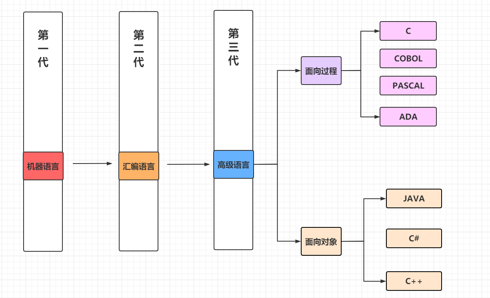


## 2.面向对象和面向过程的对比

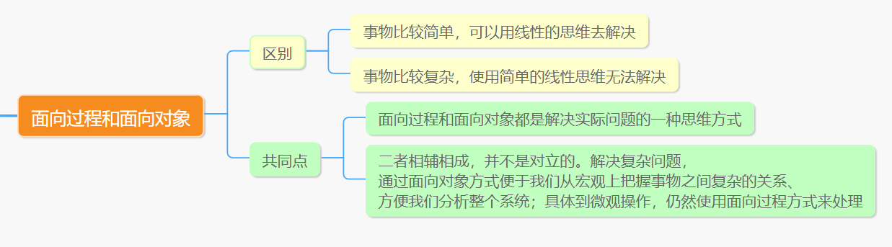

## 3.面向过程思想概述

​      面向过程的思想去实现一个功能的步骤

> ​        首先要做什么，怎么做，最后我们再代码体现。一步一步去实现，而具体的每一步都需要我们去实现和操作。这些步骤相互调用和协作，实现我们的功能。每一个步骤我们都是参与者，并且需要面对具体的每一个步骤和过程，这就是面向过程最直接的体现。


面向过程开发关心的就是每一步的实现，如果每一步都能够实现那么功能就能够实现，中间如果任何一个步骤出现问题，都会导致失败。

面向过程的代表语言：C语言


## 4.面向对象思想概述


> ​        面向过程的编程思想只能满足简单功能的实现，但在实际开发当中，项目的功能只会越来越多，不会越来越少，需求也是不断地变化的，可随着需求的更改，功能的增多，发现需要面向每一个过程就很麻烦了，并且程序的可维护性也是非常非常差的，能不能把这每一个步骤和功能再进行封装，根据不同的功能，进行不同的封装，功能类似的封装在一起。使用的时候，找到对应的类就可以了。这就是面向对象的思想。


1. OOA : 面向对象分析
2. OOD：面向对象设计
3. OOP：面向对象编程


## 5.面向对象编程初步

### 5.1 如何开汽车

事物比较`简单`，可以用线性的思维去解决

面向过程： 

1. 踩离合
2. 挂挡
3. 踩油门，放离合
4. 开了


面向对象：

1. 驾驶员
2. 汽车
3. 驾驶员开汽车(car.start();)


### 5.2 如何造汽车

​        事物比较复杂，使用简单的线性思维无法解决

面向过程：

	1. 造车轮
	2. 造发动机
	3. 造挡风玻璃
	4. 造车皮？
	5. .....

难点：很难决定上面这些步骤之间的关系！先造发动机还是先造车轮?  


面向对象：

车轮
	买橡胶
		到马来西亚
		找到橡胶厂
		掏钱买
		用船将橡胶运到国内
	造磨具
	将橡胶放入磨具
	出车轮
发动机
	….
车壳
	….
座椅
	…
挡风玻璃
	….
将上面的造出的东东，组装，汽车造出！


## 6.面向对象的好处

1. 面向对象也是基于面向过程的编程思想，但是面向对象相比于面向过程更符合我们的思维方式，万物皆对象。
2. 可以将复杂的问题简单化，大大提高了程序的可读性和可维护性
3. 面向过程思想中，我们是程序的**执行者**，面向对象当中，我们是程序的**调用者**，这样的话也可以方便程序给其他人调用，提高了程序的扩展性。


## 7.面向对象的特征

1. 封装(encapsulation)
2. 继承(inheritance)
3. 多态(polymorphism)
4. 抽象(abstract)


# 二、类和对象

现实世界是由什么组成的？


​               世界是由对象组成的


## 1.类和对象的概念

对象：是具体的事物

类：是对对象的抽象

> 对象：张三、李四、王五、赵六
>
> 抽取上述对象的相同的部分：
>
> ​         年龄、姓名、身高、体重、打牌、去隔壁老王家、唱歌、跳舞、打王者荣耀、吃鸡....


天使类：

具体的四个天使对象：


​    

抽象 他们的 **共同** 的特点

1. 带翅膀(带翅膀的不一定是天使，也可能是鸟人)
2. 女孩
3. 善良


## 2. Java类描述事物

​       目前我们已经可以用计算机来表示八大基本数据类型，但是我们在开发的时候还要存储其他的数据，比如 一个人，一条狗，一张图片，一个视频等等，这种情况我们应该怎么实现？

​       我们学习编程语言的目的就是为了模拟现实世界的事物，实现信息化。其实呢在计算中使用Java语言模拟现实时间是很简单的，Java为我们提供了 `类`,所有Java是通过 `类` 来描述世界的 

现实生活中如何描述一个事物：

1. 属性  该事物的特征描述
2. 行为  方法，该事物的动作行为

举个栗子描述：表示一条狗

1. 属性   狗的品种  狗的颜色  狗的体重
2. 行为   跳  叫  睡  吃  


我们学习Java语言的最基本单位是类，在Java中使用 **类** 来描述事物


## 3.类和对象的关系

类：类是抽象的，是一组相关的属性和行为的集合，可以看出一个模板

对象：对象是具体的，是客观存在的实例，是该类事物的具体体现

> 举例： 老婆  翠花 = new 老婆();
>
> 类: 老婆 是一个类
>
> 对象: new 老婆(); 是一个对象， 取了一个名字叫 翠花
>
> 引用  叫 翠花相当于叫了老婆对象


对象的特征：

属性：对象具有的各个特征

每个对象的每个属性都拥有特定值

 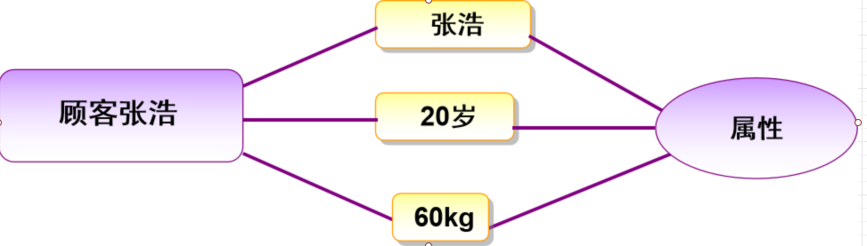


行为：对象执行的操作

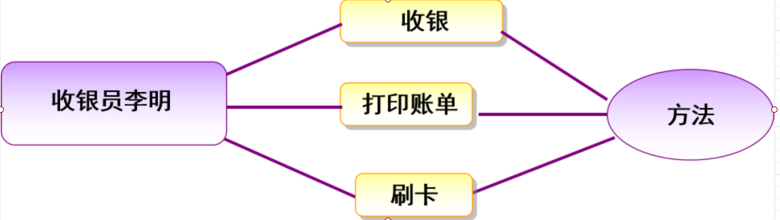


对象：用来描述客观事物的一个实体，由一组属性和方法构成

列举出图片中的这辆跑车的属性和方法

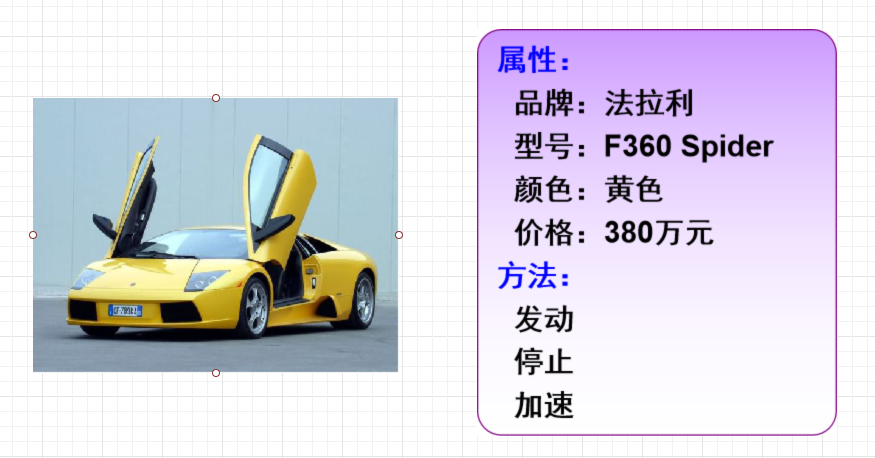


列举出下图小狗的属性和行为

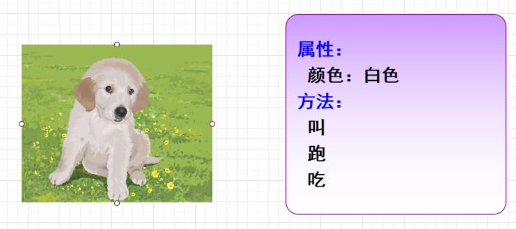


类是抽象的概念，仅仅是模板，比如说: 人

对象是一个你能够看得到。摸得着的具体的实体


## 4.类和对象的具体使用

### 4.1 类的定义

类的理解：

1. 类是用于来描述实现事物的
2. 类是抽象
3. 类是一个模板、是属性和方法的集合
4. 类是Java中最基础的单位
5. Java中使用class类描述类


Java中使用class类来描述类

1. 成员变量：表示的是事物的属性【人：姓名 身高 体重】
2. 成员方法：表示的是事物的行为【吃 喝 睡 跑 学习...】


语法格式:

```java
[访问权限修饰符] class 类名{
    成员变量;
    成员方法;
}
```


### 4.2 对象的创建和使用

对象的理解：

1. 对象的可观存在的，是具体
2. 万事万物皆对象
3. 对象是通过类刻画出来的
4. 对象我们又称为实例，对象、引用、变量...


#### 4.2.1 对象的创建

语法格式:

```java
类名 对象名 = new 类名();
```

具体的创建：

```java
    /**
     * 程序的入口
     * @param args
     */
    public static void main(String[] args) {
        // 创建一个Dog对象
        Dog wangcai = new Dog(); // 创建了一个Dog对象
        System.out.println(wangcai);
        Dog xiaoming = new Dog();
        System.out.println(xiaoming);
    }
```


#### 4.2.2 对象的使用

​	上面我们通过`new` 关键字创建了一个`Dog`对象。然后我们想要获取Dog对象的属性和调用Dog的方法。这时我们需要通过'.'进行操作。

1. 引用属性：对象名.属性
2. 调用方法: 对象名.方法名()

案例代码：

```java
public class DemoOOP1 {
    /**
     * 程序的入口
     * @param args
     */
    public static void main(String[] args) {
        // 创建一个Dog对象
        Dog wangcai = new Dog(); // 创建了一个Dog对象
        System.out.println(wangcai);
        //获取相关的属性信息
        System.out.println(wangcai.age);
        System.out.println(wangcai.color);
        System.out.println(wangcai.name);
        // 我们也可以对属性做相关的赋值操作
        wangcai.name = "旺财";
        wangcai.age = 5;
        wangcai.color = "白色";
        System.out.println("--------sout---soutv---------");
        System.out.println("名称 = " + wangcai.name);
        System.out.println("年龄:"+wangcai.age);
        System.out.println("颜色 = " + wangcai.color);
        System.out.println("-----------对象方法的调用---------");
        // 成员方法的调用
        wangcai.eat();
        wangcai.jump();
        Dog xiaoming = new Dog();
        System.out.println(xiaoming);
    }
}

class Dog{
    // --- 定义相关的属性
    // 姓名
    String name;
    // 年龄
    int age;
    // 颜色
    String color;

    // 定义相关的方法
    public void eat(){
        System.out.println("吃大骨头...");
    }

    public void jump(){
        // sout
        System.out.println("跳跃");
    }

}
```


#### 4.2.3 课堂案例

1.编写一个学生类，输出学生的相关信息

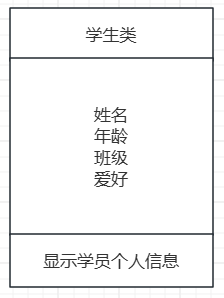

```java
public class DemoOOP2 {
    public static void main(String[] args) {
        // 创建学生对象
        Student zs = new Student();
        // 输出学生信息
        zs.printInfo();
    }
}

// 定义一个学生类
class Student{
    // 定义相关的属性信息 姓名 年龄 班级 爱好
    String name;
    int age;
    String className;
    String hobby;

    // 定义相关的行为  打印学生信息
    public void printInfo(){
        System.out.println("name="+name+"\t age="+age
                + "\t className="+className+"\t hobby="+hobby);
    }
}

```


2.编写一个教员类，输出相关的信息

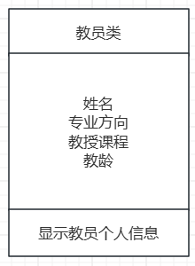

```java
public class DemoOOP3 {
    public static void main(String[] args) {
        Teacher zl = new Teacher();
        zl.teacherName = "张三丰";
        zl.major = "数学";
        zl.printInfo();
    }
}

class Teacher{
    String teacherName; // 姓名
    String major; // 专业
    String course; // 课程
    String teachingAge; // 教龄

    public void printInfo(){
        System.out.println("teacherName='" + teacherName + '\'' +
                ", major='" + major + '\'' +
                ", course='" + course + '\'' +
                ", teachingAge='"+teachingAge);
    }

}
```


3.定义一个管理员类

1. 定义一个管理员类Administrator
2. 定义相关的属性和方法
3. 定义一个测试类TestAdministrator
4. 创建两个管理员类的对象，并输出他们的信息


```java
package com.boge.oop1;

/**
 * 管理员类
 *    属性：
 *      账号
 *      密码
 *    行为：
 *      登录
 *      注销
 */
public class Administrator {
    // 账号
    String  userName;
    // 密码
    String password;

    /**
     * 判断账号密码是否正确
     * @return
     */
    public boolean login(){
        System.out.println("账号登录...");
        if("zhangsan".equals(userName) && "123".equals(password)){
            return true;
        }
        return false;
    }

    public void logout(){
        System.out.println("退出登录...");
    }
}


package com.boge.oop1;

public class TestAdministrator {

    /**
     * 创建两个管理员类的对象，并输出他们的信息
     * @param args
     */
    public static void main(String[] args) {
        Administrator admin = new Administrator();
        admin.userName = "zhangsan";
        admin.password = "123";
        System.out.println(admin.userName + "\t" + admin.password);
        boolean login = admin.login(); // 调用登录的方法
        System.out.println("login = " + login);

        Administrator root = new Administrator();
        root.userName = "lisi";
        root.password = "111";
        System.out.println(root.userName + "\t" + root.password);
        boolean login1 = root.login();
        System.out.println("login1 = " + login1);
    }
}
```


### 4.3 对象的内存分析

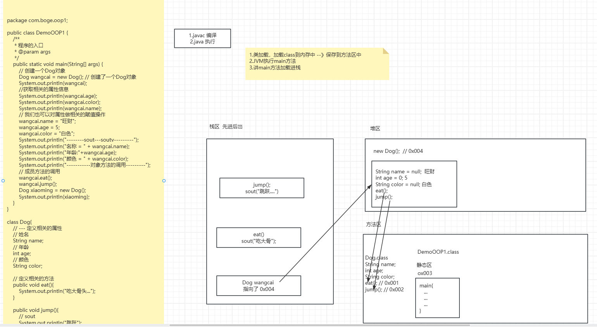


## 5.局部变量和成员变量

变量：非常容易搞混淆的。大家刚开始学习要注意!!!!

1. 局部变量
2. 成员变量


### 5.1 定义的位置不同

成员变量：定义在类体以内，方法体以外

局部变量：定义在方法体内或者声明在方法的形参中

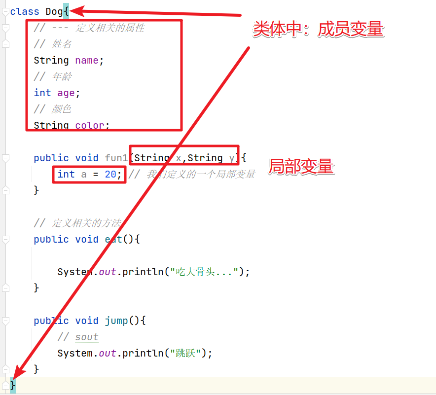


### 5.2 在内存中的位置不同

成员变量：在堆内存中存储

局部变量：在栈区中存储

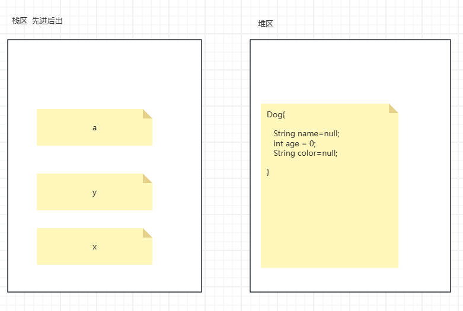


### 5.3 初始化的值不同

成员变量：有默认值，可以不赋初值

局部变量：没有默认值的。所有的局部变量在使用之前必须赋值

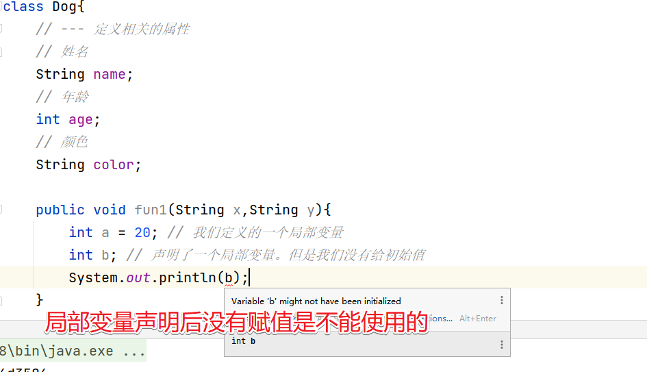


### 5.4 生命周期不同

生命周期：一个变量从创建到销毁的过程

成员变量：随着对象的创建而创建，随着对象的销毁而销毁，具体的结束时间是在垃圾回收器空闲的时候销毁

局部变量：随着方法的调用而创建，随着方法的结束而销毁


### 5.5 局部变量和成员变量重名的情况

当局部变量和成员变量重名的情况下，局部变量优先级要高于成员变量【就近原则】

```java
class Dog{
    // --- 定义相关的属性
    // 姓名
    String name;
    // 年龄
    int age;
    // 颜色
    String color;

    public void fun1(String x,String y){
        int a = 20; // 我们定义的一个局部变量
        int b; // 声明了一个局部变量。但是我们没有给初始值
        b = 1;
        System.out.println(b);
    }

    // 定义相关的方法
    public void eat(){
        System.out.println("吃大骨头..."+name);
        // 生命了一个局部变量，局部变量和成员变量同名
        String name = "小白";
        System.out.println("吃大骨头..."+name);
    }

    public void jump(){
        // sout
        System.out.println("跳跃");
    }
}
```


## 6.值传递还是引用传递

### 6.1 基本数据类型

基本数据类型作为方法的形参，形参的改变不会影响实际的参数，传递的是值本身

```Java
/**
 * 值传递和引用传递
 */
public class DemoOOP4 {
    public static void main(String[] args) {
        Demo d = new Demo();
        int x = 10; // 局部变量
        System.out.println("方法调用前x = " + x );

        d.change(x); // 基本数据类型是 值传递

        System.out.println("方法调用后x = " + x );
        
    }
}

class Demo{
    public void change(int a){
        a += 5; // 局部变量
        System.out.println("方法中的a = " + a);
    }

    public void changePerson(Person person){
        person.name = "李四";
        person.age = 22;
        System.out.println("方法调用中的Person信息：" + person.name +"\t" + person.age);
    }
}
```

打印结果

```txt
方法调用前x = 10
方法中的a = 15
方法调用后x = 10
```


### 6.2 引用数据类型

引用数据类型作为形参，形参的改变会影响实际参数，传递的是地址值

```java 

/**
 * 值传递和引用传递
 */
public class DemoOOP4 {
    public static void main(String[] args) {
        Demo d = new Demo();
        int x = 10; // 局部变量
        System.out.println("方法调用前x = " + x );

        d.change(x); // 基本数据类型是 值传递

        System.out.println("方法调用后x = " + x );
        System.out.println("---------自定义类型----------");
        Person person = new Person();
        person.name = "张三";
        person.age = 18;

        System.out.println("方法调用前person: " + person.name +"\t" + person.age);
        d.changePerson(person); // 引用传递
        System.out.println("方法调用后person: " + person.name +"\t" + person.age);
    }
}

class Demo{
    public void change(int a){
        a += 5; // 局部变量
        System.out.println("方法中的a = " + a);
    }

    public void changePerson(Person person){
        person.name = "李四";
        person.age = 22;
        System.out.println("方法调用中的Person信息：" + person.name +"\t" + person.age);
    }
}

/**
 * 自定义类型
 */
class Person{
    public String name;
    public int age;
}

```

打印结果

```txt
方法调用前x = 10
方法中的a = 15
方法调用后x = 10
---------自定义类型----------
方法调用前person: 张三	18
方法调用中的Person信息：李四	22
方法调用后person: 李四	22
```


## 7. 匿名对象

没有名次的对象我们称为匿名对象

```java
new Demo();
new Demo().change(22);
```

匿名对象的特点：

1. 对象只会被使用一次，作为调用者来说之后就获取不到这个对象
2. 如果对象只需要使用一次的话，那么我们就可以使用匿名对象
3. 匿名对象一旦使用完成就会自动释放，节约内存资源
4. 作为方法的实际参数传递会比较方便


# 三、常见的几个关键字

## 1. 封装(private)

​	隐藏对象的属性和方法的实现，仅仅对外提供公共的访问方式。封装的特点：

1. 隐藏了功能的实现过程，外界只需要通过公共的方法访问即可
2. 提高了代码的复用性
3. 提高了代码的安全性

## 2. private

​	private 关键字是一个访问权限修饰符。private的特点：

1. 修饰的成员不能被外界直接访问
2. 虽然不能被外界访问，但是可以在本类中是可以直接访问

```java

public class DemoOOP2 {
    public static void main(String[] args) {
        IPhone phone = new IPhone();
        // 设置相关的属性信息
        phone.setBrand("iphone15Plus");
        phone.setColor("中国红");
        phone.setPrice(1234.5);
        System.out.println(phone.getBrand() + "\t" + phone.getColor() + "\t" + phone.getPrice());
    }
}

/**
 * 封装一个手机类
 */
class IPhone{

    private String brand; // 品牌
    private String color;// 演示
    private double price; // 价格

    public void setBrand(String b){
        brand = b;
    }
    public void setColor(String c){
        color = c;
    }

    public void setPrice(double p){
        price = p;
    }

    public String getBrand(){
        return brand;
    }

    public String getColor(){
        return color;
    }

    public double getPrice(){
        return price;
    }
}
```


## 3. 课堂案例

代码演示封装一个苹果手机类

```java

public class DemoOOP2 {
    public static void main(String[] args) {
        IPhone phone = new IPhone();
        // 设置相关的属性信息
        phone.setBrand("iphone15Plus");
        phone.setColor("中国红");
        phone.setPrice(1234.5);
        System.out.println(phone.getBrand() + "\t" + phone.getColor() + "\t" + phone.getPrice());
    }
}

/**
 * 封装一个手机类
 */
class IPhone{

    private String brand; // 品牌
    private String color;// 演示
    private double price; // 价格

    public void setBrand(String b){
        brand = b;
    }
    public void setColor(String c){
        color = c;
    }

    public void setPrice(double p){
        price = p;
    }

    public String getBrand(){
        return brand;
    }

    public String getColor(){
        return color;
    }

    public double getPrice(){
        return price;
    }
}
```


## 4.this关键字

​      this:代表当前类的对象引用，其实这个`this`和我们现实生活中的很多案例相似，比如: 每个人都有一个名字，张三、 李四、 王五，代词，你，我，他等，`this`就相当于 `我`

为什么要使用this:

1. 成员变量和局部变量重名
2. 创建任意一个对象默认都会创建一个this的引用指向同一个堆区空间
3. this的设计就类似于实现生活中的代词 我的
4. 默认一个类的成员都会省略掉this关键字
5. 谁调用就是谁。this表示当前对象的引用
6. this只能够出现在类的内部。

this的本质就是一个对象，引用，实例，变量。只不过和创建的对象指向了同一个块堆区的空间，

使用this对堆的空间做了修改那么一样会修改对象本身。


应用场景：

1. 当成员变量和局部变量重名的情况
2. 当需要在类的内部访问本类的成员(成员变量和成员方法)
3. this访问本类的构造方法的时候(下节课就会介绍)


## 5.构造方法

构造方法的作用：能够在对象创建之后对对象的成员变量快速的赋值

普通方法的语法格式：

```java 
[访问权限修饰符] 返回类型 方法名(参数列表){
    方法体;
    return 返回值;
}
```

构造方法的语法格式:

```java
[访问权限修饰符]  类名(参数列表){
    方法体;
}
```


构造方法的特点：

1. 构造方法没有返回值，连`void`的关键字都没有
2. 构造方法的方法名必须和类名相同
3. 方法体一般都是用来完成成员变量赋值的
4. 如果我们没有显示的添加构造方法，那么系统默认会给我们提供一个无参的构造方法
5. 如果我们自己添加了构造方法。那么会覆盖掉系统提供的默认的构造方法
6. 构造方法可以重载
7. 可以通过`this`关键字实现构造器之间的相互调用，但是只能放在构造方法的第一行
8. 在书写任何一个Java类的时候。都应该加上无参构造方法。这是一个好的编程习惯。


通过Idea快速的生成构造方法

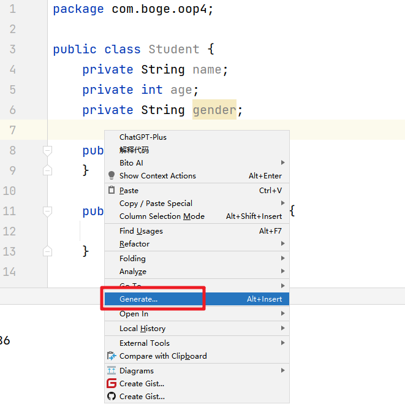

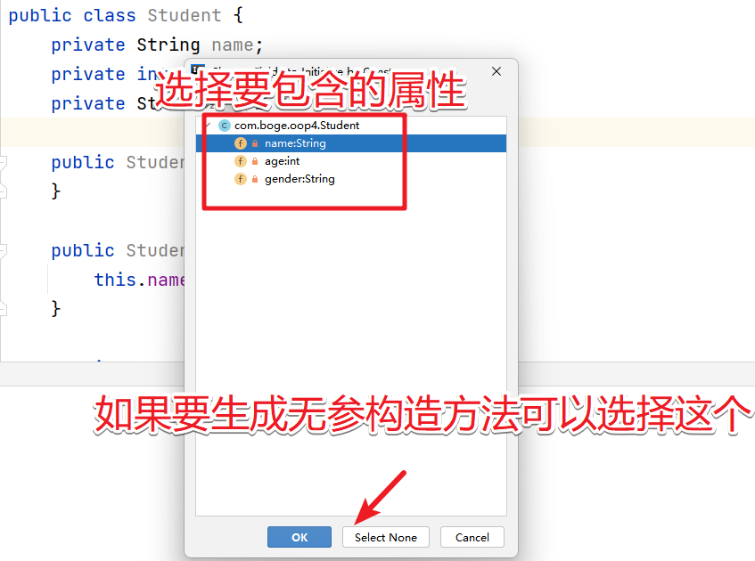

小结：一个最基本的java类，书写应该具备的特点：

1. 成员变量
2. 构造方法
   1. 无参构造方法
   2. 有参构造方法
3. 普通方法
   1. getter方法
   2. setter方法


```java
package com.boge.oop4;

public class Student {
    // 成员变量
    private String name;
    private int age;
    private String gender;

    // 构造方法
    public Student() {
    }

    public Student(String name) {
        this.name = name;
    }

    public Student(int age) {
        this.age = age;
    }

    public Student(String name, int age, String gender) {
        this.name = name;
        this.age = age;
        this.gender = gender;
    }

    //  普通的  getter/setter 方法
    public String getName() {
        return name;
    }

    public void setName(String name) {
        this.name = name;
    }

    public int getAge() {
        return age;
    }

    public void setAge(int age) {
        this.age = age;
    }

    public String getGender() {
        return gender;
    }

    public void setGender(String gender) {
        this.gender = gender;
    }
}

```


## 6.面向对象综合小练习

1、定义一个长方形类,定义 求周长和面积的方法，然后定义一个测试类，进行测试。

```java
package com.boge.oop5;

/**
 * 1、定义一个长方形类,定义 求周长和面积的方法，然后定义一个测试类，进行测试。
 */
public class Demo1 {
    public static void main(String[] args) {
        Rectangle rectangle = new Rectangle(10,5);
        System.out.println("周长："+rectangle.getPermeter());
        System.out.println("面积："+rectangle.getArea());
    }

}

class Rectangle{

    // 成员变量
    private  int length; // 长度
    private  int width; // 宽度

    // 构造方法
    public Rectangle() {
    }

    public Rectangle(int length, int width) {
        this.length = length;
        this.width = width;
    }

    // 提供对象的 getter 和 setter 方法
    public int getLength() {
        return length;
    }

    public void setLength(int length) {
        this.length = length;
    }

    public int getWidth() {
        return width;
    }

    public void setWidth(int width) {
        this.width = width;
    }
    // 提供 获取 周长和面积的方法
    public int getPermeter(){
        return this.length * 2 + this.width * 2;
    }

    // 面积的方法
    public int getArea(){
        return this.length * this.width;
    }
}

```


2、封装一个学生类，有姓名，有年龄，有性别，有英语成绩，数学成绩，语文成绩，封装方法，求总分，平均分，以及打印学生的信息。

```java
package com.boge.oop5;

public class Demo2 {
    public static void main(String[] args) {
        Student student = new Student("张三",18,"男",66,99,76);
        System.out.println(student.getTotalScore());
        System.out.println(student.getAvgScore());
        student.printStudentInfo();
    }
}

/**
 * 2、封装一个学生类，有姓名，有年龄，有性别，有英语成绩，
 *   数学成绩，语文成绩，封装方法，求总分，平均分，以及打印学生的信息。
 */
class  Student{
    // 定义相关的属性信息
    private String name;
    private int age;
    private String gender;
    private double englishScore;
    private double mathScore;
    private double chineseScore;

    // 定义构造方法
    public Student() {
    }
    // 定义有参

    public Student(String name, int age, String gender, double englishScore, double mathScore, double chineseScore) {
        this.name = name;
        this.age = age;
        this.gender = gender;
        this.englishScore = englishScore;
        this.mathScore = mathScore;
        this.chineseScore = chineseScore;
    }
    // 省略 getter/setter方法
    public double getTotalScore(){
        return this.chineseScore + this.mathScore + this.englishScore;
    }

    public double getAvgScore(){
        return this.getTotalScore()/3;
    }

    public void printStudentInfo(){
        System.out.println("name="+this.name
                + "\t + age=" + this.age
                + "\t + gender=" + this.gender
                + "\t + chineseScore=" + this.chineseScore
                + "\t + englishScore=" + this.englishScore
                + "\t + mathScore=" + this.mathScore
        );
    }
}
```


3、定义一个“点”（Point）x  y   set  get类用来表示二维空间中的点。要求如下：
	A  可以生成具有特定坐标的点对象。
	B  提供可以设置坐标的方法。
	C  提供可以计算该点距离另一点距离的方法。
	D  提供可以计算三个点构成图形的面积的方法。
 面积可以使用海伦公式：边长分别为a,b,c   p=(a+b+c)/2
			 s=Math.sqrt(p*(p-a)*(p-b)*(p-c))

```java
package com.boge.oop5;

public class Demo3 {

    /**
     * 3、定义一个“点”（Point）x  y   set  get类用来表示二维空间中的点。要求如下：
     * 	A  可以生成具有特定坐标的点对象。
     * 	B  提供可以设置坐标的方法。
     * 	C  提供可以计算该点距离另一点距离的方法。
     * 	D  提供可以计算三个点构成图形的面积的方法。
     *  面积可以使用海伦公式：边长分别为a,b,c   p=(a+b+c)/2
     * 			 s=Math.sqrt(p*(p-a)*(p-b)*(p-c))
     * @param args
     */
    public static void main(String[] args) {
        Point p1 = new Point(1,3);
        Point p2 = new Point(4,7);
        Point p3 = new Point(2,9);
        System.out.println(p1.getDistance(p2));
        System.out.println(p1.getArea(p1,p2,p3));
    }
}

class Point{
    private double x;
    private double y;

    public Point() {
    }

    public Point(double x, double y) {
        this.x = x;
        this.y = y;
    }

    public double getX() {
        return x;
    }

    public void setX(double x) {
        this.x = x;
    }

    public double getY() {
        return y;
    }

    public void setY(double y) {
        this.y = y;
    }

    /**
     * 获取当前对象到另一个点的距离
     * @return
     */
    public double getDistance(Point p){
        double _x = this.x - p.x; // x 轴之间的距离
        double _y = this.y - p.y; // y 轴之间的距离
        //return Math.sqrt(_x*_x + _y*_y);
        return Math.sqrt(Math.pow(_x,2)+Math.pow(_y,2));
    }

    /**
     * 计算任意两点之间的距离
     * @param
     * @return
     */
    public double getDistance(Point p1,Point p2){
        double _x = p1.x - p2.x; // x 轴之间的距离
        double _y = p1.y - p2.y; // y 轴之间的距离
        //return Math.sqrt(_x*_x + _y*_y);
        return Math.sqrt(Math.pow(_x,2)+Math.pow(_y,2));
    }

    /**
     * 面积可以使用海伦公式：边长分别为a,b,c   p=(a+b+c)/2
     *  			 s=Math.sqrt(p*(p-a)*(p-b)*(p-c))
     * @return
     */
    public double getArea(Point p1,Point p2,Point p3){
        double a = getDistance(p1,p2);
        double b = getDistance(p1,p3);
        double c = getDistance(p2,p3);
        double p = (a+b+c)/2;
        return Math.sqrt(p*(p-a)*(p-b)*(p-c));
    }
}

```


## 7.static 关键字

​     static修饰的变量我们叫静态变量/共享变量/类变量

static的特点：

1. 静态变量属于某个类，而不属于某个具体的对象
2. 只有静态才能访问静态，非静态变量不能够出现在静态方法中
3. 访问静态成员的方式
   1. 类名.成员变量
   2. 类名.成员方法
4. 静态环境下不能出现`this`和`super`关键字
5. static能够修饰的成员(成员变量，成员方法，修改类 内部类)
6. 我们开发自己的工具类的时候会经常用到static

案例代码：

```java
package com.boge.oop6;

public class Demo1 {
    public static void main(String[] args) {
        System.out.println(Person.colour);
        System.out.println(Person.country);
        Person.eat();
        Person.jump();
        // static所修饰的方法和属性我们可以直接通过 类名.xxx 访问。同时我们也可以通过对象来访问
        Person person = new Person();
        System.out.println(person.country);
        System.out.println(person.colour);
        person.jump();
        person.eat();
    }
}

class Person{
    String age;
    static String country = "中国"; // 国家
    static String colour = "黄皮肤"; // 肤色

    public static void eat(){
        // this.age = 18; // 我们是先有类。然后才有对象
        System.out.println("eat ....");
    }

    public static void jump(){
        System.out.println("jump ...");
    }
}
```


## 8.代码块

​    使用`{}`包裹的就是代码块

### 8.1 局部代码块

​	定义在类的局部位置，定义在方法中，作用：限定局部变量的作用域

```java
    public void eat(){
        int a = 10;
        { // 局部代码块
            int c = 20;
            System.out.println(c+a);
        }
        // System.out.println(c); 限定局部变量的作用域
        int b = 20;
    }
```


### 8.2 构造代码块

​	定义在类的成员变量的位置，用来抽取多个构造方法的重复的代码，完成成员变量的初始化操作，执行的顺序会优先于构造方法的执行

```java 
    {
        this.name = "aaa";
        this.age = 18;
        System.out.println("普通代码块执行了...");
    }
    // 静态代码块：完成静态成员变量的初始化操作
    static{
        country = "中国";
        colour = "黄色";
        System.out.println("静态代码块执行了....");
    }
```


###  8.3 静态代码块

​	static修饰的代码块称为静态代码块，作用：一般用于完成静态成员变量的初始化操作，静态代码块只会执行一次，在类加载的时候执行。

```java
// 静态代码块：完成静态成员变量的初始化操作
static{
    country = "中国";
    colour = "黄色";
    System.out.println("静态代码块执行了....");
}
```

这三者之间的执行顺序：

1. 静态代码块 > 构造代码块 > 构造方法 > 普通代码块
2. 静态代码块执行一次，在类加载的时候
3. 构造代码块和构造方法是在对象创建的时候执行，可以执行很多次
4. 局部代码块是和方法绑定


##  9. package和import关键字

### 9.1 为什么样要使用package

1. 可以处理类重名的问题
2. 方便管理数目众多的类

### 9.2 包的语法格式

`包`(package)的本质就是`文件夹`

格式

```java
package 包名; // 包名表示的是当前这个类 所处的文件夹路径  
```

有了这个路径我们就可以将当前类供其他类来使用

在使用其他类的功能使用有几个要注意点

1. 在同一个包下面的类可以直接使用
2. 在Java中 java.lang 包下面的所有的类型可以直接使用
3. 除了以上两点其他类型的使用我们都必须通过`import`关键字来导入才开以使用


### 9.3 import的语法格式

import语法格式

```java
import 类的全路径;
```


包名：满足标识符的规则和规范即可


注意事项：

1. 同包下不需要导包
2. java.lang 下面所有的类也不需要导包
3. 如果一个类没有包名，那么该类将不会被其他包所导入
4. 建议 先创建包 再创建类
5. 包的声明必须出现在第一句，注释除外，package语句在一个java文件中只能出现一句
6. 我们需要使用到某个包下面的多个类型，那么这时候我们可以通过 包名.*；的方式使用
7. 如果一个类文件需要使用到两个包下同名的类型，一个通过import来导入，两个通过代码中全路径指定的方式来实现
8. 在定义类的时候不要和系统名相同


## 10. JavaDoc生成API文档

通过idea工具来快速生成

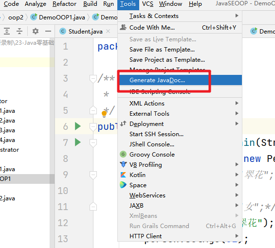

设置生成的相关信息：`-encoding UTF-8 -charset UTF-8`

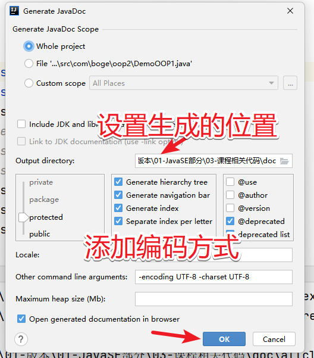

生成的效果

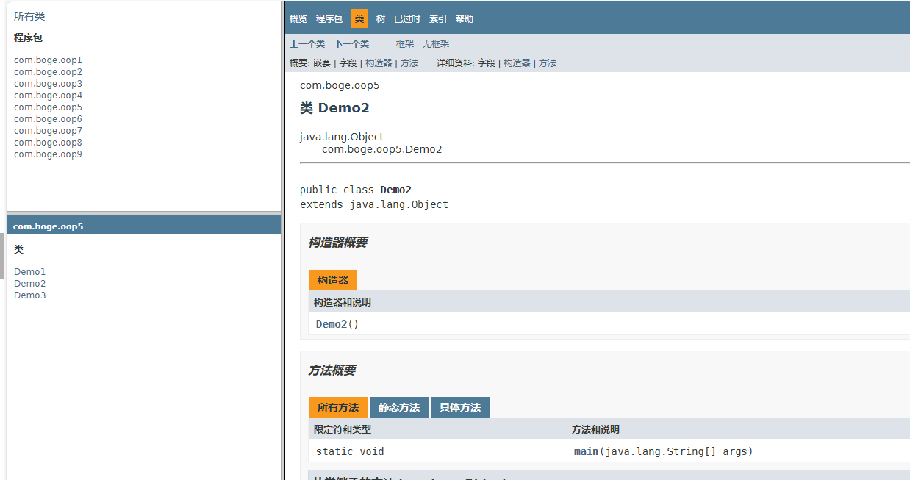


继承+多态+封装【private】


# 四、继承

## 1.继承的语法格式

格式

```java
class 子类名称 extends 父类名称{
    
}
```

被继承的这个类称为`父类`、 基类或者 超类

继承的这个类称为`子类` 或者 派生类


## 2. 继承的案例

父类：

```java
package com.bobo.oop08;

/**
 * 这是个Person类，抽取了 Student、Doctor、Police三个类的公共代码
 * @author dpb
 *
 */
public class Person {
	
	public String name;

	public int age;

	public String gender;

	public void sleep() {
		System.out.println("sleep .... ");
	}
}

```


Student,Police,Doctor三个子类

```java
package com.bobo.oop08;

/**
 * 这是一个学生类
 * @author dpb
 *
 */
public class Student extends Person{
	
	public String stuNo; // 学生编号
	
	public void study(){
		System.out.println("study ....");
		
	}
}

```


Police

```java
package com.bobo.oop08;

/**
 * 这是一个警察类
 * @author dpb
 *
 */
public class Police extends Person{
	
	public String policeNo; // 警员编号
	
	
	/**
	 * 抓坏人的方法
	 */
	public void catchBadGuys(){
		System.out.println(".....");
		
	}
}

```

Doctor

```java
package com.bobo.oop08;

/**
 * 这是一个医生类
 * @author dpb
 *
 */
public class Doctor extends Person{
	
	
	public String doctorNum; // 医生编号
	
	public String department; // 部门
	
	
	public void savePeople(){
		System.out.println("save ...");
	}
}

```


## 3.继承的好处

1. 简化了代码
2. 提高了代码的可维护性
3. 提高了扩展性


## 4.继承的缺点

开发设计思想：高内聚低耦合(尽量在一个类里面内聚，类和类之间的关系尽量保持独立)

继承后耦合性提高，牵一发动全身， 这个缺点不能改进，在Java中里面尽量不要使用继承


## 5. 继承的注意事项

1. 继承是对一批类的抽象，类是对一批对象的抽象
2. Java中只支持`单继承`，不支持多继承，但是支持多层继承
3. 子类可以继承父类private修饰的属性和方法，但是不可见
4. 子类不可以继承父类构造方法【创建对象的时候，子类的构造方法在第一行会调用父类的构造方法】
5. 子类除了继承父类的属性和方法以外，还可以添加自己的属性和方法


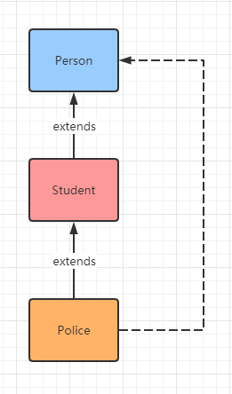


## 6. 怎么使用继承

继承的本质是什么？ --> 简化代码

1. 先写出所有的子类，观察子类共有的成员变量和成员方法
2. 抽象出共同点，书写出父类
3. 让子类区继承父类，并把子类中的共有属性删除


## 7.课堂案例

1、定义一个人类(姓名，年龄，性别，吃，睡) ，学生类继承人类(学号，班级，课程) ，老师类继承人类(工号，教龄，教书)

```java
package com.bobo.oop09;

/**
 * 姓名，年龄，性别，吃，睡
 * @author dpb
 *
 */
public class Person {

	public String name;
	
	public int age;
	
	public String gender;
	
	public void eat(){
		System.out.println("Person.eat() ....");
	}
	
	public void sleep(){
		System.out.println("Person.sleep() ...");
	}
}

```


```java
package com.bobo.oop09;

/**
 * 老师类继承人类(工号，教龄，教书)
 * @author dpb
 *
 */
public class Teacher extends Person{

	public String workNum;
	
	public int schoolAge;
	
	public String course;
	
	
}
```


```java
package com.bobo.oop09;

/**
 * 学生类继承人类(学号，班级，课程)
 * @author dpb
 *
 */
public class Student extends Person{
	
	public String stuNo;
	
	public String className;
	
	public String course;
	
}
```


## 8. super关键字

​     `super`关键字可以理解为 父类对象，`this`关键字表示当前对象

      1. 当一个属性的使用没有添加`this`或者`super`关键字,那么他的查找顺序是  局部变量-->成员变量-->父类变量  如果还没有找到那么就会包编译异常。
      1. 被this修饰的变量，如果本类的成员变量中没有找到，同样也会去父类中查找
      1. 被super修饰的变量只会从父类中查找，如果父类中没有，而子类中存在，同样会报编译错误


super和this关键字访问成员的区别

成员变量

1. this.成员变量
2. super.成员变量  super 是不能访问私有的成员变量的，可以通过访问对应的共有方法实现


成员方法：

1. this.成员方法
2. super.成员方法


构造方法：

1. this(参数列表);

2. super(参数列表);

   任何一个构造方法都默认的会在构造方法的第一句上写上 super(); 访问父类的无参构造方法

   目的是初始化父类的成员变量

   Constructor call must be the first statement in a constructor

super和this方法构造方法都必须出现在构造方法的第一句，this和super在方法构造方法的时候，二者是不能共存

```java
package com.boge.obj2.oop5;

public class Father {

    public int num = 10;
    private int age; // 子类也是没有办法直接使用的，这时我们可以通过共有的方法来提供
    public String address;

    public void eat(){
        System.out.println("father eat ... ");
    }

    public Father(){
        System.out.println("father 。。。 无参构造方法");
    }

    public Father(int num) {
        this.num = num;
    }

    public int getAge(){
        return age;
    }
}

package com.boge.obj2.oop5;

public class Son extends Father{

    public int num = 30; // 成员变量

    public String gender;

    /**
     * 在使用变量的时候
     *   局部变量--》成员变量--》父类中的变量
     */
    public void show(){
        int num = 50; // 局部变量
        // 局部变量的输出
        System.out.println("num = " + num);
        // 成员变量的输出
        System.out.println("num = " + this.num);
        // 父类变量的输出
        System.out.println("num = " + super.num);
        System.out.println(this.address);
        //System.out.println(super.gender);
        System.out.println(super.getAge());
        eat();
    }

    public Son(){
        super(); // 父类构造方法的调用
        System.out.println("son ... 无参构造方法");
    }

    public Son(int num) {
        this();
        //super(num); // 调用父类中的有参的构造方法
    }
}

package com.boge.obj2.oop5;

public class DemoTest {
    public static void main(String[] args) {
        Son son = new Son();
        son.show();
    }
}

```


## 9. 访问权限修饰符

作用：表示被修饰的元素的访问权限

访问权限修饰符有四个： public protected [default] private

访问权限修饰符可以修饰的元素： 

1. 类  只有public、abstract和final能够修饰，或者不加【private和protected可以修饰内部类】
2. 成员变量
3. 成员方法


四个修饰符的特点

1. public修饰的成员对一切类可见
2. protected修饰的成员本包下面都可见，不同包下只有子类可见
3. default修饰的成员仅对同包下面的可见
4. private修饰的成员仅对本类可见


Java中的封装就是通过访问权限修饰符来实现的

访问权限修饰符的宽严的关系

```java
public  > protected  >  default  >  private
```

|                      | **public** | **protected** | **[default]** | **private** |
| -------------------- | ---------- | ------------- | ------------- | ----------- |
| 同一类中             | √          | √             | √             | √           |
| 同一包中子类、其它类 | √          | √             | √             |             |
| 不同包中子类         | √          | √             |               |             |
| 不同包中其它类       | √          |               |               |             |

## 10. 方法的重写

​         如果从父类继承的方法不能满足子类的需求的情况下，可以对其进行改写，这个过程叫方法的覆盖(override),也称为方法的重写，子类中出现了和父类中一模一样的方法声明，也称为方法的覆盖或者方法的复写。

方法的重写的规则

1. 方法名称相同
2. 参数列表相同
3. 返回值类型相同或者是其子类
4. 访问权限修饰符不能严于父类


方法重写的注意事项：

1. 父类中的私有的方法不能重写的
2. 构造方法不能被重写
3. 子类重写父类方法时，访问权限不能更低
4. 重载和重写的区别

面试题：

重载和重写的区别：

重载的定义：

1. 同一个类中
2. 方法名称相同
3. 参数列表不同
4. 和返回值及访问权限修饰符没有关系


|          | 位置 | 方法名 | 参数列表 | 返回值       | 访问权限修饰符 |
| -------- | ---- | ------ | -------- | ------------ | -------------- |
| 方法重写 | 子类 | 相同   | 相同     | 相同或者子类 | 不能严于父类   |
| 方法重载 | 同类 | 相同   | 不相同   | 没有关系     | 没有关系       |


## 11. 课堂案例讲解

（1）设计一个User类，其中包括用户名、口令等属性以及构造方法（至少重载2个）。获取和设置口令的方法，显示和修改用户名的方法等。编写应用程序测试User类。

```java
/**
 * （1）设计一个User类，其中包括用户名、口令等属性以及构造方法（至少重载2个）。
 * 获取和设置口令的方法，显示和修改用户名的方法等。编写应用程序测试User类。
 */
public class User {
    private String userName;
    private String password;

    public User(){

    }

    public User(String userName){
        this.userName = userName;
    }

    public User(String userName,String password){
        this(userName);
        this.password = password;
    }

    // 提供对应的getter和setter方法
    public String getUserName() {
        return userName;
    }

    public void setUserName(String userName) {
        this.userName = userName;
    }

    public String getPassword() {
        return password;
    }

    public void setPassword(String password) {
        this.password = password;
    }
}

package com.boge.obj3.demo1;

public class DemoTest {
    public static void main(String[] args) {
        User user = new User("张三","123");
        System.out.println(user.getUserName());
        System.out.println(user.getPassword());
    }
}
```


（2）定义一个Student类,其中包括用户名、密码、姓名、性别、出生年月等属行以及init()——初始化各属性、display()——显示各属性、modify()——修改姓名等方法。实现并测试这个类。

```java
package com.boge.obj3.demo2;

/**
 * （2）定义一个Student类,其中包括用户名、密码、姓名、性别、出生年月等属行
 *    以及init()——初始化各属性、display()——显示各属性、modify()——修改姓名等方法。实现并测试这个类。
 */
public class Student {
    private String userName;
    private String password;
    private String name;
    private String gender;
    private String birth;

    /**
     * 完成相关的属性的初始化操作
     * @param userName
     * @param password
     * @param name
     * @param gender
     * @param birth
     */
    public void init(String userName,String password,String name,String gender,String birth){
        this.userName = userName;
        this.password = password;
        this.name = name;
        this.gender = gender;
        this.birth = birth;
    }

    /**
     * 显示各个属性
     */
    public void display(){
        System.out.println("userName="+this.userName +"\t"
                    +"password="+this.password +"\t"
                +"name="+this.name +"\t"
                +"gender="+this.gender +"\t"
                +"birth="+this.birth +"\t"
        );
    }

    /**
     * 修改姓名
     * @param name
     */
    public void modify(String name){
        this.name = name;
    }

    public static void main(String[] args) {
        Student student = new Student();
        // 完成属性的初始化操作
        student.init("admin","123","波哥","男","2001");
        // 打印信息
        student.display();
        // 修改姓名
        student.modify("波哥666");
        // 再打印信息
        student.display();
    }
}

```


（3）从上题的Student类中派生出Granduate(研究生)类，添加属性：专业subject、导师adviser。重载相应的成员方法。并测试这个类。

```java
package com.boge.obj3.demo3;

import com.boge.obj3.demo2.Student;

/**
 * 从上题的Student类中派生出Granduate(研究生)类，添加属性：专业subject、导师adviser。重载相应的成员方法。并测试这个类。
 */
public class Granduate extends Student {
    private String subject;
    private String adviser;


    /**
     * 重载！！！
     *      实现子类成员变量的初始化操作
     * @param userName
     * @param password
     * @param name
     * @param gender
     * @param birth
     * @param subject
     * @param adviser
     */
    public void init(String userName, String password, String name, String gender, String birth,String subject,String adviser) {
        super.init(userName, password, name, gender, birth);
        this.subject = subject;
        this.adviser = adviser;
    }

    /**
     * 重写!!!
     */
    @Override
    public void display() {
        super.display();
        System.out.println("subject = " + subject +" adviser=" + adviser );
    }

    public static void main(String[] args) {
        Granduate granduate = new Granduate();
        granduate.init("admin","123","波哥","男","2001","计算机","小明");
        granduate.display();
    }
}

```


（4）创建两个具有继承结构的两个类，父类和子类均有自己的静态代码块、构造方法。观察他们的运行顺序。

```java
package com.boge.obj3;

/**
 * （4）创建两个具有继承结构的两个类，父类和子类均有自己的静态代码块、构造方法。观察他们的运行顺序。
 */
public class DemoTest {
    public static void main(String[] args) {
        Son s1 = new Son();
        Son s2 = new Son();
        Son s3 = new Son();
    }
}

class Father{

    static {
        System.out.println("father .... 静态代码块");
    }

    public Father(){
        System.out.println("father ... 构造方法");
    }

}

class Son extends Father{

    static {
        System.out.println("son .... 静态代码块");
    }

    public Son(){
        super();
        System.out.println("son .... 构造方法");
    }
}

```

输出结构：

```txt
father .... 静态代码块
son .... 静态代码块
father ... 构造方法
son .... 构造方法
father ... 构造方法
son .... 构造方法
father ... 构造方法
son .... 构造方法
```


（5）编写一个汽车类Car
	    编写一个宝马类BMW 继承Car
	    编写一个奔驰类Benz 继承Car
	    在三个类中都有一个run方法，表示不同车在跑
	    编写一个人类Person，不同的对象有不同的车

```java
package com.boge.obj3.demo5;

/**
 * （5）编写一个汽车类Car
 * 	    编写一个宝马类BMW 继承Car
 * 	    编写一个奔驰类Benz 继承Car
 * 	    在三个类中都有一个run方法，表示不同车在跑
 * 	    编写一个人类Person，不同的对象有不同的车
 */
public class DemoTest {
    public static void main(String[] args) {
        BMW bmw = new BMW();
        Benz benz = new Benz();
        
        Person p1 = new Person(bmw);
        Person p2 = new Person(benz);
    }
}
class Car{
    public void run(){
        System.out.println("run .... car");
    }
}
class BMW extends Car{
    @Override
    public void run() {
        System.out.println("run ... BMW");
    }
}

class Benz extends Car{
    @Override
    public void run() {
        System.out.println("run ... Benz");
    }
}

// 不同的对象用不同的车
class Person{
    private Car car;
    
    public Person(Car car) {
        this.car = car;
    }
    
}

```


（6）完成如下功能
	a.设计一个表示二维平面上点的类Point，包含有表示坐标位置的protected 类型的成员变量x 和y，获取和设置x 和y 值的public 方法。
	b.设计一个表示二维平面上圆的类Circle，它继承自类Point，还包含有表示圆半径的protected 类型的成员变量r、获取和设置r 值的public 方法、计算圆面积的public 方法。	
	c.设计一个表示圆柱体的类Cylinder，它继承自类Circle，还包含有表示圆柱体高的protected 类型的成员变量h、获取和设置h 值的public 方法、计算圆柱体体积的public方法。
	d.建立Cylinder 对象，输出其轴心位置坐标、半径、面积、高及其体积的值。

```java
package com.boge.obj3.demo6;

public class DemoTest {
    /**
     * （6）完成如下功能
     * 	a.设计一个表示二维平面上点的类Point，包含有表示坐标位置的protected 类型的成员变量x 和y，获取和设置x 和y 值的public 方法。
     * 	b.设计一个表示二维平面上圆的类Circle，它继承自类Point，还包含有表示圆半径的protected 类型的成员变量r、获取和设置r 值的public 方法、计算圆面积的public 方法。
     * 	c.设计一个表示圆柱体的类Cylinder，它继承自类Circle，还包含有表示圆柱体高的protected 类型的成员变量h、获取和设置h 值的public 方法、计算圆柱体体积的public方法。
     * 	d.建立Cylinder 对象，输出其轴心位置坐标、半径、面积、高及其体积的值。
     * @param args
     */
    public static void main(String[] args) {
        Cylinder cylinder = new Cylinder();
        cylinder.x = 1;
        cylinder.y = 1;
        cylinder.r = 2;
        cylinder.h = 2;
        System.out.println("圆心点坐标：" + cylinder.getX()+"," + cylinder.getY());
        System.out.println("圆的半径是：" + cylinder.getR());
        System.out.println("圆的面积："+cylinder.getArea());
        System.out.println("圆柱体的体积是："+cylinder.getVolume());
    }
}

class Point{
    protected int x;
    protected int y;

    public int getX() {
        return x;
    }

    public void setX(int x) {
        this.x = x;
    }

    public int getY() {
        return y;
    }

    public void setY(int y) {
        this.y = y;
    }
}

class Circle extends Point{
    protected int r;

    public int getR() {
        return r;
    }

    public void setR(int r) {
        this.r = r;
    }

    /**
     * 获取圆的面积方法
     * @return
     */
    public double getArea(){
        return Math.PI * this.r * this.r;
    }
}

class Cylinder extends Circle{
    protected int h;

    public int getH() {
        return h;
    }

    public void setH(int h) {
        this.h = h;
    }

    /**
     * 计算圆柱体体积的方法
     * @return
     */
    public double getVolume(){
        return super.getArea() * this.h;
    }
}

```

输出的结果

```txt
圆心点坐标：1,1
圆的半径是：2
圆的面积：12.566370614359172
圆柱体的体积是：25.132741228718345
```


## 12 final关键字

​	`final`关键字是`最终`的意思，可以用来修饰`类`,`属性`和`方法`。

### 12.1 修饰类

​	表示该类不能被继承。


### 12.2 修饰变量

​	变量会变为常量，只能赋值一次，之后就不能修改了，final修饰的变量我们称为常量，而且常量的名我们都大写，而且常量的名我们会通过static修饰。

```java
public class Student {
    public static final String name ;
    // final修饰的变量会变为常量，名称我们会统一大写
    public static final String USERNAME = "admin";

    static {
        name = "aaa";
        //name= "abcd";
    }

    public static void main(String[] args) {
        // final 类型的变量的值不能被修改
        // Student.name = "aaa";
        final int a ;
        a = 66;
        //a = 88;
        System.out.println(a);
    }
}

```


### 12.3 修饰方法

​	final修饰的方法，子类是不能重写该方法的！！！

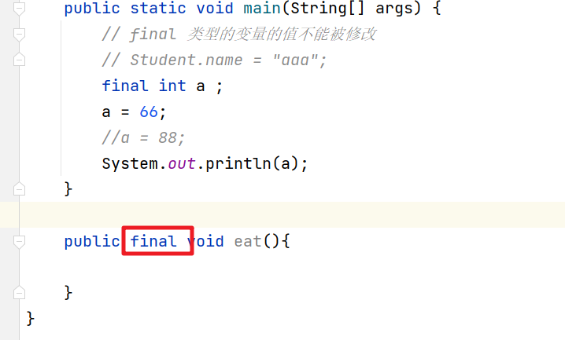


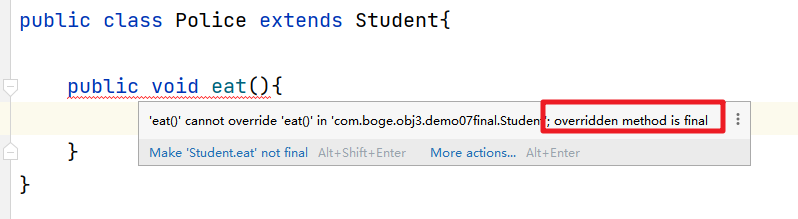


# 五、多态

## 1. 现实生活中的多态


> 老外来访被请吃饭。落座后，一中国人说：“我先去方便一下。”老外不解，被告知“方便”是“上厕所”之意。席间主宾大悦。道别时，另一中国人对老外发出邀请：“我想在你方便的时候也请你吃饭。”老外愣了，那人接着说：“如果你最近不方便的话，咱找个你我都方便的时候一起吃。”老外倒地……


生活中的多态：同一个动作在不同的环境下的不同的状态

我要去吃饭--》去哪吃 吃什么？

我要去打球--》到哪？打篮球还排球？


## 2.Java中的多态

​      同一个引用类型，使用不同的实例而执行不同的操作，即父类引用指向了子类对象

多态的实现：

1. 必须存在继承
2. 必须存在重写
3. 必须有父类引用指向子类对象  父类 fu = new 子类();


```java
package com.boge.obj4.oop1;

/**
 * 多态的介绍
 */
public class DemoTest {

    /**
     * 通过Java代码来实现多态的处理
     *    Cut操作
     * 不同的角色操作不一样
     *    理发师：剪头发
     *    医生：做手术
     *    演员：演戏
     * @param args
     */
    public static void main(String[] args) {
        // 把一个子类的实现赋值给了一个父类的引用
        CutMan cutMan1 = new Barber();
        CutMan cutMan2 = new Doctor();
        CutMan cutMan3 = new Actor();

        cutMan1.cut();
        cutMan2.cut();
        cutMan3.cut();
    }

}

class CutMan{
    public void cut(){
        System.out.println("CutMan.....");
    }
}

class Barber extends CutMan{
    @Override
    public void cut() {
        System.out.println("理头发...");
    }
}

class Doctor extends CutMan{
    @Override
    public void cut() {
        System.out.println("做手术");
    }
}

class Actor extends CutMan{
    @Override
    public void cut() {
        System.out.println("演戏中....");
    }
}


```

输出结果：

```txt
理头发...
做手术
演戏中....
```

## 3. 多态访问成员的特点

​        在多态(父类引用指向子类的实现)的情况下，我们访问引用相关的成员(成员变量，成员方法，构造方法，静态方法)时的情况

```java
父类类型  变量名 = new 子类名称();
```


### 3.1 成员变量

​        在多态中，成员变量不存在覆盖的情况，在访问的时候是直接访问的父类中的属性(狐狸有9条命，但是能说动物有9条命吗？)

### 3.2 成员方法

​	     在多态中，因为方法存在`重写` （覆盖）,所以在访问的时候执行的是子类中重写的方法

### 3.3 构造方法

​	     先执行父类的构造方法，可以帮助我们初始化父类的成员变量，然后在执行子类的构造方法中其他的代码来实现子类成员变量的初始化。


### 3.4 静态成员

​         在多态中，不会继承静态方法，因为静态方法是属于类的。所以在多态中我们调用静态方法那么执行的也是父类中的静态方法

## 4.多态的好处

多态的好处：

1. 简化代码
2. 提高了扩展性
3. 提高了程序的可维护性


多态的应用：

1. 使用父类作为一个方法的形参，如果一个父类作为参数，那么我们可以传入父类对象，也可以传入对应的子类，这就是多态的常见应用
2. 使用父类作为一个方法的返回值，暂时先不讲，在后面结合抽象类和接口统一介绍


```java
package com.boge.obj4.oop3;

public class DemoTest {

    /**
     * 设计原则：
     *    1.高内聚低耦合
     *    2.对扩展开放，对修改关闭
     *       当我们要去修改或者添加一个功能的时候，建议可以新增代码，但是不要修改原有的代码
     * @param args
     */
    public static void main(String[] args) {
        Feeder feeder = new Feeder();
        Panda p = new Panda();
        Bamboo bamboo = new Bamboo();
        feeder.feederPandaEatBamboo(p,bamboo);

        Tiger t = new Tiger();
        Meat meat = new Meat();
        feeder.feederTigerEatMeat(t,meat);
        System.out.println("--------");

        Animal a1 = new Pig();
        Animal a2 = new Panda();
        Animal a3 = new Tiger();

        Food f1 = new Bamboo();
        Food f2 = new Meat();
        Food f3 = new Fodder();

        feeder.feeder(a1,f1);
        feeder.feeder(a2,f2);
        feeder.feeder(a3,f3);

    }
}

/**
 * 饲养员
 */
class Feeder{
    /**
     * 给熊猫喂养竹子
     * @param p
     * @param b
     */
    public void feederPandaEatBamboo(Panda p, Bamboo b){
        p.show();
        b.show();
    }

    public void feederTigerEatMeat(Tiger t,Meat m){
        t.show();
        m.show();
    }

    /**
     * 方法的形参是 父类的引用
     *    执行的时候是具体的子类重写的方法
     *    这就是多态的体现
     * @param a
     * @param f
     */
    public void feeder(Animal a,Food f){
        a.show();
        f.show();
    }
}

/**
 * 动物
 */
class Animal{
    public void show(){
        System.out.println("什么也不做");
    }
}

class Panda extends  Animal{
    @Override
    public void show() {
        System.out.println("熊猫");
    }
}

class  Tiger extends Animal{
    @Override
    public void show() {
        System.out.println("老虎");
    }
}

class Pig extends Animal{
    @Override
    public void show() {
        System.out.println("猪");
    }
}

/**
 * 食物
 */
class Food{
    public void show(){
        System.out.println("什么也不做...");
    }
}

class Bamboo extends Food{
    @Override
    public void show() {
        System.out.println("竹子");
    }
}
class Meat extends Food{
    @Override
    public void show() {
        System.out.println("肉");
    }
}

class Fodder extends Food{
    @Override
    public void show() {
        System.out.println("饲料");
    }
}

```


## 5. 多态的缺点

​       在多态中如果我们想要调用子类特有的方法及属性时是实现不了

多态中的类型转换

> 向上转型（自动转换）
>
> 格式：<父类型> <引用变量名> = new <子类型>();
> 特点：
> 			子类转为父类  父类的引用指向子类对象。自动进行类型转换
> 			此时通过父类引用变量调用的方法是子类覆盖或继承父类的方法
> 			此时通过父类引用变量无法调用子类特有的属性和方法
>
> 向下转型（强制转换）
> 格式：<子类型> <引用变量名> = (<子类型> )<父类型的引用变量>;
> 特点：
> 			父类转为子类，父类引用转为子类对象。强制类型转换
> 			在向下转型的过程中，如果没有转换为真实子类类型，会出现类型转换异常

```java
package com.boge.obj4.oop4;

public class DemoTest {

    public static void main(String[] args) {
        Person p = new Student();
        p.eat();
        // 我想要调用子类中特有的方法 study

       // System.out.println(p.study());
        // 父类转换为子类  强制类型转换
        Student student = (Student) p;
        student.study();
        Person p1 = new Doctor();
        Student s2 = (Student) p1;
        s2.study();
    }
}

class  Person{
    public void eat(){
        System.out.println("父类中的 ,,, eat");
    }
}

class Student extends Person{

    @Override
    public void eat() {
        System.out.println("学生中的 ,,, eat");
    }

    public void study(){
        System.out.println("学习的方法");
    }
}

class Doctor extends Person{
    @Override
    public void eat() {
        System.out.println("子类 doctor eat");
    }

    public void save(){
        System.out.println("doctor save ....");
    }
}

```

父类强制转换为子类的时候如果类型不匹配会出现`ClassCastExecpetion`

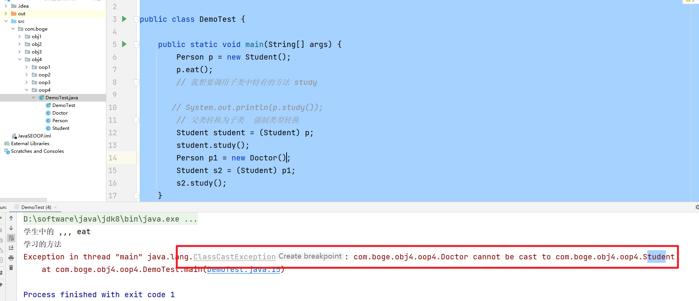


## 6. instanceof关键字

​	测试它左边的对象是否是它右边的类型的实例，如果是返回true否则返回false

记住：instanceof通常是和向下转型【强制类型转换】结合使用

```java
package com.boge.obj4.oop4;

public class DemoTest {

    public static void main(String[] args) {
        Person p = new Student();
        p.eat();
        // 我想要调用子类中特有的方法 study

       // System.out.println(p.study());
        // 父类转换为子类  强制类型转换
        Student student = (Student) p;
        student.study();
        Person p1 = new Doctor();
        // 强制类型转换，转换的时候有可能出现类型转换错误
        // instanceof 用来做对象类型的判断 可以帮助我们规避 java.lang.ClassCastExecption 异常
        if(p1 instanceof Student){
            Student s2 = (Student) p1;
            s2.study();
        }else if(p1 instanceof Doctor){
            Doctor d1 = (Doctor) p1;
            d1.save();
        }

    }
}

class  Person{
    public void eat(){
        System.out.println("父类中的 ,,, eat");
    }
}

class Student extends Person{

    @Override
    public void eat() {
        System.out.println("学生中的 ,,, eat");
    }

    public void study(){
        System.out.println("学习的方法");
    }
}

class Doctor extends Person{
    @Override
    public void eat() {
        System.out.println("子类 doctor eat");
    }

    public void save(){
        System.out.println("doctor save ....");
    }
}

```

## 7.课堂练习

课堂练习：

> 	实现主人与宠物玩耍功能
> 	和狗狗玩接飞盘游戏。
> 	和企鹅玩游泳游戏。
> 	编写测试类测试


案例代码

```java
package com.boge.obj4.oop5;

public class PetDemo {

    /**
     * 实现主人与宠物玩耍功能
     * 和狗狗玩接飞盘游戏。
     * 和企鹅玩游泳游戏。
     * 编写测试类测试
     * @param args
     */
    public static void main(String[] args) {
        Master master = new Master(); // 主人对象
        Pet p1 = new Dog();
        Pet p2 = new Penguin();
        master.play(p1);
        master.play(p2);
    }
}

/**
 * 主人类
 */
class Master{

    /**
     * 和宠物玩耍
     *  Pet pet =  new Dog();
     *  Pet pet =  new Penguin();
     */
    public void play(Pet pet){
        // 和不同的宠物玩耍。玩的内容也不一样。
        // 那么我们需要判断具体的宠物类型
        if(pet instanceof Dog){
            // 和 狗狗 玩耍
            Dog dog = (Dog) pet; // 向下转型
            dog.frisbee();
        }else if(pet instanceof Penguin){
            Penguin penguin = (Penguin) pet;
            penguin.swimming();
        }
    }
}

/**
 * 宠物类
 */
class Pet{
    String name;
    public void eat(){
        System.out.println("吃东西");
    }

}


/**
 * 宠物
 *    狗
 */
class Dog extends Pet{

    public void frisbee(){
        System.out.println("狗狗玩飞盘游戏...");
    }
}

/**
 * 企鹅
 *   宠物
 */
class Penguin extends Pet{
    public void swimming(){
        System.out.println("企业在游泳....");
    }
}

```


# 六、抽象类

​	Java中的抽象类是一种不能被实例化的类，它由关键字`abstract`修饰。抽象类可以包含抽象方法（没有实现的方法）和具体方法（有实现的方法）。抽象类是面向对象编程中继承的一个重要概念

## 1.抽象类的相关的概念

被abstract关键字修饰的类，就被称为抽象类

被abstract关键字修饰的方法，被称为抽象方法，抽象方法是没有方法体的,抽象方法必须定义在抽象类中

```txt
Abstract methods do not specify a body
The abstract method eat in type Pet can only be defined by an abstract class
```


```java
package com.bobo.oop09;

/**
 * 宠物类
 * @author dpb
 *
 */
public abstract class Pet {
	
	String name;
	
	/**
	 * 父类中的这个方法 我们可以仅仅定义为一个声明，具体的实现交给子类去实现即可
	 */
	public abstract void eat();

}
```


格式：

```java
// 抽象类
abstract class 类名{}
```

```java
// 抽象方法
abstract 返回值类型 方法名(参数列表);
```


## 2.抽象类的特点

1.抽象类和抽象方法一定要使用`abstract`关键字

2.抽象类中不一定有抽象方法

```java
/**
 * 抽象中不一定有抽象方法
 *    抽象方法一定要在抽象类中
 * @author dpb
 *
 */
public abstract class Person {

}
```

3.没有抽象方法的抽象类的存在意义是什么？ ---> 抽象类不能被实例化

​     不让外界创建对象

```java
Cannot instantiate the type Person
```


4.抽象类虽然不能被实例化，但是我们可以利用多态的思想类赋值

```java
public class OOPDemo01 {

	public static void main(String[] args) {
		//Person p = new Person();
		// Pet抽象  Dog是Pet的子类 Dog是一个普通类
		Pet p1 = new Dog();
		p1.eat();
	}
}
```


5.作为抽象类的子类应该怎么办

父类

```java
public abstract class Person {

	public abstract void say();
}
```


子类有两个选择：

​	 1.把子类自身也变为抽象类

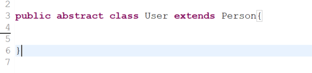


​	  2.子类实现父类中的所有的抽象方法

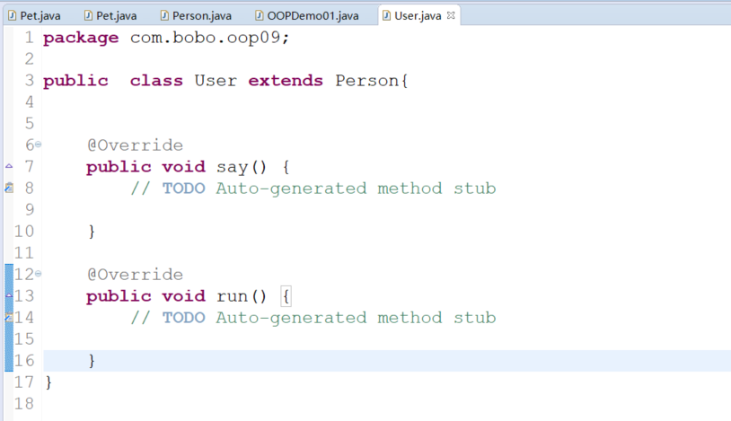


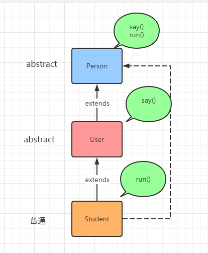


6.抽象类中可以包含哪些内容

成员变量，成员方法，常量，构造方法，静态方法，代码块，静态代码块都可以【普通类中的成员在抽象类中都可以有】

抽象类本身是不能够被实例化的，所以抽象类就是一个用类给子类服务的类


```java
package com.bobo.oop09;

/**
 * 抽象中不一定有抽象方法
 *    抽象方法一定要在抽象类中
 * @author dpb
 *
 */
public abstract class Person {
	
	// 普通的成员变量  定义的变量是给子类使用的
	String name;
	// final修饰的变量  常量
	final String COUNTRY = "中国";
	// 静态常量
	static final int MAX_VALUE = 99999;
	
	// 普通方法
	public void sleep(){
		
	}
	
	// 静态方法
	public static void play(){
		
	}
	// 构造方法
	public Person(){
		
	}
	
	{
		// 代码块也可以
	}
	
	static {
		// 静态代码块
	}
	
	public Person(String name){
		this.name = name;
	}

	public abstract void say();
	
	public abstract void run();
}

```


7.static,final,private是否可以修饰抽象方法

static和abstract：是不能够共存的。static是为方便调用，abstract为了给子类重写的，没有方法体

final和abstract：是相互冲突的，final修饰的方法不能被重写，而abstract修饰的方法就是为了让子类重写的。

private和abstract：也是冲突的，private修饰的方法不能够被继承，也就不能够被重写了，而abstract修饰的方法就是为了让子类重写的


综上所述：

1. 抽象类的所有的抽象方法都是用来给子类重写的
2. 抽象类的所有的非抽象方法也是用来给子类使用的
3. 抽象类的构造方法是用来给子类初始化父类继承过来的成员
4. 抽象类的成员变量也是用来给子类使用的
5. 抽象类就是一个彻头彻尾的服务类


## 3.课堂案例

​	编写交通工具类，具有前进run()功能，子类有自行车、小轿车、地铁，重写父类方法，主人有属性name,age属性，方法回家goHome(交通工具)，需要使用交通工具，使用抽象类来描述

```java
/**
 * 交通工具类
 */
public abstract class Traffic {
    public abstract void run();
}

public class Bicycle extends Traffic{
    @Override
    public void run() {
        System.out.println("骑自行车回家...");
    }
}

public class Car extends Traffic{
    @Override
    public void run() {
        System.out.println("开车小轿车回家...");
    }
}

public class Subway extends Traffic{
    @Override
    public void run() {
        System.out.println("回家太远了。坐地铁回去...");
    }
}

/**
 * 主人类
 */
public class Master {
    private String name;
    private int age;

    /**
     * 乘坐相关的交通工具回家
     */
    public void goHome(Traffic traffic){
        traffic.run();
    }

    public String getName() {
        return name;
    }

    public void setName(String name) {
        this.name = name;
    }

    public int getAge() {
        return age;
    }

    public void setAge(int age) {
        this.age = age;
    }
}
public class OOPDemo {
    /**
     * 编写交通工具类，具有前进run()功能，子类有自行车、小轿车、地铁，重写父类方法，
     * 主人有属性name,age属性，方法回家goHome(交通工具)，需要使用交通工具，使用抽象类来描述
     * @param args
     */
    public static void main(String[] args) {
        Master master = new Master();
        // 创建相关的交通工具对象
        Traffic bicycle = new Bicycle();
        Traffic car = new Car();
        Traffic subway = new Subway();
        master.goHome(bicycle);
        master.goHome(car);
        master.goHome(subway);
    }
}

```


static,final,abstract的比较

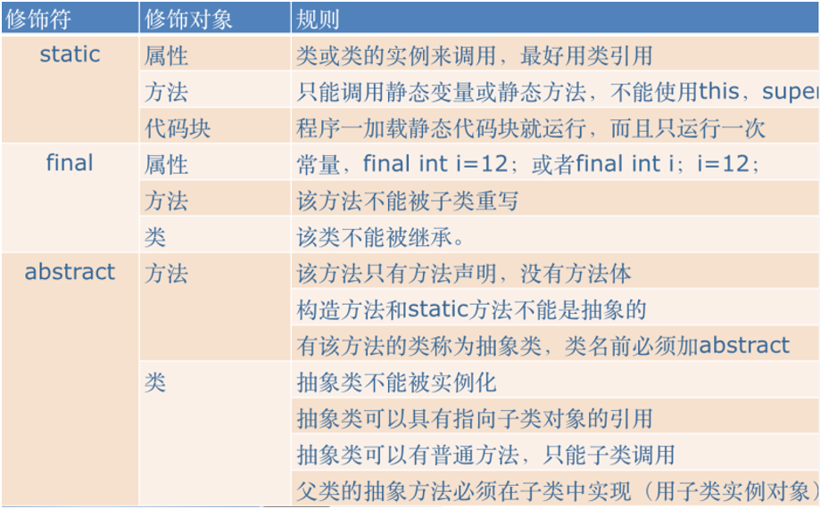


## 4.作业讲解

1.使用多态实现计算器的加减乘除，根据运算符不同实例化不同子类进行计算(运算符可键盘接收输入)
	例如：加法有num1、num2属性，方法：计算求和
              减法有num1、num2属性，方法：计算求差

```java
package com.boge.obj5abstract.hm;

import java.util.Scanner;

public class OOPDemo1 {
    /**
     * 1.使用多态实现计算器的加减乘除，根据运算符不同实例化不同子类进行计算(运算符可键盘接收输入)
     * 	例如：加法有num1、num2属性，方法：计算求和
     *       减法有num1、num2属性，方法：计算求差
     * @param args
     */
    public static void main(String[] args) {
        Scanner in = new Scanner(System.in);
        System.out.println("请输入操作符...");
        String operator = in.next();
        // 根据输入的对应的操作符获取对应的操作对象
        Calculate calculate = null;
        switch (operator){
            case "+":
                calculate = new Add(20,30);
                break;
            case "-":
                calculate = new Subtraction(50,20);
                break;
            default:
                System.out.println("请输入正确的操作符...");
        }
        if(calculate != null){
            double operation = calculate.operation();
            System.out.println("运行的结果是:"+operation);
        }

    }
}

abstract class Calculate{
    protected int num1;
    protected int num2;

    public Calculate(int num1, int num2) {
        this.num1 = num1;
        this.num2 = num2;
    }


    /**
     * 操作两个数的方法
     *     具体的运算操作我们交给子类来完成。所以这里就声明为一个抽象方法
     * @return
     */
    public abstract double operation();
}

/**
 * 相加
 */
class Add extends Calculate{

    public Add(int num1, int num2) {
        super(num1, num2);
    }

    @Override
    public double operation() {
        return super.num1 + super.num2;
    }
}

class Subtraction extends Calculate{

    public Subtraction(int num1, int num2) {
        super(num1, num2);
    }

    @Override
    public double operation() {
        return this.num1 - this.num2;
    }
}

```


2.西游记中，3个徒弟，共同的方法（吃斋，念佛，取经），
	孙悟空自己的方法（除妖），
	猪八戒自己的方法（牵马），
	沙和尚自己的方法（挑行李）,
	编写程序使用多态分别调用孙悟空、猪八戒、沙和尚的所有方法


```java
package com.boge.obj5abstract.hm;

public class OOPDemo2 {

    /**
     * 西游记中，3个徒弟，共同的方法（吃斋，念佛，取经），
     * 	孙悟空自己的方法（除妖），
     * 	猪八戒自己的方法（牵马），
     * 	沙和尚自己的方法（挑行李）,
     * 	编写程序使用多态分别调用孙悟空、猪八戒、沙和尚的所有方法
     * @param args
     */
    public static void main(String[] args) {
        HeShang swk = new Swk();
        // 调用父类共有的方法
        swk.chizhai();
        swk.lianfo();
        swk.qujing();
        // 调用子类特有的方法，那么需要显示的向下转型
        ((Swk)swk).chuyao();
        HeShang baj = new Zbj();
        baj.qujing();
        baj.lianfo();
        baj.chizhai();
        ((Zbj)baj).qianma();
        HeShang shs = new Shs();
        shs.chizhai();
        shs.lianfo();
        shs.qujing();
        ((Shs)shs).tiaoxingli();
    }
}

/**
 * 和尚：抽象类
 */
abstract class HeShang{

    abstract void chizhai();
    abstract void lianfo();
    abstract void qujing();
}

/**
 * 孙悟空
 */
class Swk extends HeShang{

    @Override
    void chizhai() {
        System.out.println("孙悟空 吃斋");
    }

    @Override
    void lianfo() {
        System.out.println("孙悟空 念佛");
    }

    @Override
    void qujing() {
        System.out.println("孙悟空 取经");
    }

    public void chuyao(){
        System.out.println("孙悟空 除妖");
    }
}

class Zbj extends HeShang{

    @Override
    void chizhai() {
        System.out.println("猪八戒 吃斋");
    }

    @Override
    void lianfo() {
        System.out.println("猪八戒 念佛");
    }

    @Override
    void qujing() {
        System.out.println("猪八戒 取经");
    }

    public void qianma(){
        System.out.println("猪八戒 牵马");
    }
}

class Shs extends HeShang{

    @Override
    void chizhai() {
        System.out.println("沙和尚 吃斋");
    }

    @Override
    void lianfo() {
        System.out.println("沙和尚 念佛");
    }

    @Override
    void qujing() {
        System.out.println("沙和尚 取经");
    }

    public void tiaoxingli(){
        System.out.println("沙和尚 挑行李");
    }
}

```


# 七、接口

## 1.生活中的接口

生活中的接口的特点：

1. 接口是可以扩展功能的
2. 接口是一种规范，一种标准
3. 接口是灵活


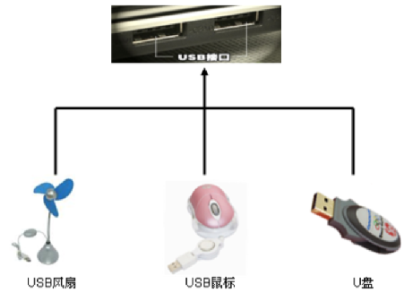


## 2.Java中的接口

​     接口是抽象方法和常量的集合，JDK1.8之后接口中可以包含静态方法和默认方法。

语法规则

```java
关键字 接口名{
    常量;
    抽象方法;
}

interface 接口名{
    ....
}
```


案例代码：

```java
/**
 * 第一个接口案例
 *    常量和抽象方法的集合
 */
public interface InterfaceDemo1 {
    
    // 静态常量
    public static final String NAME = "波哥";
    // 在接口中我们只能声明 常量。 可以省略 static 和 final 关键字
    public int AGE = 18;
    
    public abstract void eat(); // 抽象方法
    
    public void run(); // 在接口中可以省略 abstract关键字
    
    // jdk1.8 的特性中。在接口中我们可以什么 静态方法和default方法
    
    public static void sleep(){
        System.out.println("sleep ...");
    }
    
    default void jump(){
        System.out.println("jump ...");
    }
}

```


## 3.接口的特点

### 3.1 接口使用interface关键字

### 3.2 接口由常量和抽象方法组成

常量：默认接口中所有的成员的变量都是省略 public static final 这几个关键字的，一般接口的成员变量都是大写的

抽象方法：默认接口中的所有成员方法都是省略 public abstract的

在这里我们建议大家在写的时候都加上

JDK1.8之后增加的 静态方法和default方法也要注意

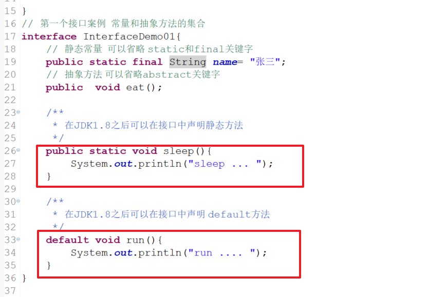


### 3.3 接口不能实例化，得通过实现类来实现

​        接口中存在抽象方法，那就表明接口本身也是一个抽象类，所以肯定不能被实例化，那么此时我们只能通过接口的实现类来实现，要实现接口的实现类我们要通过` Implements` 关键字来实现

```java
/**
 * 创建的Person类实现 InterfaceDemo01接口
 * 
 * @author dpb
 *
 */
 class Person implements InterfaceDemo01{

	@Override
	public void eat() {
		System.out.println("Person ... eat");
		
	}
	
}
```

接口实现类的特点：

a. 如果一个类实现了接口，那么该类就必须实现接口中定义的所有的抽象方法

b. 如果一个接口不想实现接口的方法，那么子类必须定义为一个接口或者抽象类


```java
/**
  * 子类不想实现父接口中定义的抽象方法那么可以定义本身为一个接口，
  * 然后通过 extends 继承父接口的所有的抽象方法和常量
  * @author dpb
  *
  */
 interface Student extends InterfaceDemo01{
	 
 }
 
 abstract class User implements InterfaceDemo01{
	 
 }
```


### 3.4 接口可以多实现

相比较`继承`的单继承而言，接口在这方面就显得很灵活，支持多实现

```java
package com.bobo.oop02;

public interface Person {
	
	public void sleep();

}

```

```java
package com.bobo.oop02;

public interface Police extends Person {

	public void zhuxiaotou();
}

```

```java
package com.bobo.oop02;

public interface Student extends Person{

	public void study();
}

```

```java
package com.bobo.oop02;

public class User implements Student,Police{

	@Override
	public void sleep() {
		// TODO Auto-generated method stub
		
	}

	@Override
	public void zhuxiaotou() {
		// TODO Auto-generated method stub
		
	}

	@Override
	public void study() {
		// TODO Auto-generated method stub
		
	}

}
```


### 3.5 接口是可以多继承的

此处要额外注意，在Java中接口与接口是可以多继承的！！！


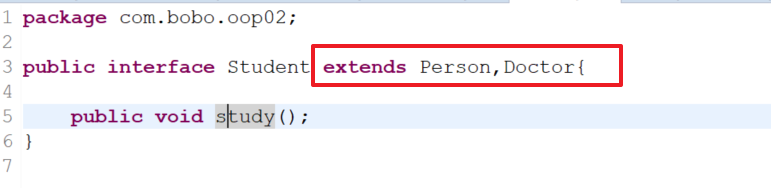


### 3.6 接口是一种规范，标准

​	接口是一种规范，一种标准，同时接口也是灵活的。

### 3.7 类和接口的关系

类和类：单继承，不可以实现

类和接口：单继承，多实现

接口和接口：多继承，不可以多现实


### 3.8 继承和接口的使用场景

当我们设计一个非常复杂而又无法实现的类的时候可以使用继承

当我们重新开始编写一些简单的功能或者指定一些标准的时候使用接口

开发中一般采用面向接口编程，`抽象类是模板，接口是规范`


## 4.接口和抽象类的对比

| 比较点 | 抽象类                                       | 接口                           |
| ------ | -------------------------------------------- | ------------------------------ |
| 定义   | 用abstract关键字来修饰的类                   | interface关键字来修饰          |
| 组成   | 抽象方法，普通方法，构造方法、成员变量，常量 | 抽象方法，静态常量，JDK1.8注意 |
| 使用   | 子类继承(extends)                            | 实现类实现(implements)         |
| 关系   | 抽象类可以实现接口                           | 接口是不能继承抽象类的         |
| 对象   | 都是通过对象的多态类实现的                   | 都是通过对象的多态类实现的     |
| 局限   | 不能多继承，不能实例化                       | 可以多继承，不能实例化         |
| 选择   | 建议选择接口，避免单继承                     | 建议选择接口，避免单继承       |
| 实际   | 模板                                         | 标准                           |


## 5.课堂案例

要求如下：   
   (1) 所有的可以拨号的设备都应该有拨号功能 （Dailup） 
   (2) 所有的播放设备都可以有播放功能(Play)。 
   (3) 所有的照相设备都有拍照功能(takePhoto)。 
   (4) 定义一个电话类 Telephone，有拨号功能。 
   (5) 定义一个Dvd类有播放功能。 
   (6) 定义一个照相机类 Camera, 有照相功能。 
   (7) 定义一个手机类 Mobile, 有拨号，拍照，播放功能。 
   (8) 定义一个人类 Person, 有如下方法： 
      <1> 使用拨号设备 use (拨号设备) 
      <2> 使用拍照设备 use(拍照设备) 
      <3> 使用播放设备 use(播放设备) 
      <4> 使用拨号  播放  拍照设备 use(拨号播放拍照设备)
    (9) 编写测试类Test 分别创建人，电话，Dvd，照相机，手机对象，让人使用这些对象


案例代码

```java
package com.boge.obj5interface.oop3;

public class OOPDemo1 {

    /**
     * 要求如下：
     *    (1) 所有的可以拨号的设备都应该有拨号功能 （Dailup）
     *    (2) 所有的播放设备都可以有播放功能(Play)。
     *    (3) 所有的照相设备都有拍照功能(takePhoto)。
     *    (4) 定义一个电话类 Telephone，有拨号功能。
     *    (5) 定义一个Dvd类有播放功能。
     *    (6) 定义一个照相机类 Camera, 有照相功能。
     *    (7) 定义一个手机类 Mobile, 有拨号，拍照，播放功能。
     *    (8) 定义一个人类 Person, 有如下方法：
     *       <1> 使用拨号设备 use (拨号设备)
     *       <2> 使用拍照设备 use(拍照设备)
     *       <3> 使用播放设备 use(播放设备)
     *       <4> 使用拨号  播放  拍照设备 use(拨号播放拍照设备)
     *     (9) 编写测试类Test 分别创建人，电话，Dvd，照相机，手机对象，让人使用这些对象
     * @param args
     */
    public static void main(String[] args) {
        IPerson person = new Person();
        // 创建对应的设备
        IDailup dailup = new Telephone();
        IPlay dvd = new Dvd();
        ITakePhoto takePhoto = new Camera();
        IMobile mobile = new Mobile();
        // 对应的调用
        person.use(dailup);
        person.use(dvd);
        person.use(takePhoto);
        person.use(mobile);

    }

}

/**
 * 声明定义了接口
 *    注意接口的命名 都是以 I 开头
 */
interface IDailup{

    /**
     * 拨号
     */
    void dailup();
}

/**
 * 有播放功能的接口
 */
interface IPlay{
    /**
     * 播放功能
     */
    void play();
}

/**
 * 照相功能
 */
interface ITakePhoto{
    /**
     * 拍照功能
     */
    void takePhoto();
}

class Telephone implements IDailup{

    @Override
    public void dailup() {
        System.out.println("电话拨号功能...");
    }
}

class Dvd implements IPlay{

    @Override
    public void play() {
        System.out.println("Dvd 播放功能..");
    }
}

class Camera implements ITakePhoto{

    @Override
    public void takePhoto() {
        System.out.println("相机 拍照...");
    }
}

interface IMobile extends IDailup,IPlay,ITakePhoto{

}

class Mobile implements IMobile{

    @Override
    public void dailup() {
        System.out.println("手机拨号中,,,");
    }

    @Override
    public void play() {
        System.out.println("手机播放中");
    }

    @Override
    public void takePhoto() {
        System.out.println("手机拍照...");
    }
}

/*class Mobile implements IDailup,IPlay,ITakePhoto{

}*/

interface IPerson{
    void use(IDailup dailup);
    void use(IPlay play);
    void use(ITakePhoto takePhoto);
    void use(IMobile mobile);
}

class Person implements IPerson{

    @Override
    public void use(IDailup dailup) {
        dailup.dailup();
    }

    @Override
    public void use(IPlay play) {
        play.play();
    }

    @Override
    public void use(ITakePhoto takePhoto) {
        takePhoto.takePhoto();
    }

    @Override
    public void use(IMobile mobile) {
        mobile.dailup();
        mobile.play();
        mobile.takePhoto();
    }
}


```


## 6. 多态的应用

什么是多态：父类的引用指向了子类的实例

多态的实现方法：

1. 使用父类作为方法的形参实现多态
2. 使用父类作为方法的返回值实现多态


继承多态：当这个作为参数的父类是普通类或者抽象类时

接口多态：当这个作为参数的父类是一个接口时，构成接口多态


### 6.1 多态作为形参

#### 6.1.1 基本数据类型

​	基本数据类型作为形参，就是我们讲的 `值传递` 这块没什么区别，也不涉及到多态

#### 6.1.2 引用类型

**普通类**

​         当一个形参希望我们传递的是一个普通类时，我们实际传递的是该类的对象/匿名对象

```java
package com.bobo.oop04;

public class OOPDemo01 {

	public static void main(String[] args) {
		
		Student stu = new Student();
		Person p = new Person();
		p.run(stu);
		System.out.println("*********");
		p.run(new Student());// 将匿名对象当做实参传递
	}

}

class Student{
	public void study(){
		System.out.println("好好学习，天天向上....");
	}
}

class Person{
	
	public void run(Student stu){
		stu.study();
		System.out.println("person ... run");
	}
}

```


**抽象类**

​        当一个形参希望我们传入的是一个抽象类时，我们实际上传入的是该类的子类对象/子类的匿名对象

```java
package com.bobo.oop05;

public class OOPDemo01 {

	public static void main(String[] args) {
		// 多态的体现
		AbsStudent stu = new Student();
		Person p = new Person();
		p.run(stu);
		System.out.println("*****1****");
		p.run(new Student());// 将匿名对象当做实参传递
		System.out.println("*****2****");
		AbsStudent stu2 = new AbsStudent(){
			
			public void study() {
				// TODO Auto-generated method stub
				System.out.println("好好学习，天天向上....run");
			}
		};
		// 抽象类不能被实例化的原因是因为有没有被实现的抽象方法
		// 那么既然是这样的话。那么我们就来实现抽象类中的抽象方法即可
		// AbsStudent1 s1 = new AbsStudent1(){};
		p.run(stu2);
		
		p.run(new AbsStudent(){
			
			public void study() {
				// TODO Auto-generated method stub
				System.out.println("好好学习，天天向上....run 666");
			}
		});
	}

}

/**
 * 定义了一个抽象类
 * @author dpb
 *
 */
abstract class AbsStudent{
	public abstract void study();
}

abstract class AbsStudent1{
	
}

class Student extends AbsStudent{

	@Override
	public void study() {
		System.out.println("好好学习，天天向上....");
	}

}


class Person{
	
	/**
	 * 形参要求传递进来一个 抽象类型
	 * 
	 * AbsStudent stu = new Student();
	 * @param stu
	 */
	public void run(AbsStudent stu){
		stu.study();
		System.out.println("person ... run");
	}
}

```


**接口**

​         当一个形参希望我们传入的是一个接口时，我们实际上传入的是该接口的实现类对象/实现类匿名对象

```java
package com.bobo.oop06;

public class OOPDemo01 {

	public static void main(String[] args) {
		
		IStudent stu = new Student();
		Person p = new Person();
		p.run(stu);
		System.out.println("*********");
		p.run(new Student());// 将匿名对象当做实参传递
		
		IStudent stu2 = new IStudent(){

			@Override
			public void study() {
				// TODO Auto-generated method stub
				System.out.println("好好学习，天天向上....接口");
			}
			
		};
		p.run(stu2);
		p.run(new IStudent(){

			@Override
			public void study() {
				// TODO Auto-generated method stub
				System.out.println("好好学习，天天向上....接口1");
			}
			
		});
		
	}

}

class Student implements IStudent{
	public void study(){
		System.out.println("好好学习，天天向上....");
	}
}

interface IStudent{
	
	void study();
}

class Person{
	
	public void run(IStudent stu){
		stu.study();
		System.out.println("person ... run");
	}
}

```


### 6.2 多态作为返回值

#### 6.2.1 基本数据类型

​	基本数据类型作为返回值，就是我们讲的 `值传递` 这块没什么区别，也不涉及到多态

#### 6.2.2 引用类型

**普通类**

​		 当一个方法的返回值是一个普通类，实际返回的就是该类的对象，我们可以使用该类的对象类接收

```java
package com.bobo.oop07;

public class OOPDemo01 {

	public static void main(String[] args) {
		// TODO Auto-generated method stub
		Student s = new Student();
		Person p1 = s.study();
		Person p2 = s.eat();
		System.out.println(p1);
		System.out.println(p2);
	}

}

class Person{
	
}

class Student{
	public Person study(){
		return new Person();
	}
	
	public Person eat(){
		Person p = new Person();
		return p;
	}
}
```


**抽象类**

​         当一个方法的返回值是一个抽象类时，实际返回的是该抽象类的子类对象，我们可以使用该抽象类接收。如果用该类的子类来接收那么就要考虑类型的强制转换问题

```java
package com.bobo.oop08;

public class OOPDemo01 {

	public static void main(String[] args) {
		// TODO Auto-generated method stub
		Student s = new Student();
		AbsPerson p1 = s.study();
		AbsPerson p2 = s.eat();
		// 子类接收 父类的返回 那么需要强制类型转换
		Person p3 = (Person)s.study(); // 强制转换有可能出现 ClassCastException异常
		if(p2 instanceof Person){
			Person p4 = (Person)p2;
		}
		
		System.out.println(p1);
		System.out.println(p2);
	}

}

abstract class AbsPerson{
	
}

class Person extends AbsPerson{
	
}

class Student{
	public AbsPerson study(){
		return new Person();
	}
	
	public AbsPerson eat(){
		//AbsPerson p = new AbsPerson(){};
		return new AbsPerson(){};
	}
}
```


**接口**

​       当一个方法的返回值是一个接口时，实际返回的是该接口的实现类对象，我们可以使用接口来接收，同样的如果我们使用实现类来接收的话，那么同样有可能出现ClassCastException的问题，也就是强制类型转换的问题。

```java
package com.bobo.oop09;

public class OOPDemo01 {

	public static void main(String[] args) {
		// TODO Auto-generated method stub
		Student s = new Student();
		//  IPerson p1 = new Person();
		IPerson p1 = s.study();
		IPerson p2 = s.eat();
		// 子类接收 父类的返回 那么需要强制类型转换
		Person p3 = (Person)s.study(); // 强制转换有可能出现 ClassCastException异常
		if(p2 instanceof Person){
			Person p4 = (Person)p2;
		}
		
		System.out.println(p1);
		System.out.println(p2);
	}

}

interface IPerson{
	
}

class Person implements IPerson{
	
}

class Student{
	public IPerson study(){
		return new Person();
	}
	
	public IPerson eat(){
		//AbsPerson p = new AbsPerson(){};
		return new IPerson(){};
	}
}
```


补充：当方法的返回值类型是引用类型的时候，可以使用链式调用

```java
interface IPerson{
	IPerson sleep();
	IPerson run();
	IPerson eat();
}

class Person implements IPerson{

	@Override
	public IPerson sleep() {
		// TODO Auto-generated method stub
		return this;
	}

	@Override
	public IPerson run() {
		// TODO Auto-generated method stub
		return this;
	}

	@Override
	public IPerson eat() {
		// TODO Auto-generated method stub
		return this;
	}
	
}

	public static void main(String[] args) {
		IPerson p1 = s.study();
		// 链式调用
		IPerson p5 = p1.eat().sleep().run().eat().run().sleep();
	}

```


# 八、 内部类

## 1.内部类的相关概念

​      将类定义在类的内部，那么该类就称为`内部类`

注意：内部类是一个相对的概念，如果Outter类中有一个类Inner类，那么Otter类相对于Inner类来说就外部类，而Inner相对于Outter来说就是内部类

```java
/**
 * 普通的Java类
 * 一个Java类的成员：
 *    属性，方法
 *    普通成员变量
 *    静态成员变量
 *    常量
 *    普通方法
 *    静态方法
 *    构造方法
 *    静态代码块
 *    普通代码块
 */
public class Outter {

    /**
     * 这是一个内部类
     */
    class Inner{

    }
}
```


Java中不能被实例化的类型有哪些？

1. 抽象类
2. 接口
3. 所有的构造方法都被private修饰的类型
4. 内部类不能被外界直接实例化


为什么要使用内部类？

提高类的安全性


## 2. 内部类的特点

1. 内部类可以直接访问外部类的所有的成员(变量和方法)
2. 外部类如果要访问内部类成员，必须创建内部类对象来实现
3. 内部类编译后的class文件命名有别于普通类：外部类$内部类.class Outter$Inner.class
4. 要访问内部类的成员是非常麻烦的，而且造成程序耦合性增强，可读性降低，所以内部类慎用


## 3.内部类的分类


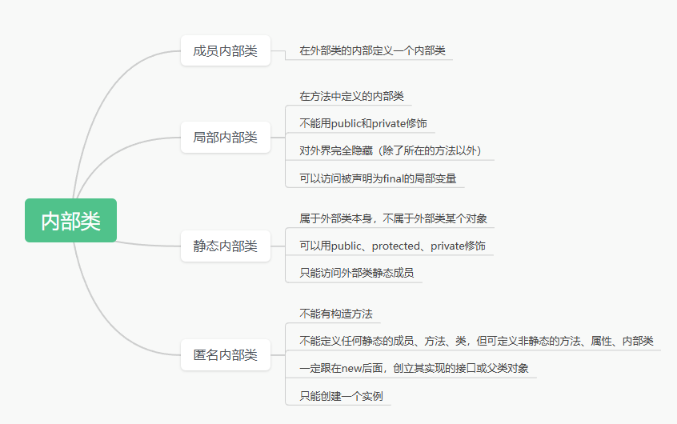


### 3.1 成员内部类

​	我们在外部类中定义一个成员内部类,这个内部类和成员变量成员方法是同级的


#### 3.1.1 如何在外部获取内部类对象

**内部类非私有**

​      因为内部类非私有，所以我们可以通过如下的格式直接获取内部类的对象

```java
外部类.内部类 变量名称 = 外部类对象.内部类对象;
```

```java
public class Outter {

    private String name;

    public void fun1(){

    }

    /**
     * 这是一个内部类
     *   这是一个成员内部类
     *   这个内部类和成员变量成员方法是同级的
     */
    class Inner{

        public void fun2(){
            System.out.println("fun2 ....");
            System.out.println(name);
            fun1();
        }
    }

    public void eat(){

    }
}


public class InnerClassDemo {

    /**
     * 普通成员内部类获取对象的语法
     *    外部类.内部类 变量名称 = 外部类对象.内部类对象;
     * @param args
     */
    public static void main(String[] args) {
        //Inner  in = new Inner();
        System.out.println("----");
        // 需要获取内部类对象
        Outter.Inner inner = new Outter().new Inner();
        inner.fun2();
    }
}

```


**内部类私有**

​	   内部类作为外部类的成员，那么是可以用  private 来修饰的，既然用 private修饰那也就意味着外界是没办法直接获取该对象的，同时我们也没法通过相关的类型来接收，但是我们可以在外部类中提供相关的getter/setter方法来处理。

```java
package com.bobo.oop12;

public class OOPDemo01 {

	public static void main(String[] args) {
		// 我们在外部如何获取内部类的对象
		/*Outter.Inner in = new Outter().new Inner();
		in.show();*/
		
		Outter out = new Outter();
		System.out.println(out.getName());
		
		out.setInner();
		System.out.println(out.getInner());
		// 可以获取内部类对象  但是没法用变量来接收，没法访问相关的属性和方法
		out.getInner();
	}

}

class Outter{
	
	private String name = "张三";
	
	public String getName() {
		return name;
	}

	public void setName(String name) {
		this.name = name;
	}

	/**
	 * 这个内部类是外部类的一个成员
	 * @author dpb
	 *
	 */
	private class Inner{
		
		public void show(){
			System.out.println("show ... " + name);
		}
	}
	
	public void setInner(){
		Inner in = new Inner();
		in.show();
	}
	
	public Inner getInner(){
		Inner in = new Inner();
		return in;
	}
	
	void info(){
		
	}
	
	
}
```


#### 3.1.2 变量名相同的情况

当外部类成员变量和内部类成员变量及内部类方法中的局部变量同名的情况下怎么处理

```java
public class Outter {

    private String name = "张三" ;

    public void fun1(){

    }

    class Inner{
        private String name = "李四";

        public void fun2(){
            System.out.println("fun2,.,....");

            // 内部类中的属性和外部类中的属性同名。内部类中的属性会覆盖外部类中的属性
            System.out.println(name);
            // 我们可能需要获取外部类的属性。这个怎么获取呢？
            // 外部类名.this.变量名
            System.out.println("外部类name="+Outter.this.name);
            fun1();
        }
    }

    private class Inner2{
        public String userName;
        public void show(){
            System.out.println("内部类2----show方法执行了...");
        }
    }

    public void setInner(){
        Inner2 inner2 = new Inner2();
        inner2.show();
    }

    public Inner2 getInner2(){
        return new Inner2();
    }

    public void eat(){
        jump();
    }
    private void jump(){

    }

}
```


在这种情况下获取外部类中的成员变量的方式

```java
外部类名.this.变量名
```


### 3.2 局部内部类

成员内部类我可以理解为和成员变量同级，那么局部内部类我们也可以理解为和局部变量同级的内部类

```java
package com.bobo.oop13;

public class OOPDemo02 {

	public static void main(String[] args) {
		// TODO Auto-generated method stub
		Outter02 out = new Outter02();
		out.show();
	}

}

class Outter02{
	
	int num1 = 20;
	
	/**
	 * 在JDK1.8之后 把局部内部类中使用的外部方法的局部变量默认的提升为 final
	 * 在JDK1.8之前 这里会强制要求我们将 局部变量声明为final类型
	 */
	public void show(){
		 int num  = 30;
		
		// 定义一个局部内部类
		class Inner{
			public void info(){
				System.out.println("inner info ..." + num);
			}
		}
		// 我们要使用内部类对象 调用其中的方法才会执行
		Inner in = new Inner();
		// num = 50;
		in.info();
		System.out.println(num);
	}
}

```


### 3.3 静态内部类

​        被static修饰的成员内部类我们称为静态内部类。

获取内部类实例的语法格式：

```java
外部类.内部类 变量名称 = new 外部类.内部类();
```

```java
package com.bobo.oop14;

public class OOPDemo01 {

	public static void main(String[] args) {
		// 1.获取外部内对象
		Outter out = new Outter();
		//out.show();
		// 2.获取静态内部类对象
		// Outter.Inner in = new Outter().new Inner();
		// Outter.Inner in = Outter.(new Inner());
		Outter.Inner in = new Outter.Inner();
		Outter.name = "";
		Outter.show();

	}

}

class Outter{
	
	public static String name = "张三";
	
	public static void show(){
		System.out.println(name);
	}
	
	/**
	 * 定义的一个静态内部类
	 * @author dpb
	 *
	 */
	static class Inner{
		public static String name="李四";
		
		public int age = 20;
		
		public void info1(){
			System.out.println(age);
		}
		
		public static void info2(){
			System.out.println("内部类:" + name);
		}
	}
	
}

```


静态内部类相比于成员内部类来说简化了方法方式，好处同样的提高了类型的安全性。

静态内部类的特点：

1. 本身还是一个class，所以内部成员和普通类没区别
2. 静态内部类不能获取外部类中的非静态的属性和方法
3. 在外部内中要获取内部类对象直接实例化即可

如果要获取静态内部类中的静态方法或者属性的话可以通过如下方式获取

```java
外部类名称.内部类名称.静态方法();
外部类名称.内部类名称.静态变量;
```


### 3.4 匿名内部类

没有名称的内部类我们称为匿名内部类。如果一个内部类在整个操作中只使用了一次的话，那就可以定义为匿名内部类。

没有使用匿名内部类的情况

```java
package com.bobo.oop15;

public class OOPDemo01 {

	public static void main(String[] args) {
		new X().fun2();

	}

}

interface Person{
	void sleep();
}

class User implements Person{

	@Override
	public void sleep() {
		System.out.println("睡觉真舒服啊....");
		
	}
	
}

class X {
	void fun1(Person p){
		p.sleep();
	}
	
	void fun2(){
		this.fun1(new User());
	}
}
```


使用匿名内部类的情况

```java
package com.bobo.oop16;

public class OOPDemo01 {

	public static void main(String[] args) {
		new X().fun2();

	}

}

interface Person{
	void sleep();
}

/*class User implements Person{

	@Override
	public void sleep() {
		System.out.println("睡觉真舒服啊....");
		
	}
	
}*/

class X {
	void fun1(Person p){
		p.sleep();
	}
	
	void fun2(){
		this.fun1(new Person(){

			@Override
			public void sleep() {
				System.out.println("AAAAAA....");
			}
			
		});
	}
}
```

匿名内部是Java为了方便我们编写程序而设计的一种机制，因为有时候有的内部类之需要创建一个对象就可以了，这时候匿名内部类就比较合适好，匿名内部类一般都是和接口及抽象类关联的

