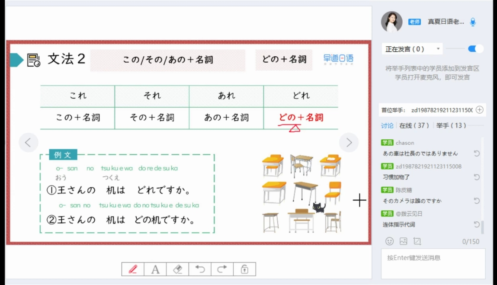

## L2 笔记

### 03 第二课 这是小苹果

2025/11/10  月曜日

> 1、单词
* ノート--笔记本;note-1-n
* てちょう-手帳-手账;备忘录;记事本-0-n
* ほん-本-书-1-n
* つくえ-机-桌子;书桌-0-n
* くつ-靴-鞋-2-n
* しんぶん-新聞-报纸-0-n
* めいさんひん-名産品-特产-0-n
* おみやげ-お土産-礼品-0-n
* ニュース--新闻;News-1-n
* これ--这;这个-0-pron
* それ--那;那个-0-pron
* あれ--那;那个-0-pron
* だれ-誰-谁-1-
* どなた-何方-谁-1
* くるま-車-车-0
* どれ--哪个-1
* じしょ-辞書-词典-1
* じてんしゃ-自転車-自行车-0
* カメラ--相机-1
* とけい-時計-钟;表-0
* かさ-傘-伞-1
* すずき-鈴木-铃木;姓-0
* でんわ-電話-电话-0
* しゃしん-写真-照片-1
* かた-方-位;人-1
* かぞく-家族-家人-1
* おかあさん-お母さん-母亲-2
* シルク--丝绸;silk-1
* ハンカチ--手绢;handkerchief-0

> 2、语法

1. 指示代词：これ、それ、あれ
* 事物指示代词，不能用来指代人
* 表示这个、那个、更远的那个。他们三个通常配合 は です使用
  * これは私のノートです　　　这是我的笔记本。
  * それは日本語の本ですか。　这是日语书吗
  * 
  * A: それは　日本語の本ですか
  * B: いいえ、日本語の本ではありません。これは　中国語の本です。

* 询问是什么：
  * A: それは　何ですか。
  * B: これは　手帳です。

2. 询问谁： 誰（だれ）
* A: それは　誰の靴ですか。
* B: これは　私の靴です。
* だれ　＝　どなた（何方）　　后者的说法一般更礼貌 翻译成哪一位
  * あの人は　だれですか。
  * あの方は　何方ですか。

3. どれ 哪个：
* 張さんは車はどれですか。
* 「私の車は」あれです。

4. この、その、あの、どの + n
* 表示这个的，那个的
  * この本　は　佐藤さんの「本」です。　这本书是佐藤的【书】
  * そのカメラは　誰の「カメラ」ですか。　那个相机是谁的
  * あの車は　社長の　「車」ではありません。
  * 
  * 王さんの　カメラはどれですか。
  * 王さんの　カメラはどのカメラですか。

5. 表示xx人 和 xx语
* 使用 じん　表示哪国人
  * にほんじん　　　日本人
  * ちゅうごくじん　中国人
* 使用 ご　表示哪国语 例子：
  * にほんご　　　日本語
  * ちゅうごくご　中国語

6. 询问年龄：    
* おいくつ　询问年龄 比较礼貌的用法
  * お母さんは　おいくつですか。　　　你母亲多大了
* 何歳　平辈或者对晚辈用法 询问年龄
  * 貴方は　何歳ですか。

 　　
> 3、句子
* あの人は　だれですか。
* あの人は　どの人ですか。　
* あの人は　どなたですか。

* 王さんの本はどれですか　
* 王さんの本は　どの本ですか。
* これです。

> 4、练习
* A: それは何ですか。
* B: これは手帳です。

* A: あれは　張さんの車ですか。
* B: いいえ、私の車ではありません。

* 吉田先生　（は）（どの）　人ですか。
* その傘（は）李さん（の）ではありません。
* 鈴木さん（の）大学は（どの）大学ですか。

> 5、数字
* ゼロ-零-0-1
* れい-零-0-1
* いち-一-1-1
* に-二-2-1
* さん-三-3-0
* し-四-4-1
* よん-四-4-1
* ご-五-5-1
* ろく-六-6-2
* しち-七-7-2
* なな-七-7-1
* はち-八-8-2
* きゅう-九-9-1
* く-九-9-1
* じゅう-十-10-1

