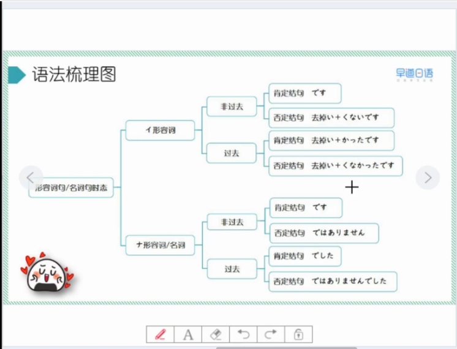
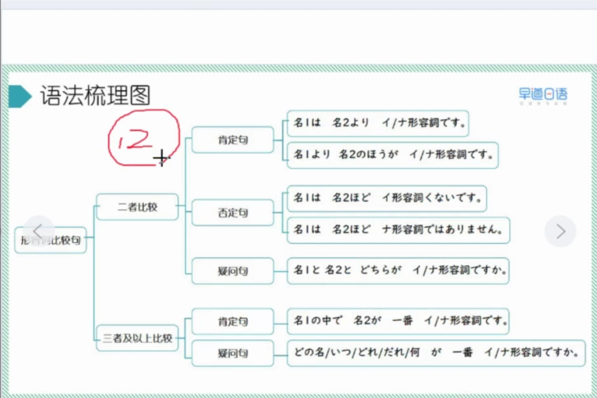
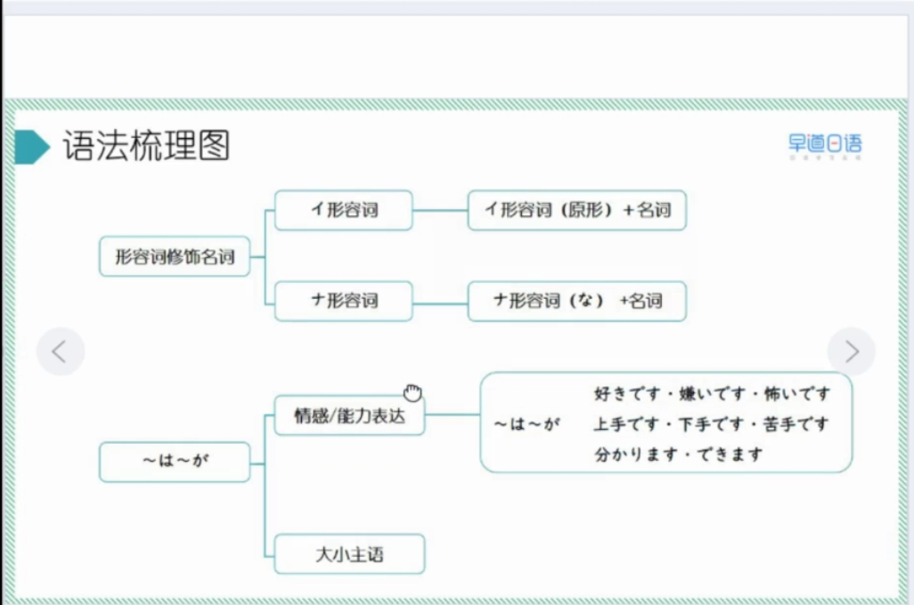
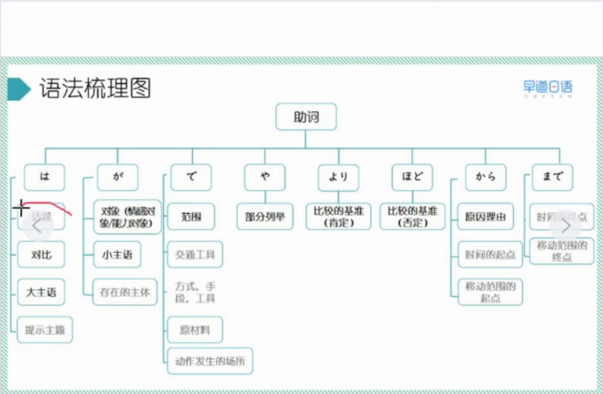
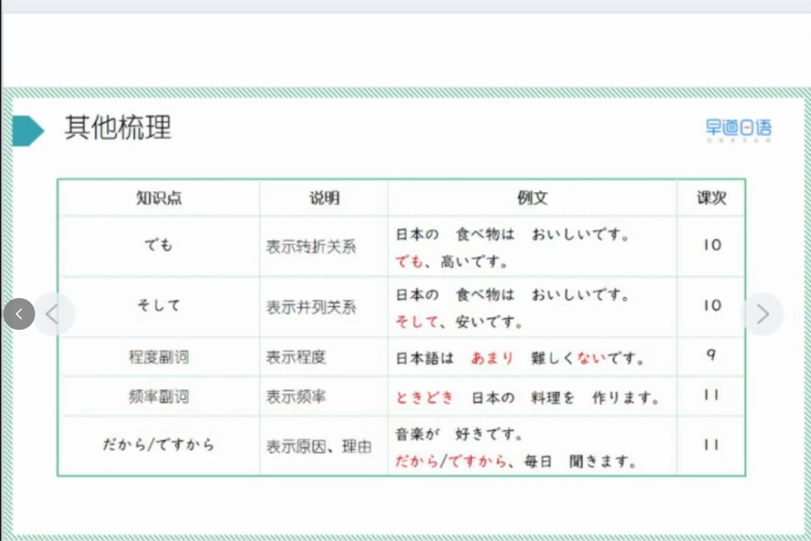
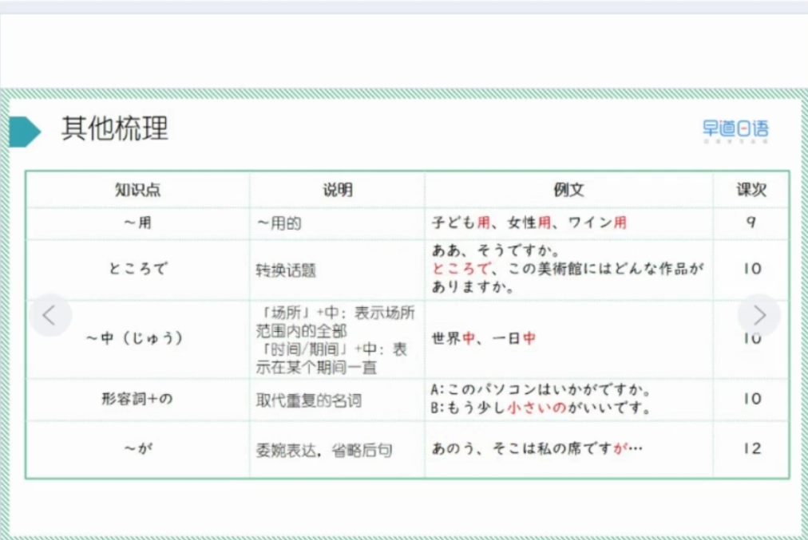

## L2 笔记

### 18  第三单元复习课

2025/12/19  金曜日

* がいごく　外国
* つかれます　疲れます
* ながめ　眺め
* かぶき　歌舞伎
* もみじ　紅葉
* まよいます　迷います
* とおい　遠い
* おさけ　お酒
* おかし　お菓子
* けっこんしき　結婚式
* ひ　日
* のみもの　飲み物
* にがて　苦手
* はれ　晴れ
* さくひん　作品
* せいかつ　生活
* くもり　曇り
* さかな　魚　

> 1、语法总结

1. 形容词名词时态

2. 形容词比较句

3. 形容词修饰名词 表示情感 大小主语

4. 语法总结

5. 其他

> 2、练习

    

