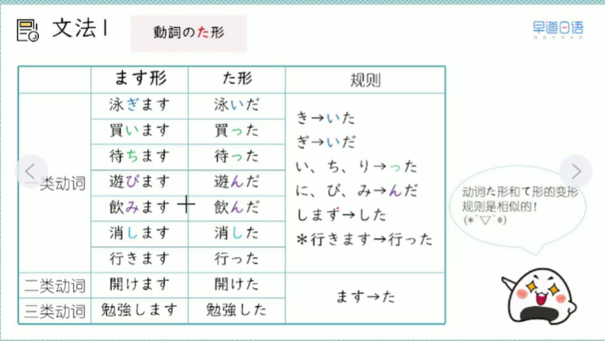

## L3 笔记

### 17 第二十一课　你见过雪吗

### 雪を見たことがありますか

能够表达过去的经历

2026/2/11 水曜日

> 1、单词

1. 单词
* ことば-言葉-语言;句子-3-n
  * 話し言葉　口语
  * 書き言葉　书面语
* どろぼう-泥棒-小偷-0-n
* きっぷ-切符-票-0-n
* わたします-渡します-交给;递给-3-v
* おくれます-遅れます-迟到-3-v
* きます-着ます-穿-2-v

2. 短语
* 言葉　を　教えます
* 泥棒　が　家に入ります
* 切符　を　買います
* 資料　を　社長に　渡します
* 電車　が　遅れました   电车晚点了
* 電車　に　遅れました　 我没赶上车
* 浴衣　を　着ます

> 2、语法
1. 动词 た　型
* 表示发生了，代表过去式 行った　＝　行きました　
* V2　去 ます　＋　た
  * 食べます　食べた
  * 開けます　開けた
* V3　将 します 变成　した
  * 勉強します　勉強した
  * 来ます　　　来た
* V1　い　ち　り　った
* V1　に　び　み　んだ
* き　いた
* ぎ　いだ
* 行きます　行った
* 

2. 动词た型 +　ことがあります 表示曾经有过
   * わたしは東京へ行ったことがあります
   * 先月、わたしは東京へいきました　　　

3. 形容词和名词简体
* 
* 

> 3、句子
* わたしは東京へ行ったことがあります

* いいですよ、ビールが大好きです
* いいよ、ビールが大好きだ

> 4、练习
1. 
* 
* 

2. 
* 毎朝、ジョギングをする
* 時間（じかん）がある
* いつも朝ご飯を食べる
* ラケットがない
* 東京へ遊びに行った
* どこへも行かなかった
* 息子におもちゃを買う
* 駅前で大きい火事があった

3. 
* 
* 

4. 1
* この店のケーキはおいしい
* 趣味は水泳だった
* あの人は歌手ではない
* 昨日のパーティーは楽しいかった
* この映画は面白くない

