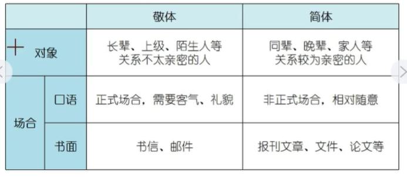
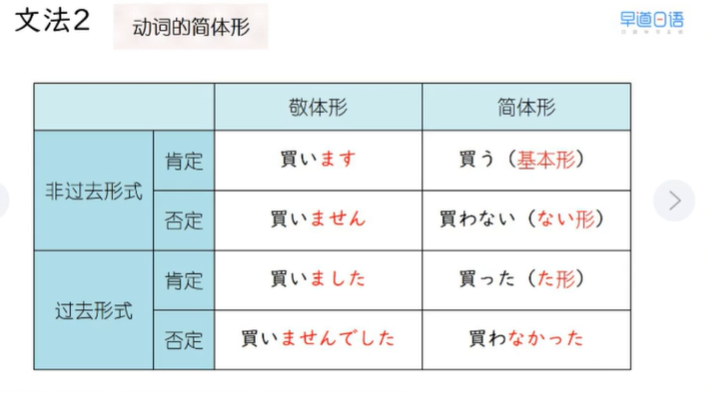
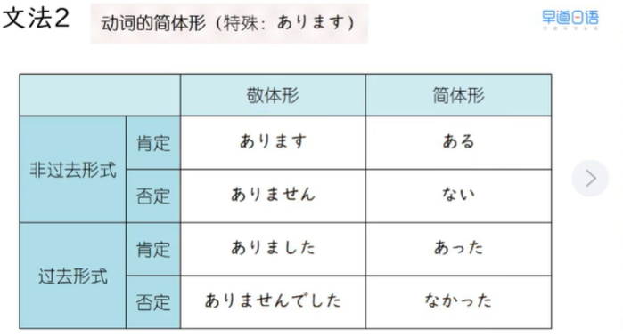
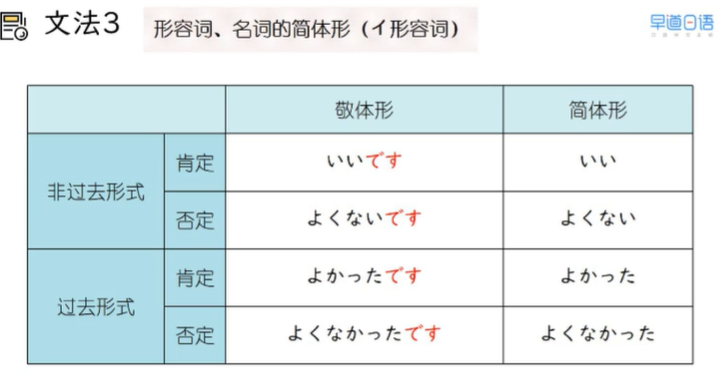
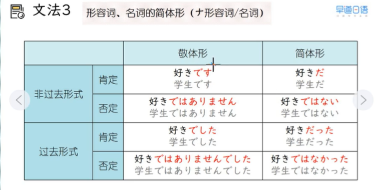
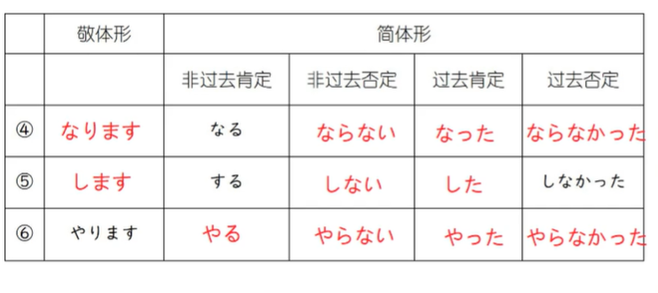
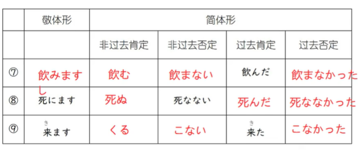
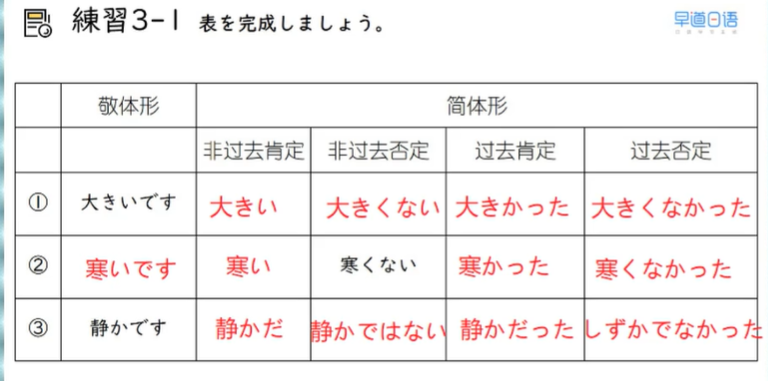
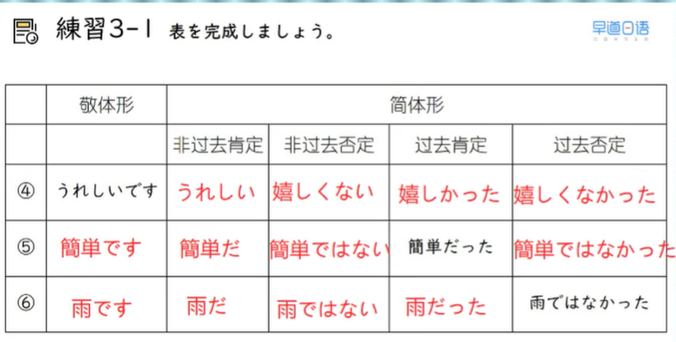

## L3 笔记

### 18 第二十二课上　哇好开心

### わあ、うれしい

学会朋友、家人之间的日常口语表达

2026/2/13 金曜日

> 1、单词

1. 单词
* けいたい-携帯-手机-0-n
  * ガラケー　翻盖手机
  * スマホ　　智能手机
* うれしい-嬉しい-开心;高兴-3-adj
  * 楽しい　物做主语
    * パーティーは楽しいです
  * 嬉しい　人做主语，且不能用于第三人称
    * プレゼントをもらいました、嬉しいです
* ねむい-眠い-困-0-adj
* おもい-重い-重-0-adj
  * 軽（かる）い
* きゅう-急-突然-0-adj
* やります--做-3-v
  * 三类动词的します不能换成やります

2. 短语
* 急　な　雨  突然的雨
* 会議　を　やります（します）
* 勉強　を　やります（します）
* サッカー　を　やります（します）

> 2、语法
1. 敬体和简体

2. 动词的简体

* ます　变 基本型
  * 買います　買う
* ません　变 ない型
* ました　变 た型
* ませんでした　变なかった
  * 買いませんでした　買わなかった　
* あります特殊变形
  * 

3. 形容词和名词简体
* 
* 

> 3、句子
* 飲みに行きませんか　　敬体
* 飲みに行かない       简体

* いいですよ、ビールが大好きです
* いいよ、ビールが大好きだ

> 4、练习
1. 
* 
* 

2. 
* 毎朝、ジョギングをする
* 時間（じかん）がある
* いつも朝ご飯を食べる
* ラケットがない
* 東京へ遊びに行った
* どこへも行かなかった
* 息子におもちゃを買う
* 駅前で大きい火事があった

3. 
* 
* 

4. 1
* この店のケーキはおいしい
* 趣味は水泳だった
* あの人は歌手ではない
* 昨日のパーティーは楽しいかった
* この映画は面白くない

