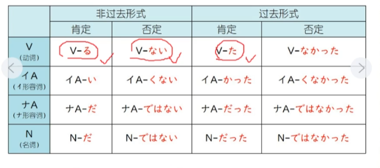
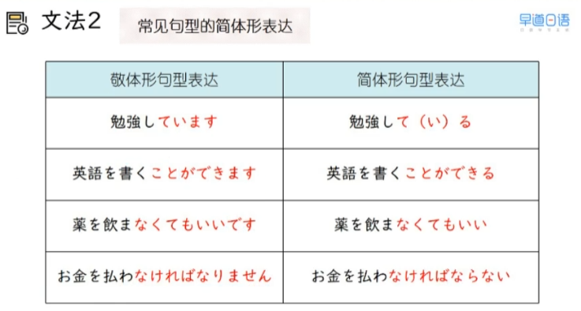
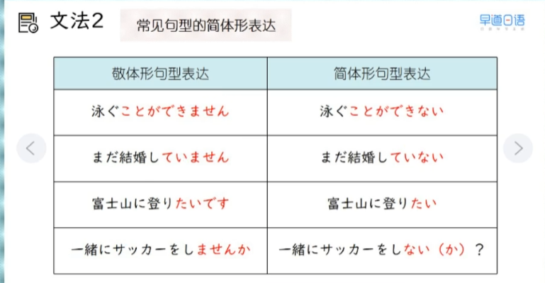
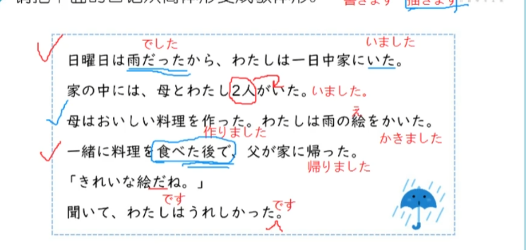
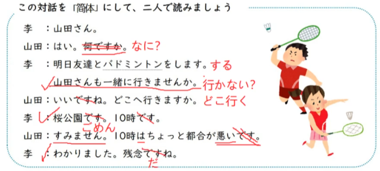

## L3 笔记

### 19 第二十二课下　喝咖啡吗

### コーヒー、飲む？

学会朋友、家人之间的日常口语表达

2026/2/25 水曜日

> 1、单词

1. 单词
* てんきん-転勤-转勤-0　
* つごう-都合-方便;情况-0
  * 都合はどうですか　　方便吗? 有条件吗? 有时间吗?
  * 都合がいいです
  * 都合が悪いです
* よてい-予定-预定;安排-0
  * 予定がありますか。 
  * よやく-予約-预约
* まあまあ--差不多;凑合-0
  * まあまあできました　　完成的害行，凑合

> 2、语法
1. 简体疑问句中省略 か 使用 ? 代替　语气要上扬
   * 飲みに行きますか。
   * 飲みに行くか。
   * 飲みに行く？

2. 简体会话中，不产生歧义时可以省略助词
* 省略は　が　を等
  * 午後、寿司を食べます。
  * 午後、寿司を食べる。
  * 午後、寿司食べる。

3. ています的简体是ている，简体会话中，常常省略い只说てる
   * 今、勉強しています。
   * 今、勉強している。
   * 今、勉強してる。

4. な形容词和名词的简体为だ时，简体会话常常省略だ，或者在だ后面加上よ、ね等语气词
   * 今日は日曜日です。
   * 今日は日曜日だ。
   * 今日は日曜日。
   * 今日は日曜日だね。

5. 句型的简体

> 3、句子

* A:これから、どこへ行きますか。
* A:これから、どこ行く？
* B:もう帰りたいです
* B:もう帰りたい

> 4、练习
1. 

2. 
* 今日は月曜日ですか。
  * 今日は月曜日？
  * うん、月曜日
  * ううん、月曜日ではない　
* よくスキー場（じょう）に行きますか
  * よくスキー場行く？
  * うん、行く
  * ううん、行かない
* 今は中国に住んでいますか
  * 今、中国住んでる？
  * うん、住んでる
  * ううん、住んでない
* 野菜をあんまり食べませんか
  * 野菜あんまり食べない？
  * うん、食べない
  * ううん、食べる

3. 

4. 1
* スミスさんはピアノを弾（ひ）くことができます
  * スミスさんはピアノを弾くことができる
* あの人はアメリカの大統領（だいとうりょう）になりました
  * あの人はアメリカの大統領になった
* 昨日の夜十時、わたしは寝ていませんでしたよ
  * 昨日の夜十時、わたしは寝ていなかったよ
* 熱があるから、病院へ行かなければなりません
  * 熱があるから、病院へ行かなければならない

