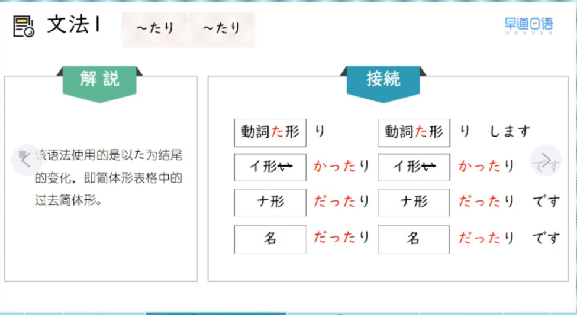

## L3 笔记

### 20 第二十三课　周末玩耍啦睡觉啦等等

### 週末は遊んだり寝だりします

能够例举若干有代表性的动作

2026/2/27 金曜日

> 1、单词

1. 单词
* きじ-生地-布料;材料-1　
* あじ-味-味道-0
* うすい-薄い-清淡;薄的-0
* こい-濃い-浓烈;重口-1
* はやい-早い-早-2
* おそい-遅い-慢;晚-0
* こみます-込みます-拥挤;堵-3
* しらせます-知らせます-告知;通知-4
* たしかめます-確かめます-确认-4

2. 短语
* 味が　薄い
* 味が　違います　味道不对，不一样
* 電車はいつも　込みます
* 休業を　お客様に　知らせます
* お知らせ　通知
* 休業を　確かめます

> 2、语法
1. 所有词性的た型  ～たり　～たり 例举有代表性的动作
* 
* v た
* a1 かった
* a2 n だった
* 接动词时 表示动作反复交替
  * 李さんは週末、家の掃除をしたり洗濯（せんたく）をしたりします
  * A:昨日、何をしましたか
  * B:スケートをしたり、映画を見たりしました
  * 毎日自分で料理を作ったり皿を洗ったりして、大変ですね
* 接形容词和名词时，表示有时...有时... 有的...有的...
  * 山田さんの仕事は暇（ひま）だったり忙しかったりです
  * あの店の料理は味が濃かったり薄かったり、毎回（まいかい）違います
  * 通勤（つうきん）は地下鉄だったり車だったり、日によってちがいます

2. 小句后 + か 表示某种不确定的内容
* 小句后的主语常用　が
* 小句是疑问句时 动词变简体 + か
* 名词/A2 去だ（非过去肯定）　＋　か
  * 卒業式がいつするか教えてください。
  * 昨日何を飲んだか忘れました。
  * この歌が誰の歌か知っていますか。
* 第一种为简体形 + かどうか　此时该小句可以翻译成:是否...
  * この料理がおいしいかどうか分かりません
  * 今日は来るかどうか私に教えてください
  * わたしは森さんが日本人かどうか知りません。
* 第二种为肯定表达 + か 否定表达 +　か
  * この料理がおいしいかまずいか分かりません
  * 今日は来るか来ないか私に教えてください
  * わたしは森さんが日本人か日本人じゃないか知りません　

> 3、句子

* わたしはポチです。うちのみんなは毎日忙しいです。わたしは家で待っています。
* 毎日、いろいろなことをします
* 毎日、寝たり、ご飯を食べたりします

* 雪ちゃんがいつ帰るかわかりません
* 雪ちゃんはいつ帰りますか
* わたしは分かりません
* わたしは　雪ちゃんがいつ帰るか　分かりません。

> 4、练习
1. たり　たり
* 大阪に行って、山に「登った」り、船（ふね）に「乗（の）った」りします。
* ここでタバコを「吸った」り、お酒（さけ）を「飲んだ」りしてはいけません。
* 国際交流学校では「日本人だった」り「中国人だった」りです。
* 一年中、天気は「はれだった」り「雪だった」りです。暑かった　寒かった

2. 句子组合
* 例子： 李さんは来ますか　　分からない
  * 李さんが来るかどうか分からない
  * 李さんが来るか来ないか分からない
* 毎日スポーツをしますか　小野さんに聞いてください
* 来週王さんは暇ですか　知りません
* 明日雨が降りますか　天気予報を見ましょう
* 会議の時間がすく決まりますか　教えてください

